# Week 1, Day 1: Introduction to Modern LLMs and Development Environment Setup

## Table of Contents
- [Session Overview](#session-overview)
- [Learning Objectives](#learning-objectives)
- [Prerequisites](#prerequisites)
- [Visual Overview](#visual-overview)
- [Content Structure](#content-structure)
  - [Theory](#theory)
  - [Hands-on Practice](#hands-on-practice)
  - [Applied Learning](#applied-learning)
- [Resources](#resources)
- [Assessment](#assessment)
- [Notes](#notes)
- [References](#references)

> **Session Overview**
> - **Duration**: 2 hours
> - **Format**: Combined lecture and hands-on practice
> - **Difficulty**: Beginner-Intermediate
> - **Key Topics**: LLM fundamentals, development setup, API integration

---


---

## Learning Objectives
By the end of this session, students will be able to:
1. Understand the fundamental concepts and latest developments in Large Language Models
2. Explain the evolution from transformer architecture to modern architectures (including Mixture-of-Experts)
3. Set up a professional development environment using contemporary tools (Modal, OpenAI, Google AI Studio)
4. Execute basic interactions with state-of-the-art LLM APIs
5. Compare and contrast different LLM providers and their capabilities
6. Implement basic error handling and best practices for LLM applications

## Prerequisites
- Basic Python programming knowledge (Python 3.8+)
- Familiarity with command-line interfaces and package management
- Understanding of basic machine learning concepts
- Access to a computer with internet connection
- (Optional) GPU access for local model deployment

## Visual Overview

```mermaid
graph TD
    A[Traditional Software] -->|Deterministic| B[Fixed Outputs]
    C[Modern LLMs] -->|Probabilistic| D[Variable Outputs]
    B -->|Predictable| E[Same input = Same output]
    D -->|Statistical| F[Same input ≈ Similar output]
    
    G[Base Models] -->|Fine-tuning| H[Domain-Specific]
    G -->|RAG| I[Knowledge-Enhanced]
    G -->|MoE| J[Mixture-of-Experts]
    
    H -->|Deployment| K[Production Apps]
    I -->|Deployment| K
    J -->|Deployment| K
    
    style A fill:#f9f,stroke:#333,stroke-width:4px
    style C fill:#bbf,stroke:#333,stroke-width:4px
    style G fill:#bfb,stroke:#333,stroke-width:4px
    style K fill:#fbf,stroke:#333,stroke-width:4px
```



## Content Structure

---

### 1. Theory (45 minutes)

> **Section Goals**
> - Understand LLM fundamentals
> - Learn about transformer architecture
> - Grasp key concepts in modern NLP

#### Introduction to Modern Large Language Models
Large Language Models (LLMs) represent a revolutionary advancement in artificial intelligence, particularly in natural language processing. As of 2024, these models have evolved significantly, offering unprecedented capabilities in understanding, generating, and manipulating text, code, and even multimodal content.

##### Historical Context and Current State
The evolution of language models showcases rapid advancement:
- Traditional N-gram models (Historical)
- Neural Language Models (2013-2016)
- Transformer Architecture (Vaswani et al., 2017)
- GPT series innovations (2018-2024)
- Mixture-of-Experts Models (2023-2024)
- Multimodal Models (2023-2024)

##### Latest Developments (2024)
1. **Advanced Architectures**
   - Sparse Mixture of Experts (MoE)
   - Efficient attention mechanisms
   - Multimodal capabilities

2. **Key Players and Models**
   - OpenAI: GPT-4 Turbo with Vision
   - Google: Gemini Series
   - Anthropic: Claude 3
   - Open Source: Mixtral-8x7B, Llama 3

##### Core Concepts and Modern Architectures
1. **Advanced Model Architectures**
   - Mixture-of-Experts (MoE) architecture
   - Sparse attention mechanisms
   - Multi-modal encoders and decoders
   - Efficient parameter utilization

2. **Foundation Models and Capabilities**
   - Pre-training and fine-tuning paradigm
   - Zero-shot and few-shot learning
   - Emergence of capabilities
   - Tool use and function calling
   - Multi-modal understanding
   - Retrieval-Augmented Generation (RAG)

3. **Deployment Considerations**
   - Model quantization and optimization
   - Inference optimization
   - Cost and latency tradeoffs
   - Responsible AI practices

#### Modern Development Environment Setup

##### Essential Tools and Platforms
1. **Development Environment**
   ```bash
   # Create a new virtual environment with Python 3.12
   python -m venv llm-dev
   source llm-dev/bin/activate  # Linux/Mac
   # or
   .\llm-dev\Scripts\activate  # Windows
   ```

2. **Core Dependencies**
   ```bash
   # Install essential packages
   pip install modal-client openai google-generativeai langchain-core python-dotenv
   
   # Install optional but recommended packages
   pip install transformers accelerate bitsandbytes
   ```

3. **Cloud Development Setup with Modal**
   ```python
   import modal
   
   stub = modal.Stub("llm-app")
   
   @stub.function()
   def process_with_llm(input_text: str) -> str:
       # Modal automatically handles cloud deployment
       return "Processed: " + input_text
   ```

4. **Multiple API Setup**
   ```python
   import os
   from dotenv import load_dotenv
   import openai
   import google.generativeai as genai
   
   load_dotenv()
   
   # OpenAI setup
   openai.api_key = os.getenv("OPENAI_API_KEY")
   
   # Google AI setup
   genai.configure(api_key=os.getenv("GOOGLE_API_KEY"))
   ```

---

### 2. Hands-on Practice (45 minutes)

> **Practical Skills**
> - Setting up modern development environment
> - Multi-provider API integration
> - Advanced error handling and monitoring
> - Cloud deployment with Modal

#### Modern LLM Integration Examples

1. **OpenAI GPT-4 Integration with Function Calling**
```python
from openai import OpenAI
from typing import List, Dict

client = OpenAI()

def get_completion_with_functions(
    prompt: str,
    functions: List[Dict] = None
) -> str:
    """
    Advanced function to interact with GPT-4 using function calling
    """
    try:
        messages = [{"role": "user", "content": prompt}]
        response = client.chat.completions.create(
            model="gpt-4-turbo-preview",
            messages=messages,
            functions=functions,
            function_call="auto"
        )
        return response.choices[0].message
    except Exception as e:
        return f"An error occurred: {str(e)}"

# Example function definition
functions = [{
    "name": "analyze_sentiment",
    "description": "Analyze the sentiment of a text",
    "parameters": {
        "type": "object",
        "properties": {
            "sentiment": {
                "type": "string",
                "enum": ["positive", "negative", "neutral"]
            },
            "confidence": {
                "type": "number",
                "description": "Confidence score between 0 and 1"
            }
        },
        "required": ["sentiment", "confidence"]
    }
}]
```

2. **Google Gemini Integration**
```python
import google.generativeai as genai

def get_gemini_response(
    prompt: str,
    model: str = "gemini-pro"
) -> str:
    """
    Function to interact with Google's Gemini model
    """
    try:
        model = genai.GenerativeModel(model)
        response = model.generate_content(prompt)
        return response.text
    except Exception as e:
        return f"An error occurred: {str(e)}"
```

3. **Cloud Deployment with Modal**
```python
import modal
import time
from typing import Dict

stub = modal.Stub("llm-app")

@stub.function(
    gpu="T4",
    timeout=600
)
def process_with_llm(
    input_text: str,
    config: Dict = None
) -> Dict:
    """
    Cloud-deployed LLM processing function
    """
    try:
        # Add processing logic here
        result = {
            "processed_text": input_text,
            "timestamp": time.time(),
            "status": "success"
        }
        return result
    except Exception as e:
        return {
            "error": str(e),
            "timestamp": time.time(),
            "status": "error"
        }

# Example deployment
if __name__ == "__main__":
    with stub.run():
        result = process_with_llm.remote(
            "Test input",
            {"model": "gpt-4"}
        )
```

#### Interactive Components
- Modern Development Setup (15 minutes)
  - Setting up Python virtual environment
  - Installing required packages
  - Configuring API keys securely
  
- Multi-Provider Integration (15 minutes)
  - Testing OpenAI API connection
  - Testing Google AI API connection
  - Implementing error handling
  
- Cloud Deployment Practice (15 minutes)
  - Setting up Modal
  - Deploying test function
  - Monitoring deployment

---

### 3. Applied Learning (30 minutes)

> **Project Goals**
> - Build a modern multi-provider LLM application
> - Implement cloud deployment
> - Practice proper error handling and monitoring
> - Compare different LLM providers

#### Mini-Project: Building a Cloud-Deployed Multi-Provider LLM Application

Create a Modal-deployed application that compares responses from different LLM providers:

```python
import modal
import time
from typing import Dict, List
import openai
import google.generativeai as genai
from datetime import datetime

stub = modal.Stub("multi-provider-llm")

@stub.function(
    gpu="T4",
    timeout=600,
    secret=modal.Secret.from_name("llm-api-keys")
)
def compare_llm_responses(
    prompt: str,
    providers: List[str] = ["openai", "gemini"]
) -> Dict:
    """
    Compare responses from multiple LLM providers
    """
    results = {
        "timestamp": datetime.now().isoformat(),
        "prompt": prompt,
        "responses": {}
    }
    
    try:
        # OpenAI GPT-4
        if "openai" in providers:
            client = openai.OpenAI()
            response = client.chat.completions.create(
                model="gpt-4-turbo-preview",
                messages=[{"role": "user", "content": prompt}]
            )
            results["responses"]["openai"] = {
                "model": "gpt-4-turbo-preview",
                "response": response.choices[0].message.content,
                "status": "success"
            }
    except Exception as e:
        results["responses"]["openai"] = {
            "error": str(e),
            "status": "error"
        }
    
    try:
        # Google Gemini
        if "gemini" in providers:
            model = genai.GenerativeModel("gemini-pro")
            response = model.generate_content(prompt)
            results["responses"]["gemini"] = {
                "model": "gemini-pro",
                "response": response.text,
                "status": "success"
            }
    except Exception as e:
        results["responses"]["gemini"] = {
            "error": str(e),
            "status": "error"
        }
    
    return results

# Example usage
if __name__ == "__main__":
    with stub.run():
        result = compare_llm_responses.remote(
            "Explain the concept of attention mechanisms in transformers.",
            ["openai", "gemini"]
        )
        
        # Pretty print results
        print("\nResults from different providers:")
        for provider, data in result["responses"].items():
            print(f"\n{provider.upper()}:")
            if data["status"] == "success":
                print(f"Model: {data['model']}")
                print(f"Response: {data['response']}")
            else:
                print(f"Error: {data['error']}")
```

This project demonstrates:
1. Cloud deployment with Modal
2. Multi-provider API integration
3. Proper error handling and result formatting
4. Response comparison across providers
5. Production-ready logging and monitoring

---

## Resources

> **Reading Time Estimate**: 2-3 hours

### Required Reading
- Vaswani, A., Shazeer, N., Parmar, N., Uszkoreit, J., Jones, L., Gomez, A. N., Polosukhin, I., & Amodei, D. (2017). Attention is all you need. *Advances in Neural Information Processing Systems, 30*, 5998-6008. https://doi.org/10.48550/arXiv.1706.03762
- Shazeer, N., Barham, P., Davis, J., et al. (2023). Mixture-of-Experts Meets Instruction Tuning: A Winning Combination for Large Language Models. *arXiv preprint arXiv:2305.14705*. https://doi.org/10.48550/arXiv.2305.14705
- Google. (2024). Gemini: A Family of Highly Capable Multimodal Models. *Google AI Blog*. Retrieved January 15, 2024.
- OpenAI. (2024). GPT-4 Technical Report. Retrieved January 15, 2024, from https://openai.com/research/gpt-4

### Supplementary Materials
- Modal Labs. (2024). Modal Documentation. Retrieved January 15, 2024, from https://modal.com/docs/guide
- OpenAI. (2024). OpenAI API Documentation. Retrieved January 15, 2024, from https://platform.openai.com/docs
- Google. (2024). Google AI Studio Documentation. Retrieved January 15, 2024, from https://ai.google.dev/docs
- Anthropic. (2024). Claude Documentation. Retrieved January 15, 2024, from https://docs.anthropic.com/claude/
- MistralAI. (2024). Mixtral-8x7B Technical Documentation. Retrieved January 15, 2024, from https://mistral.ai/news/mixtral-8x7b/

## Assessment
1. Knowledge Check Questions
   - Explain the key components of the transformer architecture
   - Describe the difference between few-shot and zero-shot learning
   - List three essential components of a production LLM application

2. Practice Exercises
   - Set up a complete development environment
   - Create a basic API integration
   - Implement error handling in LLM applications

## Notes
- Common Pitfalls:
  - API key security
  - Rate limiting considerations
  - Error handling importance
- Tips for Success:
  - Always use environment variables for sensitive data
  - Start with simple implementations
  - Test API responses thoroughly
- Next Session Preview:
  - Advanced prompt engineering techniques
  - Systematic prompt development

## References
1. Vaswani, A., et al. (2017). Attention is all you need. *Advances in Neural Information Processing Systems, 30*, 5998-6008.
2. Brown, T. B., et al. (2020). Language models are few-shot learners. *arXiv preprint arXiv:2005.14165*.
3. Devlin, J., Chang, M. W., Lee, K., & Toutanova, K. (2018). BERT: Pre-training of deep bidirectional transformers for language understanding. *arXiv preprint arXiv:1810.04805*.
4. OpenAI. (2023). OpenAI API Documentation. Retrieved from https://platform.openai.com/docs
