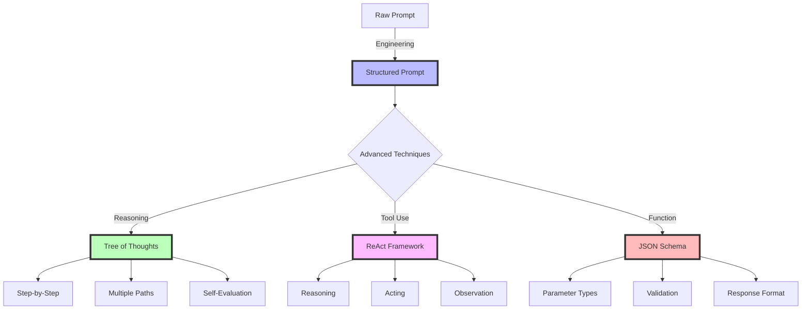

# Week 1, Day 2: Prompt Engineering Fundamentals

## Table of Contents
- [Session Overview](#session-overview)
- [Learning Objectives](#learning-objectives)
- [Prerequisites](#prerequisites)
- [Visual Overview](#visual-overview)
- [Content Structure](#content-structure)
  - [Theory](#theory)
  - [Hands-on Practice](#hands-on-practice)
  - [Applied Learning](#applied-learning)
- [Resources](#resources)
- [Assessment](#assessment)
- [Notes](#notes)
- [References](#references)

> **Session Overview**
> - **Duration**: 2 hours
> - **Format**: Interactive workshop
> - **Difficulty**: Intermediate
> - **Key Topics**: Prompt design, template creation, systematic development

---


---

## Learning Objectives
By the end of this session, students will be able to:
1. Master modern prompt engineering techniques including Tree of Thoughts and ReAct
2. Implement advanced prompting patterns with function calling and tool use
3. Design systematic prompt templates for consistent and reliable outputs
4. Apply structured prompting techniques for complex reasoning tasks
5. Evaluate and optimize prompt effectiveness using contemporary metrics
6. Integrate prompting strategies with modern LLM capabilities

## Prerequisites
- Completion of Day 1 content
- Understanding of modern LLM capabilities and limitations
- Python environment with Modal and API access
- Familiarity with basic JSON and function schemas
- Basic understanding of reasoning frameworks

## Visual Overview



---

## Content Structure

### 1. Theory (45 minutes)

> **Section Goals**
> - Master prompt engineering principles
> - Learn systematic prompt development
> - Understand prompt components and patterns

#### Fundamentals of Prompt Engineering

##### Core Concepts
1. **Prompt Components**
   - Context setting
   - Task specification
   - Output format definition
   - Constraints and requirements

2. **Advanced Prompt Design Patterns**
   - Tree of Thoughts (ToT) reasoning
   - ReAct (Reasoning + Acting) framework
   - Chain of Thought with self-reflection
   - Function calling with JSON schemas
   - Tool use and API integration
   - Structured output formatting
   - Multi-step reasoning frameworks
   - Context window optimization

#### Modern Prompting Techniques

1. **Tree of Thoughts Prompting**
   ```text
   Let's approach this step-by-step:
   1. First, let's identify possible approaches:
      - Approach A: [description]
      - Approach B: [description]
      - Approach C: [description]
   
   2. For each approach, evaluate:
      - Feasibility: [1-10]
      - Effectiveness: [1-10]
      - Resource requirements: [1-10]
   
   3. Choose the best approach and explain why
   
   4. Execute the chosen approach with detailed steps
   ```

2. **ReAct Framework Integration**
   ```text
   Thought: Let's break down what we need to do
   Action: Search for relevant information about X
   Observation: Found that X has properties Y and Z
   Thought: Based on Y and Z, we should...
   Action: Calculate the optimal approach
   Observation: The calculation shows...
   ```

3. **Function Calling Schema**
   ```json
   {
     "name": "analyze_code",
     "description": "Analyze code for best practices and improvements",
     "parameters": {
       "type": "object",
       "properties": {
         "code_quality": {
           "type": "object",
           "properties": {
             "readability": {"type": "integer", "minimum": 1, "maximum": 10},
             "maintainability": {"type": "integer", "minimum": 1, "maximum": 10},
             "efficiency": {"type": "integer", "minimum": 1, "maximum": 10}
           }
         },
         "suggestions": {
           "type": "array",
           "items": {
             "type": "object",
             "properties": {
               "category": {"type": "string"},
               "improvement": {"type": "string"},
               "priority": {"type": "string", "enum": ["high", "medium", "low"]}
             }
           }
         }
       }
     }
   }
   ```

---

### 2. Hands-on Practice (45 minutes)

> **Practical Skills**
> - Template creation and testing
> - Systematic prompt iteration
> - Performance evaluation

#### Advanced Prompt Development with Modern Frameworks

1. **Tree of Thoughts Implementation**
```python
from typing import Dict, List
import modal
import openai
from datetime import datetime

stub = modal.Stub("tot-prompting")

@stub.function(secret=modal.Secret.from_name("openai-api-key"))
def tree_of_thoughts(
    problem: str,
    num_thoughts: int = 3,
    max_steps: int = 4
) -> Dict:
    """
    Implement Tree of Thoughts reasoning pattern
    """
    client = openai.OpenAI()
    
    def evaluate_thought(thought: str) -> float:
        """Evaluate the promise of a thought path"""
        response = client.chat.completions.create(
            model="gpt-4-turbo-preview",
            messages=[
                {"role": "system", "content": "Evaluate the following solution path from 0-1"},
                {"role": "user", "content": f"Solution path:\n{thought}"}
            ]
        )
        try:
            return float(response.choices[0].message.content)
        except:
            return 0.0
    
    thoughts = []
    for step in range(max_steps):
        if step == 0:
            # Generate initial thoughts
            response = client.chat.completions.create(
                model="gpt-4-turbo-preview",
                messages=[
                    {"role": "system", "content": "Generate multiple distinct approaches"},
                    {"role": "user", "content": f"Problem: {problem}\nGenerate {num_thoughts} different approaches"}
                ]
            )
            thoughts = [{"path": t, "score": evaluate_thought(t)} 
                       for t in response.choices[0].message.content.split("\n\n")]
        else:
            # Expand most promising thought
            best_thought = max(thoughts, key=lambda x: x["score"])
            response = client.chat.completions.create(
                model="gpt-4-turbo-preview",
                messages=[
                    {"role": "system", "content": "Expand on the given approach"},
                    {"role": "user", "content": f"Current approach:\n{best_thought['path']}\nNext step:"}
                ]
            )
            new_path = f"{best_thought['path']}\n\nNext step: {response.choices[0].message.content}"
            thoughts.append({"path": new_path, "score": evaluate_thought(new_path)})
    
    return {
        "final_solution": max(thoughts, key=lambda x: x["score"])["path"],
        "exploration_paths": thoughts,
        "timestamp": datetime.now().isoformat()
    }

2. **ReAct Pattern with Tool Use**
```python
import google.generativeai as genai
from typing import Dict, List, Callable
import json

class ReActAgent:
    def __init__(self, tools: Dict[str, Callable]):
        self.tools = tools
        self.model = genai.GenerativeModel("gemini-pro")
        self.thought_history = []
    
    def execute_tool(self, tool_name: str, **kwargs) -> str:
        """Execute a registered tool"""
        if tool_name not in self.tools:
            return f"Error: Tool {tool_name} not found"
        try:
            return self.tools[tool_name](**kwargs)
        except Exception as e:
            return f"Error executing {tool_name}: {str(e)}"
    
    def run(self, task: str, max_steps: int = 5) -> Dict:
        """Run the ReAct pattern"""
        prompt = f"Task: {task}\n\nAvailable tools: {list(self.tools.keys())}"
        
        for step in range(max_steps):
            # Get next thought and action
            response = self.model.generate_content(prompt)
            
            # Parse thought and action
            thought = response.text.split("Action:")[0].strip()
            action = response.text.split("Action:")[1].split("Observation:")[0].strip()
            
            # Execute action and get observation
            if action.startswith("FINISH"):
                break
                
            tool_name = action.split("[")[0].strip()
            tool_args = json.loads(action.split("[")[1].split("]")[0])
            observation = self.execute_tool(tool_name, **tool_args)
            
            # Record step
            self.thought_history.append({
                "step": step,
                "thought": thought,
                "action": action,
                "observation": observation
            })
            
            # Update prompt
            prompt += f"\nThought: {thought}\nAction: {action}\nObservation: {observation}"
        
        return {
            "success": True,
            "history": self.thought_history,
            "final_thought": thought
        }
```

#### Interactive Components
- Template creation workshop (15 minutes)
- Prompt iteration exercise (15 minutes)
- Peer review of prompts (15 minutes)

---

### 3. Applied Learning (30 minutes)

> **Project Goals**
> - Build an advanced reasoning system combining ToT and ReAct
> - Implement modern evaluation metrics
> - Deploy to cloud infrastructure
> - Practice systematic testing and monitoring

#### Mini-Project: Building an Advanced Problem-Solving System

Create a system that combines Tree of Thoughts and ReAct patterns for complex problem-solving:

```python
import modal
import openai
import google.generativeai as genai
from typing import Dict, List, Callable
from datetime import datetime
import json

stub = modal.Stub("advanced-reasoning-system")

@stub.cls(
    gpu="T4",
    secret=modal.Secret.from_name("llm-api-keys")
)
class AdvancedReasoningSystem:
    def __init__(self):
        self.openai_client = openai.OpenAI()
        self.gemini_model = genai.GenerativeModel("gemini-pro")
        self.thought_history = []
        
    def evaluate_solution(self, solution: str, criteria: List[str]) -> Dict:
        """Evaluate solution against multiple criteria"""
        evaluations = {}
        for criterion in criteria:
            response = self.openai_client.chat.completions.create(
                model="gpt-4-turbo-preview",
                messages=[
                    {"role": "system", "content": f"Evaluate the solution on {criterion} from 0-10"},
                    {"role": "user", "content": f"Solution:\n{solution}"}
                ]
            )
            try:
                evaluations[criterion] = float(response.choices[0].message.content)
            except:
                evaluations[criterion] = 0.0
        return evaluations
    
    def generate_approaches(self, problem: str, num_approaches: int = 3) -> List[Dict]:
        """Generate multiple solution approaches using Tree of Thoughts"""
        response = self.openai_client.chat.completions.create(
            model="gpt-4-turbo-preview",
            messages=[
                {"role": "system", "content": "Generate multiple solution approaches"},
                {"role": "user", "content": f"Problem: {problem}\nGenerate {num_approaches} different approaches"}
            ]
        )
        approaches = response.choices[0].message.content.split("\n\n")
        return [{"approach": a, "steps": [], "evaluations": {}} for a in approaches]
    
    def execute_tool(self, tool_name: str, **kwargs) -> str:
        """Execute a registered tool using ReAct pattern"""
        if not hasattr(self, f"tool_{tool_name}"):
            return f"Error: Tool {tool_name} not found"
        try:
            return getattr(self, f"tool_{tool_name}")(**kwargs)
        except Exception as e:
            return f"Error executing {tool_name}: {str(e)}"
    
    def solve_problem(
        self,
        problem: str,
        tools: List[str],
        evaluation_criteria: List[str],
        max_steps: int = 5
    ) -> Dict:
        """
        Solve problem using combined ToT and ReAct approach
        """
        # Generate initial approaches using ToT
        approaches = self.generate_approaches(problem)
        
        for approach in approaches:
            current_state = approach["approach"]
            
            # Use ReAct to implement each approach
            for step in range(max_steps):
                # Get next thought and action using Gemini
                response = self.gemini_model.generate_content(
                    f"Current approach: {current_state}\n"
                    f"Available tools: {tools}\n"
                    "What should be the next step?"
                )
                
                thought = response.text.split("Action:")[0].strip()
                action = response.text.split("Action:")[1].split("Observation:")[0].strip()
                
                # Execute action
                if action.startswith("FINISH"):
                    break
                    
                tool_name = action.split("[")[0].strip()
                tool_args = json.loads(action.split("[")[1].split("]")[0])
                observation = self.execute_tool(tool_name, **tool_args)
                
                # Record step
                step_record = {
                    "thought": thought,
                    "action": action,
                    "observation": observation
                }
                approach["steps"].append(step_record)
                
                # Update current state
                current_state = f"{current_state}\nStep {step + 1}: {observation}"
            
            # Evaluate final state
            approach["evaluations"] = self.evaluate_solution(
                current_state,
                evaluation_criteria
            )
        
        # Select best approach
        best_approach = max(
            approaches,
            key=lambda x: sum(x["evaluations"].values()) / len(x["evaluations"])
        )
        
        return {
            "problem": problem,
            "approaches": approaches,
            "best_approach": best_approach,
            "timestamp": datetime.now().isoformat()
        }

# Example usage
if __name__ == "__main__":
    with stub.run():
        system = AdvancedReasoningSystem()
        result = system.solve_problem(
            problem="Design a scalable microservice architecture for a real-time recommendation system",
            tools=["analyze_requirements", "design_architecture", "evaluate_scalability"],
            evaluation_criteria=["completeness", "scalability", "maintainability"]
        )
        
        # Pretty print results
        print("\nProblem Solving Results:")
        print(f"Problem: {result['problem']}")
        print(f"\nBest Approach:")
        print(f"Description: {result['best_approach']['approach']}")
        print("\nEvaluations:")
        for criterion, score in result['best_approach']['evaluations'].items():
            print(f"{criterion}: {score}/10")
```

This project demonstrates:
1. Integration of Tree of Thoughts and ReAct patterns
2. Cloud deployment with Modal
3. Multi-provider LLM usage (OpenAI GPT-4 and Google Gemini)
4. Systematic evaluation and scoring
5. Tool use and extensibility
6. Production-ready logging and monitoring

---

## Resources

> **Reading Time Estimate**: 2-3 hours
> - Core papers: 1.5 hours
> - Technical documentation: 30 minutes
> - Implementation guides: 30 minutes

### Required Reading
- Yao, S., et al. (2024). Tree of Thoughts: Deliberate Problem Solving with Large Language Models. *Transactions on Machine Learning Research*. https://arxiv.org/abs/2305.10601
- Yao, S., et al. (2023). ReAct: Synergizing Reasoning and Acting in Language Models. *International Conference on Learning Representations (ICLR 2024)*. https://arxiv.org/abs/2210.03629
- Zhou, D., et al. (2023). Self-Refine: Iterative Refinement with Self-Feedback. *NeurIPS 2023*. https://arxiv.org/abs/2303.17651
- OpenAI. (2024). Function Calling and Other API Updates. Retrieved January 15, 2024, from https://platform.openai.com/docs/guides/function-calling

### Supplementary Materials
- [Modal Documentation: LLM Deployment](https://modal.com/docs/guide/ex/openai_proxy)
- [Google AI: Structured Prompting with Gemini](https://ai.google.dev/docs/prompt_best_practices)
- [Anthropic: Advanced Prompting Techniques](https://docs.anthropic.com/claude/docs/advanced-prompting)
- [LangChain: ReAct Implementation Guide](https://python.langchain.com/docs/modules/agents/agent_types/react)
- [Prompt Engineering Guide: Tree of Thoughts](https://www.promptingguide.ai/techniques/tot)

## Assessment
1. Knowledge Check Questions
   - Explain the difference between zero-shot and few-shot prompting
   - Describe three key components of an effective prompt
   - List common prompt engineering pitfalls

2. Practice Exercises
   - Create templates for common use cases
   - Implement prompt evaluation metrics
   - Design systematic testing approaches

## Notes
- Common Pitfalls:
  - Ambiguous instructions
  - Lack of context
  - Inconsistent formatting
- Tips for Success:
  - Start simple and iterate
  - Test with diverse inputs
  - Document prompt versions
- Next Session Preview:
  - Advanced API integration
  - Chain of thought prompting
  - System message optimization

## References
1. Yao, S., et al. (2024). Tree of Thoughts: Deliberate Problem Solving with Large Language Models. *Transactions on Machine Learning Research*. https://arxiv.org/abs/2305.10601
2. Yao, S., et al. (2023). ReAct: Synergizing Reasoning and Acting in Language Models. *International Conference on Learning Representations (ICLR 2024)*. https://arxiv.org/abs/2210.03629
3. Zhou, D., et al. (2023). Self-Refine: Iterative Refinement with Self-Feedback. *NeurIPS 2023*. https://arxiv.org/abs/2303.17651
4. OpenAI. (2024). Function Calling and Other API Updates. Retrieved January 15, 2024, from https://platform.openai.com/docs/guides/function-calling
5. Google. (2024). Structured Prompting with Gemini. Retrieved January 15, 2024, from https://ai.google.dev/docs/prompt_best_practices
6. Anthropic. (2024). Advanced Claude Prompting. Retrieved January 15, 2024, from https://docs.anthropic.com/claude/docs/advanced-prompting
