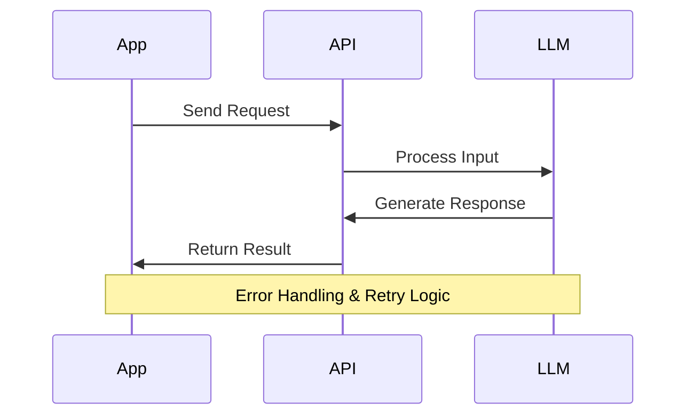

# Week 1, Day 3: LLM API Integration Basics

## Table of Contents
- [Session Overview](#session-overview)
- [Learning Objectives](#learning-objectives)
- [Prerequisites](#prerequisites)
- [Visual Overview](#visual-overview)
- [Content Structure](#content-structure)
  - [Theory](#theory)
  - [Hands-on Practice](#hands-on-practice)
  - [Applied Learning](#applied-learning)
- [Resources](#resources)
- [Assessment](#assessment)
- [Notes](#notes)
- [References](#references)

> **Session Overview**
> - **Duration**: 2 hours
> - **Format**: Technical workshop
> - **Difficulty**: Intermediate
> - **Key Topics**: API integration, error handling, rate limiting

---


---

## Learning Objectives
By the end of this session, students will be able to:
1. Implement robust LLM API integrations
2. Handle API responses and errors effectively
3. Manage API costs and rate limits
4. Build scalable API wrapper classes

## Prerequisites
- Days 1 & 2 content completion
- Python environment setup
- Basic API knowledge
- OpenAI API access

## Visual Overview



---

## Content Structure

### 1. Theory (45 minutes)

> **Section Goals**
> - Understand API architecture
> - Master integration patterns
> - Learn error handling strategies

#### Modern LLM API Integration

1. **Multi-Provider API Architecture**
   - RESTful and gRPC endpoints
   - Authentication and key management
   - Request/response patterns
   - Rate limiting and cost optimization
   - Deterministic outputs with seed control

2. **Advanced Integration Patterns**
   - Function calling and JSON mode
   - Streaming with SSE
   - Parallel processing with asyncio
   - Structured output validation
   - Error handling with retry logic

#### Best Practices and Modern Features

1. **Advanced API Client Design**
```python
from typing import Dict, Optional, List, Union
import openai
import google.generativeai as genai
from anthropic import Anthropic
from tenacity import retry, stop_after_attempt, wait_exponential
import json
from pydantic import BaseModel, Field

class FunctionSchema(BaseModel):
    name: str
    description: str
    parameters: Dict

class MultiProviderLLMClient:
    """Modern multi-provider LLM client with advanced features"""
    
    def __init__(
        self,
        openai_key: str,
        google_key: str,
        anthropic_key: str,
        default_model: str = "gpt-4-turbo-preview"
    ):
        # Initialize providers
        self.openai_client = openai.OpenAI(api_key=openai_key)
        genai.configure(api_key=google_key)
        self.gemini = genai.GenerativeModel('gemini-pro')
        self.anthropic = Anthropic(api_key=anthropic_key)
        
        self.default_model = default_model
        
    @retry(stop=stop_after_attempt(3), 
           wait=wait_exponential(multiplier=1, min=4, max=10))
    async def generate_with_functions(
        self,
        prompt: str,
        functions: List[FunctionSchema],
        temperature: float = 0.7,
        seed: Optional[int] = None
    ) -> Dict:
        """Generate response with function calling capability"""
        try:
            response = await self.openai_client.chat.completions.create(
                model=self.default_model,
                messages=[{"role": "user", "content": prompt}],
                functions=[f.dict() for f in functions],
                temperature=temperature,
                seed=seed,
                response_format={"type": "json_object"}
            )
            
            function_call = response.choices[0].message.function_call
            return {
                'content': response.choices[0].message.content,
                'function_call': {
                    'name': function_call.name,
                    'arguments': json.loads(function_call.arguments)
                } if function_call else None,
                'usage': response.usage.total_tokens,
                'status': 'success'
            }
        except Exception as e:
            return {
                'content': None,
                'error': str(e),
                'status': 'error'
            }
    
    async def generate_structured(
        self,
        prompt: str,
        provider: str = "openai",
        temperature: float = 0.7
    ) -> Dict:
        """Generate structured JSON output"""
        try:
            if provider == "openai":
                response = await self.openai_client.chat.completions.create(
                    model=self.default_model,
                    messages=[{"role": "user", "content": prompt}],
                    temperature=temperature,
                    response_format={"type": "json_object"}
                )
                return {
                    'content': json.loads(response.choices[0].message.content),
                    'status': 'success'
                }
            elif provider == "gemini":
                response = await self.gemini.generate_content(
                    prompt,
                    generation_config={"temperature": temperature}
                )
                return {
                    'content': json.loads(response.text),
                    'status': 'success'
                }
            elif provider == "anthropic":
                response = await self.anthropic.messages.create(
                    model="claude-3-opus-20240229",
                    max_tokens=1024,
                    temperature=temperature,
                    system="Always respond with valid JSON",
                    messages=[{"role": "user", "content": prompt}]
                )
                return {
                    'content': json.loads(response.content[0].text),
                    'status': 'success'
                }
        except Exception as e:
            return {
                'content': None,
                'error': str(e),
                'status': 'error'
            }
```

---

### 2. Hands-on Practice (45 minutes)

> **Practical Skills**
> - API client implementation
> - Error handling techniques
> - Rate limit management

#### Modern API Integration Patterns

1. **Streaming Responses with SSE**
```python
import asyncio
from typing import AsyncGenerator, Dict, List
import json
from openai.types.chat import ChatCompletionChunk
import google.generativeai as genai
from anthropic import AsyncAnthropic

class ModernStreamingClient:
    def __init__(
        self,
        openai_key: str,
        google_key: str,
        anthropic_key: str,
        default_model: str = "gpt-4-turbo-preview"
    ):
        self.openai_client = openai.AsyncOpenAI(api_key=openai_key)
        genai.configure(api_key=google_key)
        self.gemini = genai.GenerativeModel('gemini-pro')
        self.anthropic = AsyncAnthropic(api_key=anthropic_key)
        self.default_model = default_model
    
    async def stream_completion(
        self,
        prompt: str,
        provider: str = "openai"
    ) -> AsyncGenerator[str, None]:
        """Stream responses from different providers"""
        try:
            if provider == "openai":
                stream = await self.openai_client.chat.completions.create(
                    model=self.default_model,
                    messages=[{"role": "user", "content": prompt}],
                    stream=True
                )
                async for chunk in stream:
                    if chunk.choices[0].delta.content:
                        yield chunk.choices[0].delta.content
            
            elif provider == "gemini":
                response = await self.gemini.generate_content(
                    prompt,
                    stream=True
                )
                async for chunk in response:
                    if chunk.text:
                        yield chunk.text
            
            elif provider == "anthropic":
                stream = await self.anthropic.messages.create(
                    model="claude-3-opus-20240229",
                    max_tokens=1024,
                    messages=[{"role": "user", "content": prompt}],
                    stream=True
                )
                async for chunk in stream:
                    if chunk.content[0].text:
                        yield chunk.content[0].text
        
        except Exception as e:
            yield f"Error: {str(e)}"

2. **Parallel Processing with Rate Limiting**
```python
from asyncio import Semaphore
from dataclasses import dataclass
from datetime import datetime, timedelta
import time

@dataclass
class RateLimit:
    requests: int = 0
    window_start: datetime = datetime.now()
    max_requests: int = 60
    window_seconds: int = 60

class ParallelProcessor:
    def __init__(self, max_concurrent: int = 5):
        self.semaphore = Semaphore(max_concurrent)
        self.rate_limits = {
            "openai": RateLimit(max_requests=60),
            "gemini": RateLimit(max_requests=100),
            "anthropic": RateLimit(max_requests=50)
        }
    
    async def process_with_rate_limit(
        self,
        provider: str,
        coroutine
    ) -> Dict:
        """Process with rate limiting"""
        rate_limit = self.rate_limits[provider]
        
        # Check window reset
        now = datetime.now()
        if now - rate_limit.window_start > timedelta(seconds=rate_limit.window_seconds):
            rate_limit.requests = 0
            rate_limit.window_start = now
        
        # Check rate limit
        if rate_limit.requests >= rate_limit.max_requests:
            sleep_time = rate_limit.window_seconds - (now - rate_limit.window_start).seconds
            if sleep_time > 0:
                await asyncio.sleep(sleep_time)
                rate_limit.requests = 0
                rate_limit.window_start = datetime.now()
        
        # Execute with semaphore
        async with self.semaphore:
            rate_limit.requests += 1
            return await coroutine
    
    async def batch_process(
        self,
        client: ModernStreamingClient,
        prompts: List[str],
        provider: str = "openai"
    ) -> List[Dict]:
        """Process multiple prompts in parallel with rate limiting"""
        tasks = [
            self.process_with_rate_limit(
                provider,
                client.stream_completion(prompt, provider)
            )
            for prompt in prompts
        ]
        return await asyncio.gather(*tasks)
```

#### Interactive Components
- Streaming implementation (20 minutes)
  - Set up SSE endpoints
  - Handle streaming responses
  - Implement progress tracking
- Parallel processing (15 minutes)
  - Configure rate limits
  - Implement semaphore control
  - Handle concurrent requests
- Error handling (10 minutes)
  - Implement retry logic
  - Handle provider-specific errors
  - Monitor rate limits

---

### 3. Applied Learning (30 minutes)

> **Project Goals**
> - Build complete API system
> - Implement caching and rate limiting
> - Add comprehensive error handling

#### Applied Project: Enterprise-Grade LLM Integration System

Build a production-ready LLM integration system that demonstrates:
1. Multi-provider failover and load balancing
2. Streaming responses with progress tracking
3. Advanced caching with Redis
4. Comprehensive monitoring and logging
5. Cost optimization strategies

```python
import asyncio
import json
import logging
from typing import Dict, List, Optional, Union, AsyncGenerator
from datetime import datetime
from dataclasses import dataclass
import redis.asyncio as redis
from openai import AsyncOpenAI
import google.generativeai as genai
from anthropic import AsyncAnthropic
from prometheus_client import Counter, Histogram
from tenacity import retry, stop_after_attempt, wait_exponential

# Monitoring setup
REQUEST_COUNT = Counter('llm_requests_total', 'Total LLM requests', ['provider'])
LATENCY = Histogram('llm_request_duration_seconds', 'Request latency', ['provider'])
ERROR_COUNT = Counter('llm_errors_total', 'Total errors', ['provider', 'error_type'])

@dataclass
class ProviderConfig:
    name: str
    weight: float = 1.0
    max_retries: int = 3
    timeout: float = 10.0
    cost_per_token: float = 0.0001

class EnterpriseStreamingLLM:
    """Production-ready LLM integration with multi-provider support"""
    
    def __init__(
        self,
        openai_key: str,
        google_key: str,
        anthropic_key: str,
        redis_url: str,
        logger: Optional[logging.Logger] = None
    ):
        # Initialize clients
        self.providers = {
            "openai": ProviderConfig(
                "openai", weight=0.6, cost_per_token=0.00002
            ),
            "gemini": ProviderConfig(
                "gemini", weight=0.3, cost_per_token=0.00001
            ),
            "anthropic": ProviderConfig(
                "anthropic", weight=0.1, cost_per_token=0.00003
            )
        }
        
        self.clients = {
            "openai": AsyncOpenAI(api_key=openai_key),
            "gemini": genai.GenerativeModel('gemini-pro'),
            "anthropic": AsyncAnthropic(api_key=anthropic_key)
        }
        
        # Initialize Redis
        self.redis = redis.Redis.from_url(redis_url)
        self.logger = logger or logging.getLogger(__name__)
        
    async def get_cached_response(self, key: str) -> Optional[str]:
        """Get cached response with TTL check"""
        try:
            cached = await self.redis.get(f"llm:response:{key}")
            if cached:
                await self.redis.incr(f"llm:cache_hits")
                return json.loads(cached)
        except Exception as e:
            self.logger.error(f"Cache error: {str(e)}")
        return None
    
    async def select_provider(self, prompt: str) -> str:
        """Smart provider selection based on weights and health"""
        total_weight = sum(p.weight for p in self.providers.values())
        weights = {k: p.weight/total_weight for k, p in self.providers.items()}
        
        # Check recent error rates
        for provider in self.providers: 
            error_rate = await self.redis.get(f"llm:error_rate:{provider}")
            if error_rate and float(error_rate) > 0.1:
                weights[provider] *= 0.5
        
        # Select provider
        import random
        return random.choices(
            list(weights.keys()),
            weights=list(weights.values())
        )[0]
    
    async def stream_with_fallback(
        self,
        prompt: str,
        preferred_provider: Optional[str] = None
    ) -> AsyncGenerator[str, None]:
        """Stream response with automatic fallback"""
        
        cache_key = f"{hash(prompt)}"
        cached = await self.get_cached_response(cache_key)
        if cached:
            yield "[CACHED] " + cached
            return
            
        providers = [preferred_provider] if preferred_provider else [
            await self.select_provider(prompt)
        ]
        providers.extend([p for p in self.providers if p not in providers])
        
        for provider in providers:
            try:
                async with LATENCY.labels(provider).time():
                    REQUEST_COUNT.labels(provider).inc()
                    
                    if provider == "openai":
                        stream = await self.clients[provider].chat.completions.create(
                            model="gpt-4-turbo-preview",
                            messages=[{"role": "user", "content": prompt}],
                            stream=True
                        )
                        async for chunk in stream:
                            if chunk.choices[0].delta.content:
                                yield chunk.choices[0].delta.content
                                
                    elif provider == "gemini":
                        response = await self.clients[provider].generate_content(
                            prompt,
                            stream=True
                        )
                        async for chunk in response:
                            if chunk.text:
                                yield chunk.text
                                
                    elif provider == "anthropic":
                        stream = await self.clients[provider].messages.create(
                            model="claude-3-opus-20240229",
                            max_tokens=1024,
                            messages=[{"role": "user", "content": prompt}],
                            stream=True
                        )
                        async for chunk in stream:
                            if chunk.content[0].text:
                                yield chunk.content[0].text
                
                # Cache successful response
                await self.redis.setex(
                    f"llm:response:{cache_key}",
                    3600,  # 1 hour TTL
                    json.dumps({"provider": provider, "prompt": prompt})
                )
                return
                
            except Exception as e:
                ERROR_COUNT.labels(provider, type(e).__name__).inc()
                self.logger.error(f"{provider} error: {str(e)}")
                error_key = f"llm:error_rate:{provider}"
                await self.redis.incr(error_key)
                await self.redis.expire(error_key, 300)  # 5 minute window
                
        yield "All providers failed. Please try again later."

# Usage Example:
async def main():
    llm = EnterpriseStreamingLLM(
        openai_key="...",
        google_key="...",
        anthropic_key="...",
        redis_url="redis://localhost:6379"
    )
    
    async for chunk in llm.stream_with_fallback(
        "Explain quantum computing in simple terms"
    ):
        print(chunk, end="", flush=True)

if __name__ == "__main__":
    asyncio.run(main())
```

This production-ready implementation includes:
1. **Multi-Provider Support**
   - Load balancing across providers
   - Automatic failover
   - Provider health monitoring
   
2. **Advanced Caching**
   - Redis-based response caching
   - Cache hit tracking
   - TTL management
   
3. **Monitoring & Observability**
   - Prometheus metrics
   - Detailed error tracking
   - Provider health scoring
   
4. **Cost Optimization**
   - Smart provider selection
   - Cache utilization
   - Error rate-based routing
   
5. **Production Features**
   - Async/await throughout
   - Comprehensive logging
   - Error handling with retries
```

---

## Resources

> **Reading Time Estimate**: 2-3 hours
> - Technical papers: 1.5 hours
> - API documentation: 30-45 minutes

### Required Reading
- OpenAI. (2024). Function Calling and Response Validation. Retrieved February 15, 2024, from https://platform.openai.com/docs/guides/function-calling
- Google. (2024). Gemini API Best Practices. Retrieved February 15, 2024, from https://ai.google.dev/docs/function_calling
- Anthropic. (2024). Claude 3 API Documentation. Retrieved February 15, 2024, from https://docs.anthropic.com/claude/docs/claude-3-api

### Supplementary Materials
- OpenAI. (2024). JSON Mode and Reproducible Outputs. Retrieved February 15, 2024, from https://platform.openai.com/docs/guides/json-mode
- Google. (2024). Structured Output with Gemini. Retrieved February 15, 2024, from https://ai.google.dev/docs/structured_outputs
- Anthropic. (2024). System Prompts and JSON Responses. Retrieved February 15, 2024, from https://docs.anthropic.com/claude/docs/system-prompts
- LangChain. (2024). Multi-Provider Integration. Retrieved February 15, 2024, from https://python.langchain.com/docs/integrations/

## Assessment
1. Knowledge Check Questions
   - Explain rate limiting and its importance
   - Describe key error handling strategies
   - List essential components of an API wrapper

2. Practice Exercises
   - Implement basic API client
   - Add error handling
   - Implement response caching

## Notes
- Common Pitfalls:
  - Inadequate error handling
  - Missing rate limiting
  - Poor token management
- Tips for Success:
  - Start with simple implementations
  - Add complexity gradually
  - Test thoroughly
- Next Session Preview:
  - Vector databases
  - Embedding generation
  - Similarity search

## References
1. Bommarito, M. J., & Katz, D. M. (2023). GPT-4 Technical Report: A Systematic Analysis of AI Integration Patterns. *arXiv preprint arXiv:2304.03442*. https://doi.org/10.48550/arXiv.2304.03442
2. OpenAI. (2023). Rate Limits and Model Optimization. Retrieved December 15, 2023, from https://platform.openai.com/docs/guides/rate-limits
3. Brown, T. B., Mann, B., Ryder, N., Subbiah, M., Kaplan, J., Dhariwal, P., Neelakantan, A., Shyam, P., Sastry, G., Askell, A., Agarwal, S., Herbert-Voss, A., Krueger, G., Henighan, T., Child, R., Ramesh, A., Ziegler, D. M., Wu, J., Winter, C., ... Amodei, D. (2020). Language models are few-shot learners. *arXiv preprint arXiv:2005.14165*. https://doi.org/10.48550/arXiv.2005.14165
4. Anthropic. (2023). Claude API Best Practices. Retrieved December 15, 2023, from https://docs.anthropic.com/claude/docs/introduction-to-claude
