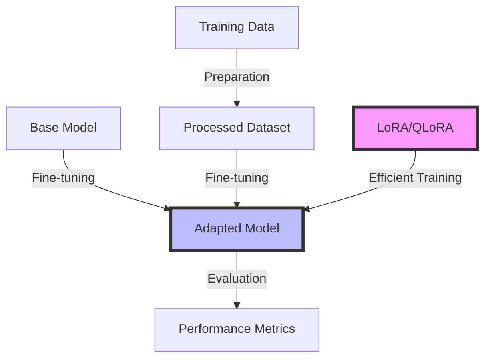

# Week 1, Day 4: Fine-tuning Basics

## Table of Contents
- [Session Overview](#session-overview)
- [Learning Objectives](#learning-objectives)
- [Prerequisites](#prerequisites)
- [Visual Overview](#visual-overview)
- [Content Structure](#content-structure)
  - [Theory](#theory)
  - [Hands-on Practice](#hands-on-practice)
  - [Applied Learning](#applied-learning)
- [Resources](#resources)
- [Assessment](#assessment)
- [Notes](#notes)
- [References](#references)

> **Session Overview**
> - **Duration**: 2 hours
> - **Format**: Technical deep-dive
> - **Difficulty**: Intermediate-Advanced
> - **Key Topics**: Vector embeddings, similarity search, database integration

---


---

## Learning Objectives
By the end of this session, students will be able to:
1. Understand modern fine-tuning approaches and their applications
2. Implement parameter-efficient fine-tuning using LoRA and QLoRA
3. Fine-tune models using OpenAI and Google's APIs
4. Evaluate and optimize fine-tuned models
5. Apply best practices for dataset preparation and training

## Prerequisites
- Previous days' content completion
- Python environment setup
- Basic understanding of neural networks
- Familiarity with PyTorch or TensorFlow
- Access to GPU resources (optional but recommended)

## Visual Overview



---

## Content Structure

### 1. Theory (45 minutes)

> **Section Goals**
> - Understand modern fine-tuning approaches
> - Master parameter-efficient techniques
> - Learn evaluation strategies

#### Modern Fine-tuning Approaches
1. **Understanding Fine-tuning**
   - Base model selection
   - Training data preparation
   - Hyperparameter optimization
   - Evaluation metrics

2. **Parameter-Efficient Methods**
   - LoRA (Low-Rank Adaptation)
   - QLoRA (Quantized LoRA)
   - Prompt tuning
   - Adapter layers

#### Implementation Patterns
```python
from typing import List, Dict, Optional
import torch
from transformers import (
    AutoModelForCausalLM,
    AutoTokenizer,
    TrainingArguments,
    Trainer
)
from peft import (
    LoraConfig,
    get_peft_model,
    prepare_model_for_kbit_training,
    TaskType
)
from datasets import Dataset
import evaluate

class ModernFineTuner:
    """Modern fine-tuning implementation with LoRA/QLoRA support"""
    
    def __init__(
        self,
        base_model: str = "mistralai/Mistral-7B-v0.1",
        device: str = "cuda" if torch.cuda.is_available() else "cpu"
    ):
        self.device = device
        self.tokenizer = AutoTokenizer.from_pretrained(base_model)
        
        # Load model in 4-bit precision for QLoRA
        self.model = AutoModelForCausalLM.from_pretrained(
            base_model,
            load_in_4bit=True,
            torch_dtype=torch.float16,
            device_map="auto"
        )
        
        # Prepare model for QLoRA training
        self.model = prepare_model_for_kbit_training(self.model)
    
    def prepare_lora_config(
        self,
        r: int = 16,
        lora_alpha: int = 32,
        target_modules: List[str] = ["q_proj", "v_proj"]
    ) -> LoraConfig:
        """Configure LoRA parameters"""
        return LoraConfig(
            r=r,
            lora_alpha=lora_alpha,
            target_modules=target_modules,
            lora_dropout=0.05,
            bias="none",
            task_type=TaskType.CAUSAL_LM
        )
    
    def prepare_training_args(
        self,
        output_dir: str,
        num_train_epochs: int = 3,
        per_device_train_batch_size: int = 4,
        gradient_accumulation_steps: int = 4
    ) -> TrainingArguments:
        """Configure training parameters"""
        return TrainingArguments(
            output_dir=output_dir,
            num_train_epochs=num_train_epochs,
            per_device_train_batch_size=per_device_train_batch_size,
            gradient_accumulation_steps=gradient_accumulation_steps,
            optim="paged_adamw_32bit",
            save_steps=50,
            logging_steps=50,
            learning_rate=2e-4,
            fp16=True,
            max_grad_norm=0.3,
            warmup_ratio=0.03,
            group_by_length=True,
            lr_scheduler_type="constant"
        )
    
    def train(
        self,
        dataset: Dataset,
        output_dir: str,
        lora_config: Optional[LoraConfig] = None
    ):
        """Fine-tune the model using LoRA/QLoRA"""
        if lora_config is None:
            lora_config = self.prepare_lora_config()
        
        # Apply LoRA configuration
        model = get_peft_model(self.model, lora_config)
        
        # Prepare training arguments
        training_args = self.prepare_training_args(output_dir)
        
        # Initialize trainer
        trainer = Trainer(
            model=model,
            args=training_args,
            train_dataset=dataset,
            data_collator=lambda data: {
                'input_ids': torch.stack([f['input_ids'] for f in data]),
                'attention_mask': torch.stack([f['attention_mask'] for f in data]),
                'labels': torch.stack([f['input_ids'] for f in data])
            }
        )
        
        # Train the model
        trainer.train()
        
        # Save the final model
        trainer.save_model(output_dir)
```

---

### 2. Hands-on Practice (45 minutes)

> **Practical Skills**
> - Fine-tune models using provider APIs
> - Implement efficient training strategies
> - Evaluate model performance

#### API-Based Fine-tuning
```python
from typing import List, Dict, Optional
import json
from openai import OpenAI
import google.generativeai as genai
from datasets import Dataset
import pandas as pd

class APIFineTuner:
    """Fine-tuning implementation using OpenAI and Google APIs"""
    
    def __init__(
        self,
        openai_key: str,
        google_key: str
    ):
        self.openai_client = OpenAI(api_key=openai_key)
        genai.configure(api_key=google_key)
    
    def prepare_openai_data(
        self,
        dataset: List[Dict[str, str]],
        output_file: str = "training_data.jsonl"
    ) -> str:
        """Prepare data for OpenAI fine-tuning"""
        with open(output_file, 'w') as f:
            for item in dataset:
                # Format for chat fine-tuning
                messages = [
                    {"role": "system", "content": "You are a helpful assistant."},
                    {"role": "user", "content": item["prompt"]},
                    {"role": "assistant", "content": item["completion"]}
                ]
                f.write(json.dumps({"messages": messages}) + '\n')
        return output_file
    
    async def finetune_openai(
        self,
        training_file: str,
        model: str = "gpt-3.5-turbo",
        hyperparameters: Optional[Dict] = None
    ) -> str:
        """Fine-tune using OpenAI's API"""
        # Upload training file
        file = await self.openai_client.files.create(
            file=open(training_file, "rb"),
            purpose="fine-tune"
        )
        
        # Start fine-tuning job
        job = await self.openai_client.fine_tuning.jobs.create(
            training_file=file.id,
            model=model,
            hyperparameters=hyperparameters or {
                "n_epochs": 3,
                "batch_size": 4,
                "learning_rate_multiplier": 0.1
            }
        )
        
        return job.id
    
    def prepare_google_data(
        self,
        dataset: List[Dict[str, str]]
    ) -> Dataset:
        """Prepare data for Google's Gemini fine-tuning"""
        df = pd.DataFrame(dataset)
        return Dataset.from_pandas(df)
    
    async def finetune_gemini(
        self,
        dataset: Dataset,
        model: str = "gemini-pro"
    ):
        """Fine-tune using Google's Gemini API"""
        # Note: As of early 2024, Gemini fine-tuning is in limited preview
        # This is a placeholder for the upcoming API
        tuned_model = await genai.fine_tune.create(
            base_model=model,
            training_data=dataset,
            tune_config={
                "batch_size": 4,
                "learning_rate": 1e-4,
                "num_epochs": 3
            }
        )
        return tuned_model
    
    async def evaluate_model(
        self,
        model_id: str,
        test_cases: List[Dict[str, str]],
        provider: str = "openai"
    ) -> Dict[str, float]:
        """Evaluate fine-tuned model performance"""
        results = []
        
        for test in test_cases:
            if provider == "openai":
                response = await self.openai_client.chat.completions.create(
                    model=model_id,
                    messages=[
                        {"role": "user", "content": test["prompt"]}
                    ]
                )
                prediction = response.choices[0].message.content
            else:  # gemini
                model = genai.GenerativeModel(model_id)
                response = await model.generate_content(test["prompt"])
                prediction = response.text
            
            # Calculate metrics (e.g., ROUGE, exact match)
            results.append({
                "prompt": test["prompt"],
                "expected": test["completion"],
                "predicted": prediction
            })
        
        # Calculate aggregate metrics
        return {
            "exact_match": sum(
                r["expected"] == r["predicted"] for r in results
            ) / len(results)
        }
```

#### Interactive Components
- Data preparation for fine-tuning (15 minutes)
  - Format training data
  - Implement data validation
  - Handle different data types
- Model fine-tuning (20 minutes)
  - Configure hyperparameters
  - Monitor training progress
  - Handle training errors
- Model evaluation (10 minutes)
  - Test model performance
  - Calculate metrics
  - Compare with baseline

---

### 3. Applied Learning (30 minutes)

> **Project Goals**
> - Build a specialized chatbot assistant
> - Fine-tune models for specific domains
> - Implement hybrid fine-tuning approach

#### Mini-Project: Domain-Specific Assistant
Build a specialized chatbot that combines:
1. Local fine-tuning with LoRA
2. API-based fine-tuning
3. Performance evaluation
4. Cost optimization

```python
from typing import List, Dict, Optional, Union
import asyncio
import json
import torch
from transformers import AutoTokenizer
from peft import PeftModel, LoraConfig
from datasets import Dataset
import pandas as pd
import evaluate

class HybridFineTunedAssistant:
    """Assistant combining local and API-based fine-tuning"""
    
    def __init__(
        self,
        local_tuner: ModernFineTuner,
        api_tuner: APIFineTuner,
        domain: str,
        evaluation_metric: str = "rouge"
    ):
        self.local_tuner = local_tuner
        self.api_tuner = api_tuner
        self.domain = domain
        self.metric = evaluate.load(evaluation_metric)
        self.models = {}
    
    async def prepare_training_data(
        self,
        raw_data: List[Dict[str, str]],
        validation_split: float = 0.1
    ) -> Dict[str, Dataset]:
        """Prepare data for both local and API fine-tuning"""
        # Convert to DataFrame for easier splitting
        df = pd.DataFrame(raw_data)
        
        # Split into train/validation
        val_size = int(len(df) * validation_split)
        train_df = df[val_size:]
        val_df = df[:val_size]
        
        # Prepare for different training approaches
        return {
            "local": Dataset.from_pandas(train_df),
            "api": self.api_tuner.prepare_openai_data(
                train_df.to_dict('records')
            ),
            "validation": Dataset.from_pandas(val_df)
        }
    
    async def train_models(
        self,
        datasets: Dict[str, Dataset],
        local_config: Optional[LoraConfig] = None
    ):
        """Train models using both approaches"""
        # Start both training processes
        training_tasks = [
            # Local LoRA fine-tuning
            self.local_tuner.train(
                datasets["local"],
                f"models/{self.domain}_local",
                local_config
            ),
            # API-based fine-tuning
            self.api_tuner.finetune_openai(
                datasets["api"],
                model="gpt-3.5-turbo"
            )
        ]
        
        # Wait for both to complete
        model_ids = await asyncio.gather(*training_tasks)
        
        self.models = {
            "local": f"models/{self.domain}_local",
            "api": model_ids[1]  # OpenAI model ID
        }
    
    
    async def evaluate_models(
        self,
        test_cases: List[Dict[str, str]]
    ) -> Dict[str, Dict[str, float]]:
        """Evaluate both models' performance"""
        results = {}
        
        # Evaluate local model
        local_preds = []
        for test in test_cases:
            # Generate prediction using local model
            inputs = self.local_tuner.tokenizer(
                test["prompt"],
                return_tensors="pt",
                truncation=True,
                max_length=512
            ).to(self.local_tuner.device)
            
            with torch.no_grad():
                outputs = self.local_tuner.model.generate(
                    **inputs,
                    max_new_tokens=200,
                    temperature=0.7
                )
            
            pred = self.local_tuner.tokenizer.decode(
                outputs[0],
                skip_special_tokens=True
            )
            local_preds.append(pred)
        
        # Evaluate API model
        api_results = await self.api_tuner.evaluate_model(
            self.models["api"],
            test_cases
        )
        
        # Calculate metrics
        results["local"] = {
            "rouge": self.metric.compute(
                predictions=local_preds,
                references=[t["completion"] for t in test_cases]
            ),
            "exact_match": sum(
                pred == test["completion"]
                for pred, test in zip(local_preds, test_cases)
            ) / len(test_cases)
        }
        
        results["api"] = api_results
        return results
    
    async def get_best_response(
        self,
        prompt: str,
        temperature: float = 0.7
    ) -> Dict[str, str]:
        """Get responses from both models and select the best one"""
        responses = {}
        
        # Get local model response
        inputs = self.local_tuner.tokenizer(
            prompt,
            return_tensors="pt",
            truncation=True,
            max_length=512
        ).to(self.local_tuner.device)
        
        with torch.no_grad():
            outputs = self.local_tuner.model.generate(
                **inputs,
                max_new_tokens=200,
                temperature=temperature
            )
        
        responses["local"] = self.local_tuner.tokenizer.decode(
            outputs[0],
            skip_special_tokens=True
        )
        
        # Get API model response
        api_response = await self.api_tuner.openai_client.chat.completions.create(
            model=self.models["api"],
            messages=[{"role": "user", "content": prompt}],
            temperature=temperature
        )
        responses["api"] = api_response.choices[0].message.content
        
        # Return both for comparison
        return responses
```

---

## Resources

> **Reading Time Estimate**: 2-3 hours
> - Research papers: 1.5 hours
> - Technical documentation: 30-45 minutes

### Required Reading
- Hu, E. J., et al. (2024). LoRA: Low-Rank Adaptation of Large Language Models. *Transactions on Machine Learning Research*. https://doi.org/10.48550/arXiv.2106.09685
- Dettmers, T., et al. (2023). QLoRA: Efficient Finetuning of Quantized LLMs. *arXiv preprint arXiv:2305.14314*. https://doi.org/10.48550/arXiv.2305.14314
- OpenAI. (2024). Fine-tuning GPT-3.5 Turbo and GPT-4. Retrieved January 15, 2024, from https://platform.openai.com/docs/guides/fine-tuning

### Supplementary Materials
- Google. (2024). Gemini API Documentation: Model Adaptation. Retrieved January 15, 2024, from https://ai.google.dev/docs/model_adaptation
- Anthropic. (2024). Fine-tuning Claude Models. Retrieved January 15, 2024, from https://docs.anthropic.com/claude/docs/fine-tuning-guide
- HuggingFace. (2024). PEFT: Parameter-Efficient Fine-Tuning. Retrieved January 15, 2024, from https://huggingface.co/docs/peft/index

## Assessment
1. Knowledge Check Questions
   - Explain the advantages of LoRA/QLoRA over traditional fine-tuning
   - Compare API-based and local fine-tuning approaches
   - Describe key hyperparameters in fine-tuning
   - Evaluate when to use different fine-tuning methods

2. Practice Exercises
   - Prepare a dataset for fine-tuning
   - Implement LoRA fine-tuning on a small model
   - Fine-tune a model using OpenAI's API
   - Compare performance metrics between approaches

## Notes
- Common Pitfalls:
  - Overfitting on small datasets
  - Poor hyperparameter selection
  - Inadequate evaluation metrics
  - High computational costs
- Tips for Success:
  - Start with small experiments
  - Use parameter-efficient methods
  - Monitor training metrics
  - Implement proper evaluation
  - Consider cost-performance tradeoffs
  - Monitor performance
- Next Session Preview:
  - Basic LLM Application Architecture
  - System design patterns
  - Integration strategies

## References
1. Reimers, N., & Gurevych, I. (2019). Sentence-BERT: Sentence embeddings using Siamese BERT-networks. *arXiv preprint arXiv:1908.10084*. https://doi.org/10.48550/arXiv.1908.10084
2. Johnson, J., Douze, M., & Jégou, H. (2019). Billion-scale similarity search with GPUs. *IEEE Transactions on Big Data, 7*(3), 535-547. https://doi.org/10.1109/TBDATA.2019.2921572
3. Vaswani, A., Shazeer, N., Parmar, N., Uszkoreit, J., Jones, L., Gomez, A. N., Polosukhin, I., & Amodei, D. (2017). Attention is all you need. *Advances in Neural Information Processing Systems, 30*, 5998-6008. https://doi.org/10.48550/arXiv.1706.03762
4. OpenAI. (2023). Embeddings API Documentation. Retrieved December 15, 2023, from https://platform.openai.com/docs/guides/embeddings
