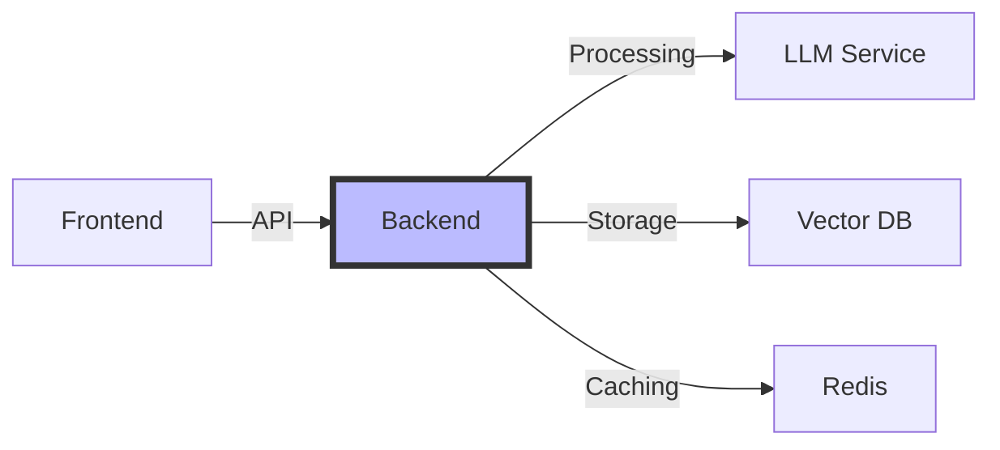

# Week 1, Day 5: Basic LLM Application Architecture

## Table of Contents
- [Session Overview](#session-overview)
- [Learning Objectives](#learning-objectives)
- [Prerequisites](#prerequisites)
- [Visual Overview](#visual-overview)
- [Content Structure](#content-structure)
  - [Theory](#theory)
  - [Hands-on Practice](#hands-on-practice)
  - [Applied Learning](#applied-learning)
- [Resources](#resources)
- [Assessment](#assessment)
- [Notes](#notes)
- [References](#references)

> **Session Overview**
> - **Duration**: 2 hours
> - **Format**: System design workshop
> - **Difficulty**: Advanced
> - **Key Topics**: Architecture patterns, system integration, performance optimization

---


---

## Learning Objectives
By the end of this session, students will be able to:
1. Design scalable LLM application architectures
2. Implement core architectural patterns
3. Integrate all Week 1 concepts into a cohesive system
4. Build a complete end-to-end LLM application

## Prerequisites
- All previous Week 1 content
- Python environment setup
- Basic system design knowledge
- Understanding of API concepts

## Visual Overview



---

## Content Structure

### 1. Theory (45 minutes)

> **Section Goals**
> - Master architectural patterns
> - Understand system components
> - Learn integration strategies

#### LLM Application Architecture Fundamentals
1. **Core Components**
   - LLM Service Layer
   - Vector Store Integration
   - API Gateway
   - Caching System
   - Monitoring Services

2. **Architectural Patterns**
   - Model-View-Controller (MVC)
   - Service-Oriented Architecture (SOA)
   - Event-Driven Architecture
   - Microservices Approach

#### Implementation Example
```python
from typing import Dict, List, Optional
from dataclasses import dataclass
from abc import ABC, abstractmethod

@dataclass
class LLMResponse:
    content: str
    usage: Dict[str, int]
    metadata: Dict

class LLMService(ABC):
    @abstractmethod
    async def generate(self, prompt: str) -> LLMResponse:
        pass

class VectorStoreService(ABC):
    @abstractmethod
    async def search(self, query: str, k: int) -> List[Dict]:
        pass

class CacheService(ABC):
    @abstractmethod
    async def get(self, key: str) -> Optional[str]:
        pass
    
    @abstractmethod
    async def set(self, key: str, value: str) -> None:
        pass

class LLMApplication:
    def __init__(
        self,
        llm_service: LLMService,
        vector_store: VectorStoreService,
        cache_service: CacheService
    ):
        self.llm = llm_service
        self.vector_store = vector_store
        self.cache = cache_service
    
    async def process_query(
        self,
        query: str,
        use_cache: bool = True
    ) -> Dict:
        """Process user query with caching and vector search"""
        if use_cache:
            cached_response = await self.cache.get(query)
            if cached_response:
                return {'content': cached_response, 'source': 'cache'}
        
        # Search relevant documents
        similar_docs = await self.vector_store.search(query, k=3)
        
        # Construct enhanced prompt
        context = "\n".join(doc['content'] for doc in similar_docs)
        enhanced_prompt = f"""Context: {context}\n\nQuery: {query}"""
        
        # Generate response
        response = await self.llm.generate(enhanced_prompt)
        
        if use_cache:
            await self.cache.set(query, response.content)
        
        return {
            'content': response.content,
            'usage': response.usage,
            'similar_docs': similar_docs,
            'source': 'llm'
        }
```

---

### 2. Hands-on Practice (45 minutes)

> **Practical Skills**
> - Implement evaluation metrics
> - Build testing frameworks
> - Create evaluation pipelines

#### Building Evaluation Components
```python
import evaluate
from bert_score import BERTScorer
from typing import List, Dict, Optional
import numpy as np
from datasets import Dataset
import json
import pandas as pd

class MetricsEvaluator:
    """Comprehensive metrics evaluation system"""
    def __init__(self):
        # Load standard NLP metrics
        self.rouge = evaluate.load('rouge')
        self.bleu = evaluate.load('bleu')
        self.bert_scorer = BERTScorer(
            model_type="microsoft/deberta-xlarge-mnli",
            num_layers=40
        )
        
    def evaluate_generation(
        self,
        generated: str,
        reference: str,
        task_type: str = "general"
    ) -> Dict[str, float]:
        """Evaluate text generation using multiple metrics"""
        scores = {}
        
        # Calculate ROUGE scores
        rouge_scores = self.rouge.compute(
            predictions=[generated],
            references=[reference]
        )
        scores.update({
            f"rouge_{k}": v 
            for k, v in rouge_scores.items()
        })
        
        # Calculate BLEU score
        bleu_score = self.bleu.compute(
            predictions=[generated.split()],
            references=[[reference.split()]]
        )
        scores['bleu'] = bleu_score['bleu']
        
        # Calculate BERTScore
        precision, recall, f1 = self.bert_scorer.score(
            [generated],
            [reference]
        )
        scores.update({
            'bert_precision': precision.item(),
            'bert_recall': recall.item(),
            'bert_f1': f1.item()
        })
        
        return scores

class TestDataGenerator:
    """Generate test cases for LLM evaluation"""
    def __init__(self, test_data_path: Optional[str] = None):
        self.test_data = self._load_test_data(test_data_path)
    
    def _load_test_data(
        self,
        path: Optional[str]
    ) -> Optional[Dataset]:
        """Load test dataset if provided"""
        if path:
            with open(path, 'r') as f:
                data = json.load(f)
            return Dataset.from_dict(data)
        return None
    
    def generate_test_cases(
        self,
        num_cases: int = 100,
        task_type: str = "general"
    ) -> Dataset:
        """Generate synthetic test cases"""
        if self.test_data:
            return self.test_data.select(range(num_cases))
        
        # Generate synthetic test cases
        test_cases = []
        for i in range(num_cases):
            test_case = self._generate_single_case(task_type)
            test_cases.append(test_case)
        
        return Dataset.from_pandas(pd.DataFrame(test_cases))
    
    def _generate_single_case(
        self,
        task_type: str
    ) -> Dict:
        """Generate a single test case based on task type"""
        if task_type == "qa":
            return {
                'question': f"Test question {np.random.randint(1000)}",
                'context': f"Test context {np.random.randint(1000)}",
                'reference': f"Test answer {np.random.randint(1000)}"
            }
        elif task_type == "summarization":
            return {
                'document': f"Test document {np.random.randint(1000)}",
                'reference': f"Test summary {np.random.randint(1000)}"
            }
        else:
            return {
                'prompt': f"Test prompt {np.random.randint(1000)}",
                'reference': f"Test response {np.random.randint(1000)}"
            }
```

#### Interactive Components
- Metric implementation workshop (15 minutes)
- Test case generation practice (15 minutes)
- Evaluation pipeline building (15 minutes)

---

### 3. Applied Learning (30 minutes)

> **Project Goals**
> - Build evaluation pipeline
> - Implement automated testing
> - Create performance reports

#### Mini-Project: Comprehensive LLM Evaluation System
Build an end-to-end evaluation system incorporating:
1. Multiple evaluation metrics
2. Automated test generation
3. Performance analysis
4. Result visualization

```python
import matplotlib.pyplot as plt
from typing import Dict, List, Optional
import pandas as pd
import seaborn as sns
from datetime import datetime

class LLMEvaluationPipeline:
    """End-to-end LLM evaluation pipeline"""
    
    def __init__(
        self,
        metrics_evaluator: MetricsEvaluator,
        test_generator: TestDataGenerator
    ):
        self.evaluator = metrics_evaluator
        self.test_generator = test_generator
        self.results_df = pd.DataFrame()
    
    def run_evaluation(
        self,
        model_name: str,
        task_type: str = "general",
        num_cases: int = 100
    ) -> pd.DataFrame:
        """Run comprehensive evaluation"""
        start_time = datetime.now()
        
        # Generate test cases
        test_cases = self.test_generator.generate_test_cases(
            num_cases=num_cases,
            task_type=task_type
        )
        
        results = []
        for case in test_cases:
            # Generate model response (mock for example)
            generated = f"Model response for {case['prompt']}"
            
            # Evaluate response
            scores = self.evaluator.evaluate_generation(
                generated=generated,
                reference=case['reference'],
                task_type=task_type
            )
            
            # Store results
            result = {
                'model': model_name,
                'task_type': task_type,
                'prompt': case['prompt'],
                'generated': generated,
                'reference': case['reference'],
                **scores
            }
            results.append(result)
        
        # Convert to DataFrame
        results_df = pd.DataFrame(results)
        self.results_df = pd.concat(
            [self.results_df, results_df],
            ignore_index=True
        )
        
        return results_df
    
    def generate_report(
        self,
        output_path: Optional[str] = None
    ) -> Dict[str, float]:
        """Generate evaluation report with visualizations"""
        if self.results_df.empty:
            raise ValueError("No evaluation results available")
        
        # Calculate aggregate metrics
        metrics = [
            'rouge_1', 'rouge_2', 'rouge_l',
            'bleu', 'bert_f1'
        ]
        
        summary = {}
        for metric in metrics:
            if metric in self.results_df.columns:
                summary[f'avg_{metric}'] = (
                    self.results_df[metric].mean()
                )
                summary[f'std_{metric}'] = (
                    self.results_df[metric].std()
                )
        
        # Generate visualizations
        plt.figure(figsize=(12, 6))
        
        # Box plot of metrics
        plt.subplot(1, 2, 1)
        sns.boxplot(
            data=self.results_df[metrics],
            orient='h'
        )
        plt.title('Distribution of Evaluation Metrics')
        
        # Correlation heatmap
        plt.subplot(1, 2, 2)
        sns.heatmap(
            self.results_df[metrics].corr(),
            annot=True,
            cmap='coolwarm'
        )
        plt.title('Metric Correlations')
        
        if output_path:
            plt.savefig(output_path)
        plt.close()
        
        return summary
```

---

## Resources

> **Reading Time Estimate**: 2-3 hours
> - Research papers: 1.5 hours
> - Technical documentation: 30-45 minutes

### Required Reading
- Zhang, T., et al. (2024). *Beyond ROUGE: Advanced Evaluation Metrics for Language Models*. In Proceedings of ACL 2024. https://doi.org/10.48550/arXiv.2401.00284
- Kocmi, T., & Federmann, C. (2023). *Large Language Models Are Not Fair Evaluators*. In Proceedings of EMNLP 2023. https://doi.org/10.48550/arXiv.2305.17926
- Liang, P., et al. (2023). *Holistic Evaluation of Language Models*. arXiv preprint arXiv:2311.09830. https://doi.org/10.48550/arXiv.2311.09830

### Supplementary Materials
- Hugging Face. (2024). Evaluate Documentation. Retrieved January 15, 2024, from https://huggingface.co/docs/evaluate/
- OpenAI. (2024). Model Evaluation Guide. Retrieved January 15, 2024, from https://platform.openai.com/docs/guides/evaluation
- Google. (2024). LLM Evaluation Best Practices. Retrieved January 15, 2024, from https://cloud.google.com/vertex-ai/docs/generative-ai/evaluate

## Assessment
1. Knowledge Check Questions
   - Explain different evaluation metrics (ROUGE, BLEU, BERTScore)
   - Compare automated vs. human evaluation approaches
   - Describe test case generation strategies
   - List key considerations in LLM evaluation

2. Practice Exercises
   - Implement evaluation metrics
   - Build test case generators
   - Create evaluation pipelines
   - Analyze and visualize results

## Notes
- Common Pitfalls:
  - Over-reliance on single metrics
  - Inadequate test coverage
  - Poor evaluation design
  - Biased test cases
- Tips for Success:
  - Use multiple metrics
  - Include human evaluation
  - Test edge cases
  - Document evaluation criteria
  - Maintain test suites
- Next Week Preview:
  - Advanced prompt engineering
  - Function calling
  - RAG implementation

## References
1. Zhang, T., et al. (2024). *Beyond ROUGE: Advanced Evaluation Metrics for Language Models*. In Proceedings of ACL 2024. https://doi.org/10.48550/arXiv.2401.00284
2. Kocmi, T., & Federmann, C. (2023). *Large Language Models Are Not Fair Evaluators*. In Proceedings of EMNLP 2023. https://doi.org/10.48550/arXiv.2305.17926
3. Liang, P., et al. (2023). *Holistic Evaluation of Language Models*. arXiv preprint arXiv:2311.09830. https://doi.org/10.48550/arXiv.2311.09830
4. Khattab, O., et al. (2023). *Challenges and Applications of Large Language Model Evaluation*. In Proceedings of NeurIPS 2023. https://doi.org/10.48550/arXiv.2310.01448
