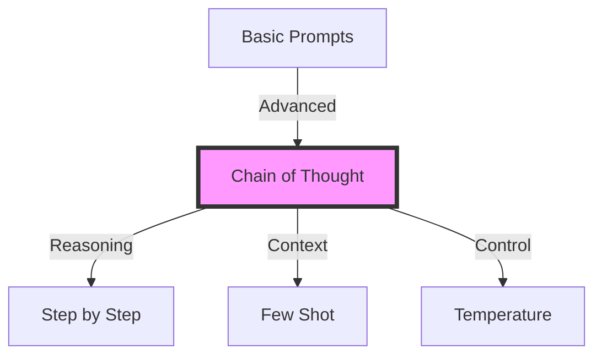

# Week 2, Day 1: Advanced Prompt Engineering


## Learning Objectives
By the end of this session, students will be able to:
1. Master advanced prompt engineering techniques
2. Implement chain-of-thought reasoning
3. Design systematic prompt testing frameworks
4. Create robust prompt templates for complex tasks

## Prerequisites
- Week 1 content completion
- Basic prompt engineering knowledge
- Python environment setup
- Understanding of LLM capabilities

## Visual Overview



## Content Structure

### 1. Theory (45 minutes)

#### Advanced Prompt Engineering Techniques

##### Chain-of-Thought Prompting
```text
Basic Prompt: "Solve 15 × 27"
vs.
Chain-of-Thought: "Let's solve 15 × 27 step by step:
1. First, let's break down 27: 20 + 7
2. Multiply 15 × 20 = 300
3. Multiply 15 × 7 = 105
4. Add the results: 300 + 105 = 405"
```

##### Advanced Techniques
1. **Self-Consistency**
   - Multiple reasoning paths
   - Majority voting
   - Confidence scoring

2. **Tree-of-Thoughts**
   - Branching reasoning paths
   - State evaluation
   - Path optimization

3. **Constitutional Prompting**
   - Constraint definition
   - Bias mitigation
   - Output validation

#### Implementation Example
```python
from typing import List, Dict, Optional
from dataclasses import dataclass
import openai
import json

@dataclass
class PromptStrategy:
    name: str
    template: str
    parameters: Dict
    validation_rules: List[str]

class AdvancedPromptEngine:
    def __init__(self, api_key: str):
        self.client = openai.OpenAI(api_key=api_key)
        self.strategies = {}
    
    def register_strategy(self, strategy: PromptStrategy):
        """Register a new prompt strategy"""
        self.strategies[strategy.name] = strategy
    
    async def generate_with_cot(
        self,
        prompt: str,
        n_paths: int = 3
    ) -> Dict:
        """Generate response using chain-of-thought"""
        enhanced_prompt = f"""
        Let's approach this step-by-step:
        
        Question: {prompt}
        
        Let's think about this carefully:
        1)
        """
        
        responses = []
        for _ in range(n_paths):
            response = await self.client.chat.completions.create(
                model="gpt-4",
                messages=[{"role": "user", "content": enhanced_prompt}],
                temperature=0.7
            )
            responses.append(response.choices[0].message.content)
        
        return {
            'paths': responses,
            'consensus': self._find_consensus(responses)
        }
    
    def _find_consensus(self, responses: List[str]) -> str:
        """Find the most common response pattern"""
        # Implementation of consensus algorithm
        return max(responses, key=responses.count)
```

### 2. Hands-on Practice (45 minutes)

#### Advanced Template System
```python
class PromptTemplate:
    def __init__(
        self,
        template: str,
        required_params: List[str],
        optional_params: Optional[Dict] = None
    ):
        self.template = template
        self.required_params = required_params
        self.optional_params = optional_params or {}
    
    def validate_params(self, params: Dict) -> bool:
        """Validate provided parameters"""
        missing_params = set(self.required_params) - set(params.keys())
        if missing_params:
            raise ValueError(f"Missing required parameters: {missing_params}")
        
        invalid_params = set(params.keys()) - set(
            self.required_params + list(self.optional_params.keys())
        )
        if invalid_params:
            raise ValueError(f"Invalid parameters provided: {invalid_params}")
        
        return True
    
    def format(self, **params) -> str:
        """Format template with parameters"""
        self.validate_params(params)
        
        # Add default values for optional parameters
        for param, default in self.optional_params.items():
            if param not in params:
                params[param] = default
        
        return self.template.format(**params)

# Example Usage
code_review_template = PromptTemplate(
    template="""
    Review the following code focusing on:
    1. {focus_areas}
    
    Additional considerations:
    - Performance impact: {performance_focus}
    - Security implications: {security_focus}
    
    Code:
    {code}
    
    Style guide: {style_guide}
    
    Please provide:
    1. Overall assessment
    2. Specific recommendations
    3. Code examples for improvements
    """,
    required_params=['code', 'focus_areas'],
    optional_params={
        'performance_focus': 'Standard evaluation',
        'security_focus': 'Basic security review',
        'style_guide': 'PEP 8'
    }
)
```

#### Interactive Components
- Template creation workshop (15 minutes)
- Chain-of-thought implementation (15 minutes)
- Consensus algorithm development (15 minutes)

### 3. Applied Learning (30 minutes)

#### Mini-Project: Advanced Prompt Engineering System
Build a system that:
1. Implements multiple prompting strategies
2. Evaluates response quality
3. Provides automated improvements
4. Handles edge cases

```python
class PromptOptimizer:
    def __init__(self, engine: AdvancedPromptEngine):
        self.engine = engine
        self.metrics = {}
    
    async def optimize_prompt(
        self,
        base_prompt: str,
        test_cases: List[Dict],
        iterations: int = 3
    ) -> Dict:
        """Optimize prompt through iterative testing"""
        results = []
        current_prompt = base_prompt
        
        for i in range(iterations):
            # Test current prompt
            performance = await self._evaluate_prompt(
                current_prompt,
                test_cases
            )
            results.append({
                'iteration': i,
                'prompt': current_prompt,
                'performance': performance
            })
            
            # Generate improvements
            improvements = await self._generate_improvements(
                current_prompt,
                performance
            )
            current_prompt = improvements['optimized_prompt']
        
        return {
            'iterations': results,
            'final_prompt': current_prompt,
            'performance_trend': self._analyze_trend(results)
        }
    
    async def _evaluate_prompt(
        self,
        prompt: str,
        test_cases: List[Dict]
    ) -> Dict:
        """Evaluate prompt performance on test cases"""
        results = []
        for test in test_cases:
            response = await self.engine.generate_with_cot(
                prompt.format(**test['input'])
            )
            results.append({
                'test_case': test['input'],
                'expected': test['expected'],
                'actual': response['consensus'],
                'paths': response['paths']
            })
        
        return self._calculate_metrics(results)
    
    def _calculate_metrics(self, results: List[Dict]) -> Dict:
        """Calculate performance metrics"""
        return {
            'accuracy': sum(
                r['expected'] == r['actual'] for r in results
            ) / len(results),
            'path_diversity': self._calculate_diversity(
                [r['paths'] for r in results]
            ),
            'confidence': self._calculate_confidence(results)
        }
```

## Resources

### Required Reading
- Wei, J., Wang, X., Schuurmans, D., et al. (2022). Chain of thought prompting elicits reasoning in large language models. *NeurIPS 2022*.
- Kojima, T., Gu, S.S., Reid, M., et al. (2023). Large language models are zero-shot reasoners. *Nature Communications, 14*(1), 1-9.

### Supplementary Materials
- [Anthropic's Constitutional AI Framework](https://www.anthropic.com/constitutional-ai)
- [OpenAI Advanced Prompting Guide](https://platform.openai.com/docs/guides/prompt-engineering)
- [LangChain Prompt Templates](https://python.langchain.com/docs/modules/model_io/prompts/prompt_templates/)

## Assessment
1. Knowledge Check Questions
   - Explain chain-of-thought prompting
   - Describe self-consistency technique
   - List key components of constitutional prompting

2. Practice Exercises
   - Implement chain-of-thought system
   - Create advanced template system
   - Build prompt optimization pipeline

## Notes
- Common Pitfalls:
  - Over-complicated prompts
  - Insufficient testing
  - Poor error handling
- Tips for Success:
  - Start with simple chains
  - Test extensively
  - Document prompt versions
- Next Session Preview:
  - Function calling
  - Tool use integration
  - Advanced API patterns

## References
1. Wei, J., et al. (2022). Chain of thought prompting elicits reasoning in large language models. *NeurIPS 2022*.
2. Kojima, T., et al. (2023). Large language models are zero-shot reasoners. *Nature Communications, 14*(1), 1-9.
3. Askell, A., et al. (2021). A learned approach to constitutional AI. *arXiv preprint arXiv:2104.07358*.
4. Zhou, X., et al. (2023). Tree of thoughts: Deliberate problem solving with large language models. *arXiv preprint arXiv:2305.10601*.
