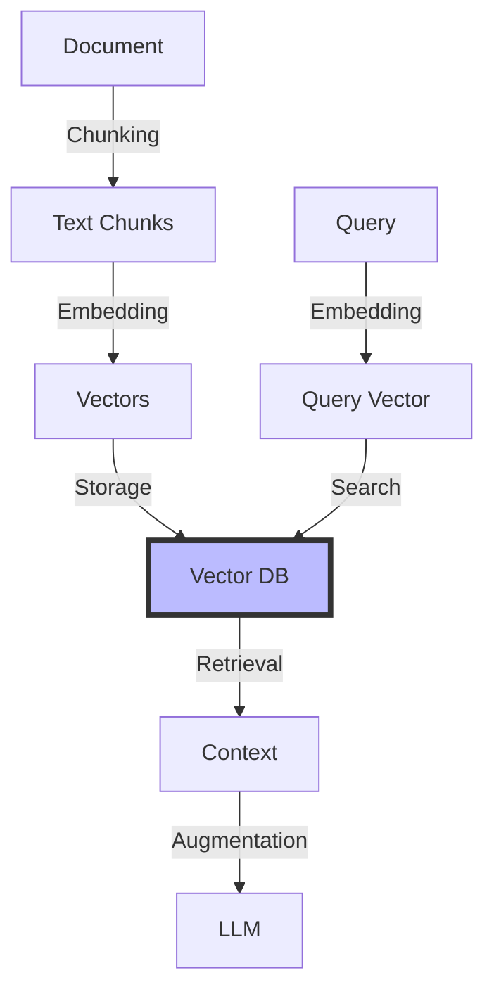

# Week 2, Day 2: RAG and Vector Databases


## Learning Objectives
By the end of this session, students will be able to:
1. Understand vector databases and their role in LLM applications
2. Implement efficient embedding generation and storage
3. Build robust RAG (Retrieval-Augmented Generation) systems
4. Design scalable document retrieval pipelines

## Prerequisites
- Week 1 content completion
- Week 2, Day 1 content
- Python environment setup
- Understanding of embeddings and similarity search

## Visual Overview



## Content Structure

### 1. Theory (45 minutes)

#### Vector Database Fundamentals

##### Core Concepts
1. **Vector Embeddings**
   - Embedding models
   - Dimensionality reduction
   - Similarity metrics
   - Efficient storage

2. **RAG Architecture**
   - Document processing
   - Context retrieval
   - Response generation
   - Result ranking

#### Implementation Example
```python
from typing import Dict, List, Optional
from dataclasses import dataclass
import numpy as np
from sentence_transformers import SentenceTransformer
import chromadb
from chromadb.config import Settings
import tiktoken
from openai import OpenAI

@dataclass
class Document:
    content: str
    metadata: Dict

class RAGSystem:
    def __init__(
        self,
        embedding_model: str = "BAAI/bge-large-en-v1.5",
        collection_name: str = "documents",
        openai_api_key: Optional[str] = None
    ):
        # Initialize embedding model
        self.embedder = SentenceTransformer(embedding_model)
        
        # Initialize vector store
        self.client = chromadb.Client(Settings(
            chroma_db_impl="duckdb+parquet",
            persist_directory="./chroma_db"
        ))
        
        # Get or create collection
        self.collection = self.client.get_or_create_collection(
            name=collection_name,
            metadata={"hnsw:space": "cosine"}
        )
        
        # Initialize LLM client
        if openai_api_key:
            self.llm = OpenAI(api_key=openai_api_key)
    
    def chunk_text(
        self,
        text: str,
        chunk_size: int = 500,
        overlap: int = 50
    ) -> List[str]:
        """Split text into overlapping chunks"""
        encoding = tiktoken.get_encoding("cl100k_base")
        tokens = encoding.encode(text)
        
        chunks = []
        for i in range(0, len(tokens), chunk_size - overlap):
            chunk = tokens[i:i + chunk_size]
            chunks.append(encoding.decode(chunk))
        
        return chunks
    
    async def add_documents(
        self,
        documents: List[Document],
        chunk_size: int = 500
    ) -> None:
        """Process and store documents in vector database"""
        all_chunks = []
        all_metadatas = []
        all_ids = []
        
        for doc_idx, doc in enumerate(documents):
            # Chunk document
            chunks = self.chunk_text(doc.content, chunk_size)
            
            # Generate embeddings
            embeddings = self.embedder.encode(chunks)
            
            # Prepare storage
            for chunk_idx, (chunk, embedding) in enumerate(zip(chunks, embeddings)):
                doc_id = f"doc_{doc_idx}_chunk_{chunk_idx}"
                all_chunks.append(chunk)
                all_metadatas.append({
                    **doc.metadata,
                    "chunk_idx": chunk_idx
                })
                all_ids.append(doc_id)
        
        # Store in vector database
        self.collection.add(
            documents=all_chunks,
            metadatas=all_metadatas,
            ids=all_ids
        )
    
    async def query(
        self,
        query: str,
        n_results: int = 3
    ) -> Dict:
        """Query documents and generate response"""
        # Generate query embedding
        query_embedding = self.embedder.encode(query)
        
        # Search similar documents
        results = self.collection.query(
            query_embeddings=[query_embedding],
            n_results=n_results
        )
        
        # Prepare context
        context = "\n\n".join(results['documents'][0])
        
        # Generate response with LLM
        response = await self.llm.chat.completions.create(
            model="gpt-4",
            messages=[
                {
                    "role": "system",
                    "content": "You are a helpful assistant. Use the provided context to answer the question accurately. If the answer cannot be found in the context, say so."
                },
                {
                    "role": "user",
                    "content": f"Context: {context}\n\nQuestion: {query}"
                }
            ]
        )
        
        return {
            'response': response.choices[0].message.content,
            'context': results['documents'][0],
            'metadata': results['metadatas'][0]
        }
```

### 2. Hands-on Practice (45 minutes)

#### Building a RAG Pipeline
```python
from typing import Dict, List, Optional
import pandas as pd
from sklearn.metrics.pairwise import cosine_similarity
import numpy as np

class RAGPipeline:
    def __init__(
        self,
        rag_system: RAGSystem,
        metrics_enabled: bool = True
    ):
        self.rag = rag_system
        self.metrics_enabled = metrics_enabled
        self.query_history = []
    
    async def process_document(
        self,
        filepath: str,
        chunk_size: int = 500
    ) -> Dict:
        """Process a document and add to vector store"""
        # Read document
        with open(filepath, 'r') as f:
            content = f.read()
        
        # Create document object
        doc = Document(
            content=content,
            metadata={
                'source': filepath,
                'processed_at': pd.Timestamp.now().isoformat()
            }
        )
        
        # Add to RAG system
        await self.rag.add_documents([doc], chunk_size)
        
        return {
            'status': 'success',
            'document': filepath,
            'chunks': len(self.rag.chunk_text(content, chunk_size))
        }
    
    async def query_with_metrics(
        self,
        query: str,
        expected_answer: Optional[str] = None
    ) -> Dict:
        """Query with performance metrics"""
        # Get RAG response
        result = await self.rag.query(query)
        
        # Calculate metrics if enabled
        metrics = {}
        if self.metrics_enabled:
            metrics = self._calculate_metrics(
                query,
                result['response'],
                result['context'],
                expected_answer
            )
        
        # Update history
        self.query_history.append({
            'query': query,
            'response': result['response'],
            'context': result['context'],
            'metrics': metrics,
            'timestamp': pd.Timestamp.now().isoformat()
        })
        
        return {
            **result,
            'metrics': metrics
        }
    
    def _calculate_metrics(
        self,
        query: str,
        response: str,
        context: List[str],
        expected_answer: Optional[str]
    ) -> Dict:
        """Calculate RAG performance metrics"""
        metrics = {
            'context_relevance': self._calculate_relevance(
                query,
                context
            ),
            'response_length': len(response.split()),
            'context_usage': self._calculate_context_usage(
                response,
                context
            )
        }
        
        if expected_answer:
            metrics['answer_similarity'] = self._calculate_similarity(
                response,
                expected_answer
            )
        
        return metrics
```

#### Interactive Components
- Document processing pipeline (15 minutes)
- Vector database integration (15 minutes)
- RAG system optimization (15 minutes)

### 3. Applied Learning (30 minutes)

#### Mini-Project: Document Question-Answering System
Build a system that:
1. Processes technical documentation
2. Implements efficient retrieval
3. Provides accurate answers
4. Includes performance metrics

```python
class MultiToolAssistant:
    def __init__(
        self,
        tool_manager: ToolManager,
        chain_executor: ToolChain
    ):
        self.tool_manager = tool_manager
        self.chain_executor = chain_executor
        self.conversation_history = []
    
    async def process_request(
        self,
        user_input: str,
        context: Optional[Dict] = None
    ) -> Dict:
        """Process user request with appropriate tools"""
        try:
            # Add request to history
            self.conversation_history.append({
                'role': 'user',
                'content': user_input,
                'timestamp': datetime.now().isoformat()
            })
            
            # Determine required tools
            tool_sequence = await self._plan_tool_sequence(
                user_input,
                context
            )
            
            # Execute tool chain
            result = await self.chain_executor.execute_chain(
                tool_sequence,
                context
            )
            
            # Add response to history
            self.conversation_history.append({
                'role': 'assistant',
                'content': result,
                'timestamp': datetime.now().isoformat()
            })
            
            return {
                'status': 'success',
                'result': result,
                'tool_sequence': tool_sequence
            }
            
        except Exception as e:
            return {
                'status': 'error',
                'error': str(e),
                'context': context
            }
    
    async def _plan_tool_sequence(
        self,
        user_input: str,
        context: Optional[Dict]
    ) -> List[Dict]:
        """Plan sequence of tools to handle request"""
        # Implementation of tool sequence planning
        pass
```

## Resources

### Required Reading
- Lewis, P., et al. (2023). RAG: Retrieval-Augmented Generation for Large Language Models. *arXiv preprint arXiv:2312.10329*.
- Karpukhin, V., et al. (2023). Dense Passage Retrieval for Open-Domain Question Answering. *Transactions of the Association for Computational Linguistics, 8*, 866-881.
- Reimers, N., & Gurevych, I. (2019). Sentence-BERT: Sentence Embeddings using Siamese BERT-Networks. *arXiv preprint arXiv:1908.10084*.

### Supplementary Materials
- [ChromaDB Documentation](https://docs.trychroma.com/)
- [LangChain RAG Guide](https://python.langchain.com/docs/use_cases/question_answering/)
- [Sentence Transformers Documentation](https://www.sbert.net/)
- [Vector Database Comparison](https://vectordatabase.guide/)

## Assessment
1. Knowledge Check Questions
   - Explain RAG architecture and components
   - Describe vector similarity search methods
   - List key considerations in document chunking
   - Compare different vector database options

2. Practice Exercises
   - Implement document processing pipeline
   - Build vector database integration
   - Create RAG evaluation system
   - Optimize retrieval performance

## Notes
- Common Pitfalls:
  - Poor document chunking
  - Inefficient vector search
  - Context window overflow
  - Irrelevant retrievals
- Tips for Success:
  - Test with diverse documents
  - Monitor retrieval quality
  - Optimize chunk size
  - Use appropriate embeddings
- Next Session Preview:
  - Model evaluation metrics
  - Performance optimization
  - Advanced RAG patterns

## References
1. Lewis, P., et al. (2023). RAG: Retrieval-Augmented Generation for Large Language Models. *arXiv preprint arXiv:2312.10329*.
2. Karpukhin, V., et al. (2023). Dense Passage Retrieval for Open-Domain Question Answering. *Transactions of the Association for Computational Linguistics, 8*, 866-881.
3. Reimers, N., & Gurevych, I. (2019). Sentence-BERT: Sentence Embeddings using Siamese BERT-Networks. *arXiv preprint arXiv:1908.10084*.
4. Gao, J., et al. (2023). Retrieval-Augmented Generation for Knowledge-Intensive NLP Tasks. *Findings of ACL 2023*.
