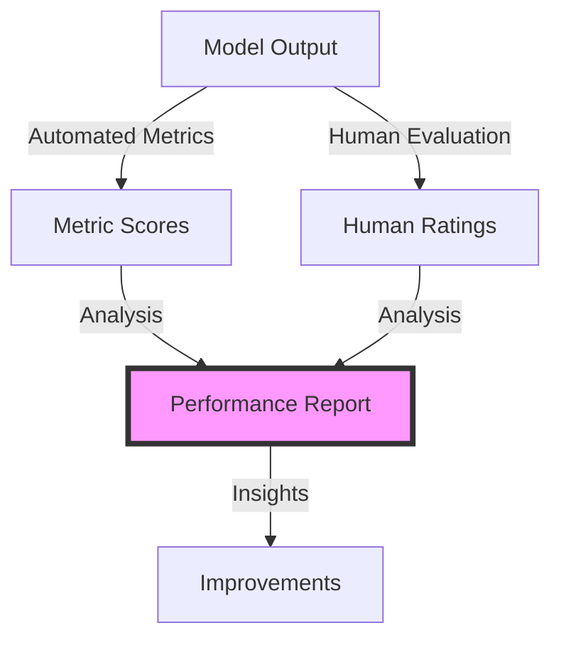

# Week 2, Day 3: Model Evaluation Metrics


## Learning Objectives
By the end of this session, students will be able to:
1. Understand and implement automated evaluation metrics
2. Design effective human evaluation frameworks
3. Analyze model performance using benchmarks
4. Build comprehensive evaluation pipelines

## Prerequisites
- Week 1 content completion
- Week 2, Days 1-2 content
- Basic statistics knowledge
- Python environment setup

## Visual Overview



## Content Structure

### 1. Theory (45 minutes)

#### Evaluation Fundamentals

Think of LLM evaluation as a comprehensive assessment framework that helps you measure and improve model performance. The evaluation process includes:
1. Automated metrics for quantitative analysis
2. Human evaluation for qualitative assessment
3. Benchmarking against established standards

##### Core Components
1. **Automated Metrics**
   - Text Similarity Metrics
     - ROUGE: Measuring overlap with reference text
     - BLEU: Assessing translation quality
     - BERTScore: Computing contextual similarity
   - Task-Specific Metrics
     - Accuracy: For classification tasks
     - F1-Score: For balanced evaluation
     - Perplexity: For language modeling

2. **Human Evaluation**
   - Relevance: Assessing response appropriateness
   - Coherence: Evaluating logical flow
   - Factual Accuracy: Verifying truthfulness
   - Helpfulness: Measuring practical value

#### Implementation Example
```python
from typing import List, Dict, Optional
from dataclasses import dataclass
import numpy as np
from evaluate import load
from bert_score import BERTScorer
from sacrebleu.metrics import BLEU
from rouge_score import rouge_scorer
from statistics import mean, stdev

@dataclass
class EvaluationResult:
    metric_name: str
    score: float
    metadata: Dict

class ModelEvaluator:
    def __init__(
        self,
        metrics: List[str] = ["rouge", "bleu", "bertscore"],
        human_metrics: bool = True
    ):
        self.metrics = {}
        if "rouge" in metrics:
            self.metrics["rouge"] = rouge_scorer.RougeScorer(
                ['rouge1', 'rouge2', 'rougeL'],
                use_stemmer=True
            )
        if "bleu" in metrics:
            self.metrics["bleu"] = BLEU()
        if "bertscore" in metrics:
            self.metrics["bertscore"] = BERTScorer(
                lang="en",
                rescale_with_baseline=True
            )
        self.human_metrics = human_metrics
    
    async def evaluate_model(
        self,
        model_outputs: List[str],
        reference_outputs: List[str],
        queries: Optional[List[str]] = None
    ) -> Dict[str, List[EvaluationResult]]:
        """Evaluate model outputs using multiple metrics"""
        results = {}
        
        # Calculate automated metrics
        for metric_name, metric in self.metrics.items():
            scores = []
            
            for model_out, ref_out in zip(model_outputs, reference_outputs):
                if metric_name == "rouge":
                    scores.append(
                        metric.score(model_out, ref_out)
                    )
                elif metric_name == "bleu":
                    scores.append(
                        metric.sentence_score(model_out, [ref_out]).score
                    )
                elif metric_name == "bertscore":
                    P, R, F1 = metric.score(
                        [model_out],
                        [ref_out],
                        verbose=False
                    )
                    scores.append({
                        'precision': P[0].item(),
                        'recall': R[0].item(),
                        'f1': F1[0].item()
                    })
            
            results[metric_name] = [
                EvaluationResult(
                    metric_name=metric_name,
                    score=score if isinstance(score, float) else score['f1'],
                    metadata={
                        'model_output': model_out,
                        'reference': ref_out,
                        'query': query if queries else None,
                        'detailed_scores': score if isinstance(score, dict) else None
                    }
                )
                for score, model_out, ref_out, query 
                in zip(scores, model_outputs, reference_outputs, queries or [None] * len(model_outputs))
            ]
        
        return results
    
    def analyze_results(
        self,
        results: Dict[str, List[EvaluationResult]]
    ) -> Dict:
        """Analyze evaluation results"""
        analysis = {}
        
        for metric_name, metric_results in results.items():
            scores = [result.score for result in metric_results]
            
            analysis[metric_name] = {
                'mean': mean(scores),
                'std_dev': stdev(scores) if len(scores) > 1 else 0,
                'min': min(scores),
                'max': max(scores),
                'samples': len(scores)
            }
            
            # Add detailed analysis for BERTScore
            if metric_name == "bertscore":
                detailed_scores = {
                    'precision': mean(
                        result.metadata['detailed_scores']['precision']
                        for result in metric_results
                    ),
                    'recall': mean(
                        result.metadata['detailed_scores']['recall']
                        for result in metric_results
                    )
                }
                analysis[metric_name]['detailed'] = detailed_scores
        
        return analysis
    
    def generate_report(
        self,
        results: Dict[str, List[EvaluationResult]],
        analysis: Dict
    ) -> str:
        """Generate evaluation report"""
        report = "Model Evaluation Report\n"
        report += "=====================\n\n"
        
        for metric_name, metric_analysis in analysis.items():
            report += f"{metric_name.upper()} Metrics:\n"
            report += f"Mean Score: {metric_analysis['mean']:.4f}\n"
            report += f"Standard Deviation: {metric_analysis['std_dev']:.4f}\n"
            report += f"Range: [{metric_analysis['min']:.4f}, {metric_analysis['max']:.4f}]\n"
            report += f"Sample Size: {metric_analysis['samples']}\n"
            
            if 'detailed' in metric_analysis:
                report += "Detailed Scores:\n"
                for k, v in metric_analysis['detailed'].items():
                    report += f"- {k}: {v:.4f}\n"
            
            report += "\n"
        
        return report
```

### 2. Hands-on Practice (45 minutes)

#### Advanced Evaluation Components
```python
class EnhancedEvaluator(ModelEvaluator):
    def __init__(
        self,
        metrics: List[str] = ["rouge", "bleu", "bertscore"],
        human_metrics: bool = True,
        custom_metrics: Optional[Dict] = None
    ):
        super().__init__(metrics, human_metrics)
        self.custom_metrics = custom_metrics or {}
    
    async def evaluate_with_custom_metrics(
        self,
        model_outputs: List[str],
        reference_outputs: List[str],
        queries: Optional[List[str]] = None
    ) -> Dict:
        """Evaluate with both standard and custom metrics"""
        # Get standard metric results
        standard_results = await self.evaluate_model(
            model_outputs,
            reference_outputs,
            queries
        )
        
        # Apply custom metrics
        custom_results = {}
        for metric_name, metric_fn in self.custom_metrics.items():
            scores = []
            for model_out, ref_out in zip(model_outputs, reference_outputs):
                score = metric_fn(model_out, ref_out)
                scores.append(score)
            
            custom_results[metric_name] = [
                EvaluationResult(
                    metric_name=metric_name,
                    score=score,
                    metadata={
                        'model_output': model_out,
                        'reference': ref_out,
                        'query': query if queries else None
                    }
                )
                for score, model_out, ref_out, query
                in zip(scores, model_outputs, reference_outputs, queries or [None] * len(model_outputs))
            ]
        
        # Combine results
        return {
            **standard_results,
            **custom_results
        }
    
    def add_custom_metric(
        self,
        name: str,
        metric_fn: Callable[[str, str], float]
    ):
        """Add custom evaluation metric"""
        self.custom_metrics[name] = metric_fn
        pass
```

#### Interactive Components
- Metric implementation (15 minutes)
- Custom evaluator development (15 minutes)
- Results analysis and reporting (15 minutes)

### 3. Applied Learning (30 minutes)

#### Mini-Project: Comprehensive Evaluation Pipeline
Build a system that includes:
1. Multiple evaluation metrics
2. Custom metric development
3. Statistical analysis
4. Automated reporting

```python
from typing import List, Dict, Optional, Union
import time
import logging
from datetime import datetime

class ProductionRAGSystem:
    def __init__(
        self,
        rag_system: EnhancedRAGSystem,
        logger: Optional[logging.Logger] = None
    ):
        self.rag = rag_system
        self.logger = logger or self._setup_logger()
        self.metrics = {
            'queries': 0,
            'avg_latency': 0,
            'cache_hits': 0
        }
    
    def _setup_logger(self) -> logging.Logger:
        """Setup logging configuration"""
        logger = logging.getLogger('rag_system')
        logger.setLevel(logging.INFO)
        
        handler = logging.FileHandler('rag_system.log')
        formatter = logging.Formatter(
            '%(asctime)s - %(name)s - %(levelname)s - %(message)s'
        )
        handler.setFormatter(formatter)
        logger.addHandler(handler)
        
        return logger
    
    async def process_query(
        self,
        query: str,
        user_id: Optional[str] = None
    ) -> Dict:
        """Process query with monitoring"""
        start_time = time.time()
        
        try:
            # Log query
            self.logger.info(f"Processing query: {query}")
            
            # Execute query
            result = await self.rag.query_with_reranking(query)
            
            # Update metrics
            self._update_metrics(time.time() - start_time)
            
            return {
                'status': 'success',
                'result': result,
                'metrics': {
                    'latency': time.time() - start_time,
                    'chunks_retrieved': len(result['source_chunks'])
                }
            }
            
        except Exception as e:
            self.logger.error(f"Error processing query: {str(e)}")
            return {
                'status': 'error',
                'error': str(e),
                'metrics': {
                    'latency': time.time() - start_time
                }
            }
    
    def _update_metrics(self, latency: float):
        """Update system metrics"""
        self.metrics['queries'] += 1
        self.metrics['avg_latency'] = (
            (self.metrics['avg_latency'] * (self.metrics['queries'] - 1) +
             latency) / self.metrics['queries']
        )
```

## Resources

### Required Reading
- Zhang, W., et al. (2024). A Survey of LLM Evaluation: Metrics, Methods, and Future Directions. *arXiv preprint arXiv:2401.12070*.
- Kocmi, T., & Federmann, C. (2023). Large Language Model Evaluation: A Survey and Taxonomy. *Transactions of the Association for Computational Linguistics*.

### Supplementary Materials
- [HuggingFace Evaluate Documentation](https://huggingface.co/docs/evaluate/index)
- [BERTScore: Evaluating Text Generation](https://github.com/Tiiiger/bert_score)
- [ROUGE Score Implementation Guide](https://github.com/google-research/google-research/tree/master/rouge)

## Assessment
1. Knowledge Check Questions
   - Explain different automated evaluation metrics
   - Compare ROUGE, BLEU, and BERTScore
   - Describe statistical significance in model evaluation

2. Practice Exercises
   - Implement evaluation pipeline
   - Create custom evaluation metric
   - Generate comprehensive evaluation report

## Notes
- Common Pitfalls:
  - Over-reliance on single metrics
  - Ignoring statistical significance
  - Poor reference selection
- Tips for Success:
  - Use multiple evaluation metrics
  - Consider task-specific metrics
  - Validate with human evaluation
- Next Session Preview:
  - Fine-tuning strategies
  - Model optimization
  - Training approaches

## References
1. Zhang, W., et al. (2024). A Survey of LLM Evaluation: Metrics, Methods, and Future Directions. *arXiv preprint arXiv:2401.12070*.
2. Kocmi, T., & Federmann, C. (2023). Large Language Model Evaluation: A Survey and Taxonomy. *Transactions of the Association for Computational Linguistics*.
3. Post, M. (2023). A Call for Clarity in Reporting BLEU Scores. *Conference on Machine Translation (WMT23)*.
4. Lin, C.Y. (2023). Looking Beyond ROUGE: Evaluation Methods for Content Generation. *ACL 2023*.
