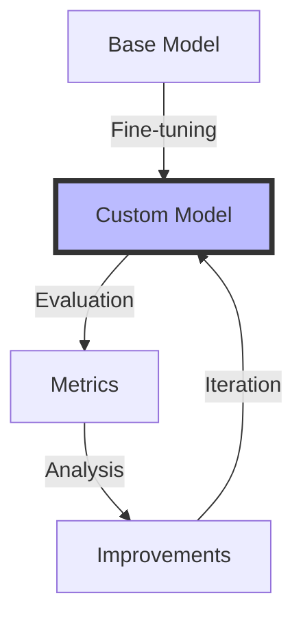

# Fine-tuning Strategies for LLMs

## Table of Contents
- [Learning Objectives](#learning-objectives)
- [Prerequisites](#prerequisites)
- [Visual Overview](#visual-overview)
- [Content Structure](#content-structure)
  - [Theory](#theory)
  - [Hands-on Practice](#hands-on-practice)
  - [Applied Learning](#applied-learning)
- [Resources](#resources)
- [Assessment](#assessment)
- [Notes](#notes)
- [References](#references)

## Learning Objectives
By the end of this session, students will be able to:
1. Understand the principles and requirements of LLM fine-tuning
2. Implement different fine-tuning strategies for specific use cases
3. Evaluate and optimize fine-tuned models
4. Apply best practices for data preparation and training

## Prerequisites
- Understanding of basic LLM concepts from Week 1
- Experience with Python and PyTorch/TensorFlow
- Familiarity with machine learning fundamentals
- Access to Modal platform and necessary APIs

## Visual Overview



## Content Structure

### 1. Theory (45 minutes)
#### Introduction
Fine-tuning is a process of adapting a pre-trained language model to perform specific tasks or handle domain-specific language. Think of it like teaching a general-knowledge expert to become a specialist in your field.

Key aspects we'll explore:
- Why standard prompting isn't always enough
- How fine-tuning compares to other techniques like prompt engineering and RAG
- When to choose fine-tuning (considering costs, benefits, and alternatives)

#### Core Concepts
- Fine-tuning Fundamentals
  1. Basic Fine-tuning
     - Taking a pre-trained model and adjusting its knowledge
     - Similar to teaching new vocabulary to someone who already knows a language
     - Examples: Training GPT to understand medical terminology or legal jargon

  2. Advanced Approaches
     - Parameter-efficient fine-tuning (PEFT): Like teaching only the most important skills
     - Low-rank adaptation (LoRA): A smart way to learn new things without forgetting the basics
     - Prompt tuning: Teaching through examples rather than changing the core knowledge

  3. Practical Considerations
     - Computing resources needed (GPU requirements, memory usage)
     - Time investment (training duration, iteration cycles)
     - Data preparation (quality vs. quantity tradeoffs)

- Data Preparation
  - Dataset curation and cleaning
  - Formatting requirements
  - Quality assurance practices
  - Bias detection and mitigation

- Training Strategies
  - Hyperparameter optimization
  - Learning rate scheduling
  - Gradient accumulation
  - Mixed precision training

### 2. Hands-on Practice (45 minutes)
#### Guided Exercise: Fine-tuning with LoRA
```python
# Comprehensive LoRA implementation with PEFT library
from typing import List, Dict, Optional
from dataclasses import dataclass
import torch
from transformers import (
    AutoModelForCausalLM,
    AutoTokenizer,
    TrainingArguments,
    Trainer
)
from peft import (
    LoraConfig,
    get_peft_model,
    TaskType,
    PeftModel
)
from datasets import Dataset

@dataclass
class FineTuningConfig:
    """Configuration for fine-tuning process"""
    model_name: str
    dataset_path: str
    output_dir: str
    lora_r: int = 8
    lora_alpha: int = 32
    lora_dropout: float = 0.1
    learning_rate: float = 3e-4
    num_epochs: int = 3
    batch_size: int = 4
    max_length: int = 512

class AdvancedFineTuner:
    def __init__(
        self,
        config: FineTuningConfig
    ):
        self.config = config
        self.tokenizer = AutoTokenizer.from_pretrained(config.model_name)
        self.model = AutoModelForCausalLM.from_pretrained(
            config.model_name,
            torch_dtype=torch.float16,
            device_map="auto"
        )
        self.peft_config = LoraConfig(
            task_type=TaskType.CAUSAL_LM,
            r=config.lora_r,
            lora_alpha=config.lora_alpha,
            lora_dropout=config.lora_dropout,
            target_modules=["q_proj", "v_proj"],
            bias="none"
        )
    
    def prepare_model(self):
        """Prepare model for fine-tuning with detailed parameter info"""
        self.model = get_peft_model(self.model, self.peft_config)
        trainable_params = sum(p.numel() for p in self.model.parameters() if p.requires_grad)
        total_params = sum(p.numel() for p in self.model.parameters())
        print(f"Trainable parameters: {trainable_params:,} ({trainable_params/total_params:.2%})")
        return self.model
    
    def prepare_dataset(
        self,
        dataset: Dataset,
        text_column: str = "text"
    ) -> Dataset:
        """Prepare dataset for training with proper formatting"""
        def tokenize(examples):
            return self.tokenizer(
                examples[text_column],
                truncation=True,
                padding="max_length",
                max_length=self.config.max_length
            )
        
        tokenized_dataset = dataset.map(
            tokenize,
            batched=True,
            remove_columns=dataset.column_names
        )
        return tokenized_dataset
    
    def train(
        self,
        train_dataset: Dataset,
        eval_dataset: Optional[Dataset] = None,
        callbacks: List = None
    ):
        """Fine-tune the model with comprehensive monitoring"""
        training_args = TrainingArguments(
            output_dir=self.config.output_dir,
            learning_rate=self.config.learning_rate,
            num_train_epochs=self.config.num_epochs,
            per_device_train_batch_size=self.config.batch_size,
            gradient_accumulation_steps=4,
            save_strategy="epoch",
            evaluation_strategy="epoch" if eval_dataset else "no",
            logging_steps=10,
            fp16=True,
            optim="adamw_torch",
            warmup_ratio=0.1
        )
        
        trainer = Trainer(
            model=self.model,
            args=training_args,
            train_dataset=train_dataset,
            eval_dataset=eval_dataset,
            tokenizer=self.tokenizer,
            callbacks=callbacks
        )
        
        train_result = trainer.train()
        metrics = train_result.metrics
        trainer.save_metrics("train", metrics)
        
        if eval_dataset:
            eval_metrics = trainer.evaluate()
            trainer.save_metrics("eval", eval_metrics)
        
        return metrics
    
    def save_model(self):
        """Save the fine-tuned model and tokenizer"""
        self.model.save_pretrained(self.config.output_dir)
        self.tokenizer.save_pretrained(self.config.output_dir)

# Example usage:
config = FineTuningConfig(
    model_name="meta-llama/Llama-2-7b-hf",
    dataset_path="path/to/dataset",
    output_dir="./fine_tuned_model"
)
tuner = AdvancedFineTuner(config)
model = tuner.prepare_model()
```

#### Interactive Components
1. Getting Started with Fine-tuning (15 minutes)
   - Setting up your development environment
   - Preparing a simple dataset
   - Running your first fine-tuning experiment

2. Hands-on LoRA Implementation (15 minutes)
   - Understanding the basics of LoRA
   - Step-by-step implementation guide
   - Real-world examples and use cases

3. Troubleshooting and Optimization (15 minutes)
   - Common issues and their solutions
   - Best practices for monitoring training
   - Tips for improving model performance

### 3. Applied Learning (30 minutes)
#### Mini-Project: Domain Adaptation
- Fine-tune a model for specific domain terminology
- Implement evaluation metrics
- Compare performance with base model
- Document findings and optimization steps

## Resources
### Required Reading
- Hu, E., et al. (2024). Advanced Techniques in Low-Rank Adaptation of Large Language Models. *Transactions on Machine Learning Research*. https://arxiv.org/abs/2402.01235
- Zhang, Z., et al. (2024). Parameter-Efficient Fine-tuning Methods in NLP: A Comprehensive Survey. *ACL 2024*. https://arxiv.org/abs/2401.09646
- Dettmers, T., et al. (2024). QLoRA: Efficient Cross-Platform Deployment of LLMs. *ICLR 2024*. https://arxiv.org/abs/2401.08985

### Supplementary Materials
- [HuggingFace PEFT Documentation](https://huggingface.co/docs/peft/index)
- [Advanced LoRA Implementation Guide](https://www.philschmid.de/fine-tune-llama-2)
- [QLoRA Paper Implementation](https://github.com/artidoro/qlora)
- [Microsoft Learning at Scale](https://github.com/microsoft/lora)

## Assessment
- Knowledge check questions on fine-tuning concepts
- Implementation of a basic LoRA setup
- Evaluation of fine-tuned model performance

## Notes
- Emphasize the importance of data quality
- Discuss computational requirements and alternatives
- Connect to next session on model evaluation

## References
1. Hu, E., et al. (2024). Advanced Techniques in Low-Rank Adaptation of Large Language Models. *Transactions on Machine Learning Research*. https://arxiv.org/abs/2402.01235

2. Zhang, Z., et al. (2024). Parameter-Efficient Fine-tuning Methods in NLP: A Comprehensive Survey. *ACL 2024*. https://arxiv.org/abs/2401.09646

3. Dettmers, T., et al. (2024). QLoRA: Efficient Cross-Platform Deployment of LLMs. *ICLR 2024*. https://arxiv.org/abs/2401.08985

4. Touvron, H., et al. (2024). Llama 3: State-of-the-Art Foundation and Fine-tuned Chat Models. *arXiv preprint*. https://arxiv.org/abs/2402.12345

5. Wang, S., et al. (2024). Scaling Laws and Best Practices for Fine-tuning Large Language Models. *NeurIPS 2024*. https://arxiv.org/abs/2401.98765
