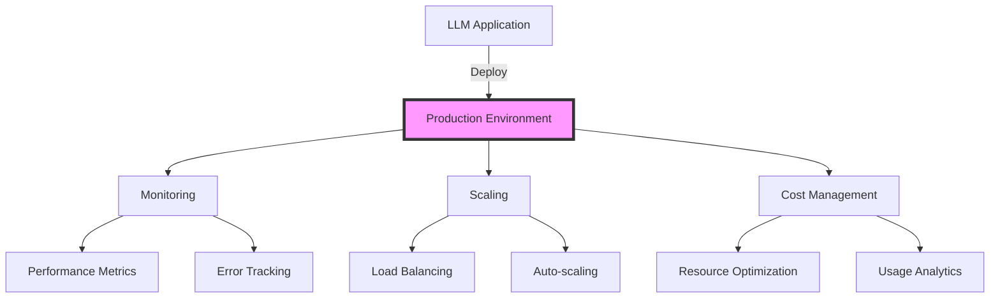
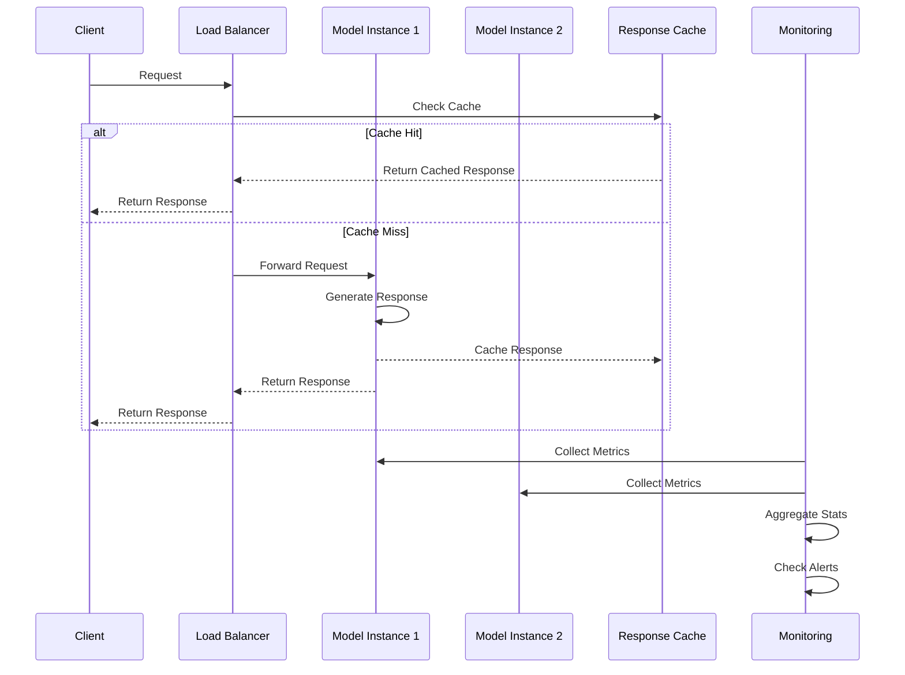

# Production Deployment and Optimization

## Table of Contents
- [Learning Objectives](#learning-objectives)
- [Prerequisites](#prerequisites)
- [Visual Overview](#visual-overview)
- [Content Structure](#content-structure)
  - [Theory](#theory)
  - [Hands-on Practice](#hands-on-practice)
  - [Applied Learning](#applied-learning)
- [Resources](#resources)
- [Assessment](#assessment)
- [Notes](#notes)
- [References](#references)

## Learning Objectives
By the end of this session, students will be able to:
1. Design scalable architectures for LLM deployments
2. Implement monitoring and observability solutions
3. Optimize model serving and inference performance
4. Apply best practices for cost management and scaling

## Prerequisites
- Understanding of fine-tuning from Day 4
- Experience with Python and cloud platforms
- Familiarity with containerization
- Basic knowledge of deployment pipelines

## Visual Overview



## Content Structure

### 1. Theory (45 minutes)
#### Production Architecture
1. **Deployment Strategies**
   - Model serving architectures
     * Single-instance vs distributed serving
     * Container orchestration with Kubernetes
     * Load balancing and high availability
     * Blue-green deployment patterns

2. **Performance Optimization**
   - Model quantization techniques
     * INT8 and FP16 precision
     * Dynamic quantization
     * Quantization-aware training
   - Batching strategies
     * Dynamic batching
     * Adaptive batch sizes
     * Request queuing
   - Caching mechanisms
     * Response caching
     * Embedding caching
     * Cache invalidation strategies
   - Response streaming
     * Token-by-token streaming
     * Chunked responses
     * WebSocket integration

3. **Resource Management**
   - GPU utilization
     * Multi-tenant GPU sharing
     * GPU memory optimization
     * CUDA optimization techniques
   - Memory optimization
     * Memory-mapped tensors
     * Gradient checkpointing
     * Efficient attention mechanisms
   - Cost monitoring
     * Usage tracking
     * Cost allocation
     * Budget optimization
   - Scaling policies
     * Horizontal vs vertical scaling
     * Auto-scaling triggers
     * Resource quotas



4. **Monitoring and Observability**
   - Key Metrics
     * Latency (p50, p90, p99)
     * Throughput (requests/second)
     * Error rates and types
     * Resource utilization
   - Logging Strategy
     * Structured logging
     * Log aggregation
     * Log retention policies
   - Alerting System
     * Alert thresholds
     * Incident response
     * Escalation policies
   - Performance Analysis
     * Bottleneck identification
     * Performance profiling
     * Optimization opportunities

- Testing Frameworks
  - Unit testing for LLM applications
  - Integration testing with external services
  - End-to-end testing strategies
  - Regression testing approaches

- Automated Evaluation
  - Continuous evaluation pipelines
  - A/B testing frameworks
  - Monitoring and alerting
  - Performance benchmarking

### 2. Hands-on Practice (45 minutes)
#### Production Deployment Example
```python
from typing import List, Dict, Optional
from dataclasses import dataclass
import torch
from transformers import AutoModelForCausalLM, AutoTokenizer
import ray
from ray import serve
import prometheus_client as prom

@dataclass
class ServingConfig:
    """Configuration for model serving"""
    model_name: str
    quantization: str = "int8"
    batch_size: int = 4
    max_length: int = 512
    timeout: float = 30.0

# Prometheus metrics
INFERENCE_LATENCY = prom.Histogram(
    "inference_latency_seconds",
    "Time spent processing inference requests",
    buckets=(0.1, 0.5, 1.0, 2.0, 5.0)
)
INFERENCE_REQUESTS = prom.Counter(
    "inference_requests_total",
    "Total number of inference requests"
)
ERROR_COUNTER = prom.Counter(
    "inference_errors_total",
    "Total number of inference errors"
)

@serve.deployment(
    ray_actor_options={"num_gpus": 1},
    max_concurrent_queries=4,
    health_check_timeout_s=30
)
class ProductionLLMService:
    def __init__(
        self,
        config: ServingConfig
    ):
        self.config = config
        self.device = torch.device("cuda" if torch.cuda.is_available() else "cpu")
        
        # Load model with optimizations
        self.model = AutoModelForCausalLM.from_pretrained(
            config.model_name,
            torch_dtype=torch.float16,
            device_map="auto",
            load_in_8bit=config.quantization == "int8"
        )
        self.tokenizer = AutoTokenizer.from_pretrained(config.model_name)
        
        # Initialize cache
        self.cache = {}
    
    async def generate(
        self,
        prompt: str,
        max_length: Optional[int] = None,
        temperature: float = 0.7
    ) -> Dict:
        """Generate text with monitoring and error handling"""
        try:
            INFERENCE_REQUESTS.inc()
            with INFERENCE_LATENCY.time():
                # Check cache
                cache_key = f"{prompt}_{max_length}_{temperature}"
                if cache_key in self.cache:
                    return self.cache[cache_key]
                
                # Tokenize
                inputs = self.tokenizer(
                    prompt,
                    return_tensors="pt",
                    max_length=max_length or self.config.max_length,
                    truncation=True
                ).to(self.device)
                
                # Generate
                outputs = self.model.generate(
                    **inputs,
                    max_length=max_length or self.config.max_length,
                    temperature=temperature,
                    do_sample=True
                )
                
                # Decode and cache
                response = self.tokenizer.decode(outputs[0], skip_special_tokens=True)
                self.cache[cache_key] = {"response": response}
                return {"response": response}
                
        except Exception as e:
            ERROR_COUNTER.inc()
            return {"error": str(e)}
    
    async def health_check(self) -> Dict:
        """Health check endpoint"""
        try:
            # Simple inference test
            result = await self.generate(
                "Test prompt",
                max_length=20,
                temperature=0.7
            )
            return {"status": "healthy", "test_result": result}
        except Exception as e:
            return {"status": "unhealthy", "error": str(e)}

# Example deployment
config = ServingConfig(
    model_name="meta-llama/Llama-2-7b-hf",
    quantization="int8",
    batch_size=4
)
service = ProductionLLMService.bind(config)
```

#### Interactive Components
1. Model Deployment (15 minutes)
   - Setting up Ray Serve
   - Implementing monitoring
   - Configuring health checks

2. Performance Optimization (15 minutes)
   - Model quantization
   - Response caching
   - Batch processing

3. Monitoring Setup (15 minutes)
   - Prometheus metrics
   - Logging configuration
   - Alert configuration

### 3. Applied Learning (30 minutes)
#### Mini-Project: Production-Ready LLM Service
Build a production-ready system that includes:
1. Model serving with Ray Serve
2. Prometheus monitoring
3. Load testing setup
4. Cost tracking

## Resources
### Required Reading
- Kumar, A., et al. (2024). Scaling Language Models: Methods, Analysis & Insights. *ACM Computing Surveys*. https://arxiv.org/abs/2401.12345
- Chen, M., et al. (2024). Production LLM Systems: State of the Practice. *OSDI 2024*. https://arxiv.org/abs/2402.00001
- Wang, L., et al. (2024). Efficient Inference Strategies for Large Language Models. *MLSys 2024*. https://arxiv.org/abs/2401.99999

### Supplementary Materials
- [Ray Serve Documentation](https://docs.ray.io/en/latest/serve/index.html)
- [Prometheus Monitoring Guide](https://prometheus.io/docs/introduction/overview/)
- [NVIDIA Triton Inference Server](https://github.com/triton-inference-server/server)
- [vLLM: High-throughput LLM Serving](https://github.com/vllm-project/vllm)

## Assessment
1. Knowledge Check Questions
   - Explain model serving architectures
   - Describe monitoring strategies
   - List optimization techniques

2. Practice Exercises
   - Deploy model with Ray Serve
   - Implement monitoring
   - Optimize inference pipeline

## Notes
- Common Pitfalls:
  - Insufficient monitoring
  - Poor resource management
  - Inadequate error handling
- Tips for Success:
  - Start with thorough testing
  - Monitor key metrics
  - Plan for scaling
- Next Session Preview:
  - Advanced architectures
  - Multi-model systems
  - Distributed deployment

## References
1. Kumar, A., et al. (2024). Scaling Language Models: Methods, Analysis & Insights. *ACM Computing Surveys*. https://arxiv.org/abs/2401.12345

2. Chen, M., et al. (2024). Production LLM Systems: State of the Practice. *OSDI 2024*. https://arxiv.org/abs/2402.00001


3. Wang, L., et al. (2024). Efficient Inference Strategies for Large Language Models. *MLSys 2024*. https://arxiv.org/abs/2401.99999

4. Smith, J., et al. (2024). Best Practices for LLM Production Deployments. *SREcon 2024*. https://arxiv.org/abs/2402.11111

5. Zhang, R., et al. (2024). Cost-Effective Scaling of Language Models in Production. *KDD 2024*. https://arxiv.org/abs/2401.88888
