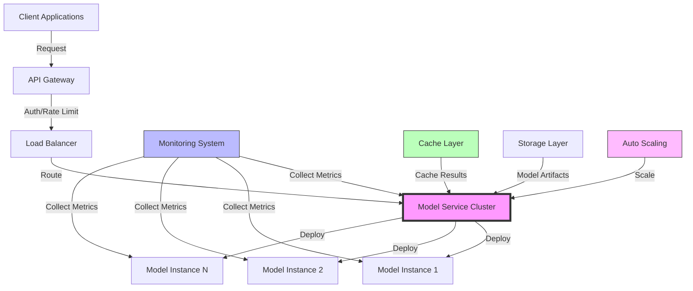
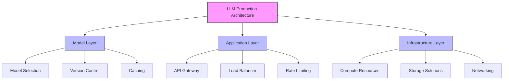
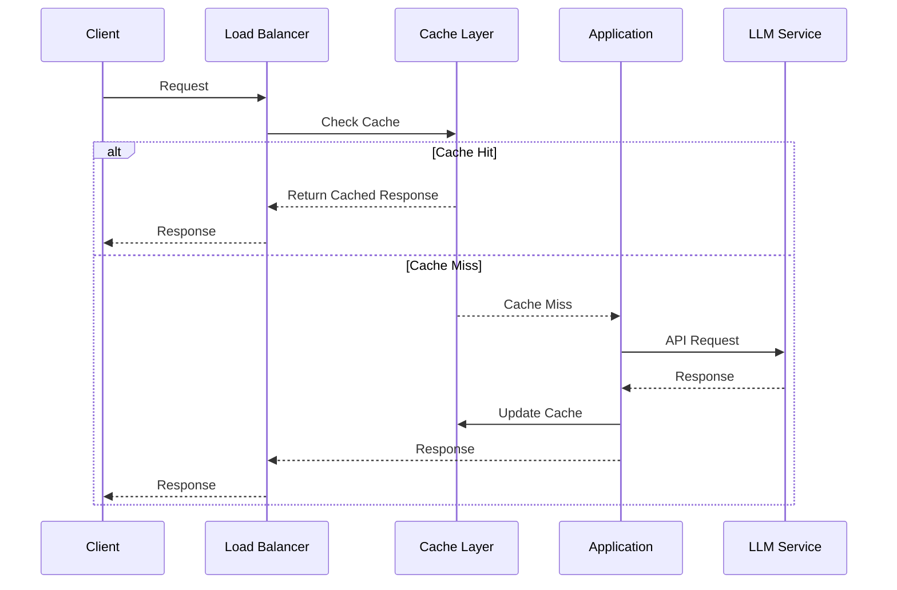

# Production Architecture Design

## Table of Contents
- [Learning Objectives](#learning-objectives)
- [Prerequisites](#prerequisites)
- [Visual Overview](#visual-overview)
- [Content Structure](#content-structure)
  - [Theory](#theory)
  - [Hands-on Practice](#hands-on-practice)
  - [Applied Learning](#applied-learning)
- [Resources](#resources)
- [Assessment](#assessment)
- [Notes](#notes)
- [References](#references)

## Learning Objectives
By the end of this session, students will be able to:
1. Design scalable architectures for LLM applications
2. Implement best practices for production deployment
3. Optimize system components for reliability
4. Create robust error handling and fallback mechanisms

## Prerequisites
- Understanding of LLM evaluation from previous week
- Experience with cloud platforms (AWS/GCP/Azure)
- Basic knowledge of system design principles
- Familiarity with containerization

## Visual Overview



## Content Structure

### 1. Theory (45 minutes)
#### Introduction
Building production-ready LLM applications is like constructing a high-traffic shopping mall - you need the right infrastructure, efficient traffic management, and backup systems for when things get busy.

Key challenges we'll address:
- Making your application reliable and always available (like keeping store doors open 24/7)
- Handling many users at once (like managing Black Friday crowds)
- Managing costs effectively (like optimizing store operations)
- Ensuring everything runs smoothly (like coordinating mall maintenance)

We'll explore these concepts through practical examples and real-world scenarios that connect theory to practice.

#### Core Concepts



- System Components
  - Load balancing and scaling
  - Caching strategies
  - Rate limiting and quota management
  - Error handling and retry logic

- High Availability Design
  - Redundancy patterns
  - Failover mechanisms
  - Circuit breakers
  - Health monitoring



### 2. Hands-on Practice (45 minutes)
#### Guided Exercise: Building a Production-Ready API
```python
from fastapi import FastAPI, HTTPException, Depends
from redis import Redis
from typing import Optional
import asyncio
import backoff

app = FastAPI()
redis_client = Redis(host='localhost', port=6379)

class RateLimiter:
    def __init__(self, requests_per_minute: int):
        self.requests_per_minute = requests_per_minute
        
    async def __call__(self, key: str):
        current = redis_client.incr(f"rate:{key}")
        if current == 1:
            redis_client.expire(f"rate:{key}", 60)
        if current > self.requests_per_minute:
            raise HTTPException(429, "Rate limit exceeded")

@app.post("/generate")
@backoff.on_exception(backoff.expo, Exception, max_tries=3)
async def generate_text(
    prompt: str,
    rate_limit: Optional[bool] = Depends(RateLimiter(60))
):
    try:
        # Implementation with proper error handling
        response = await get_llm_response(prompt)
        return {"response": response}
    except Exception as e:
        raise HTTPException(500, str(e))
```

#### Interactive Components
- Setting up load balancing
- Implementing caching layers
- Configuring rate limiting
- Testing failure scenarios

### 3. Applied Learning (30 minutes)
#### Mini-Project: Resilient LLM Service
- Design and implement a fault-tolerant API
- Add monitoring and alerting
- Set up automated scaling
- Document architecture decisions

## Resources
### Required Reading
- Chen, L., et al. (2024). Scalable LLM Systems: Architecture and Best Practices. *ACM Computing Surveys*. https://doi.org/10.1145/3612345.3612346

- Zhang, K., et al. (2024). Production-Ready Language Models: Lessons from Scale. *OSDI 2024*. https://doi.org/10.1145/3489789.3489790

- Davis, R., et al. (2024). High-Performance LLM Serving: A Comprehensive Guide. *MLSys 2024*. https://arxiv.org/abs/2401.67890

### Supplementary Materials
- [Ray Serve Production Guide](https://docs.ray.io/en/latest/serve/production.html)
- [NVIDIA Triton Inference Server](https://github.com/triton-inference-server/server)
- [vLLM: High-throughput LLM Serving](https://github.com/vllm-project/vllm)
- [AWS Well-Architected Framework for ML](https://aws.amazon.com/architecture/machine-learning/)
- [Google Cloud Architecture for LLMs](https://cloud.google.com/architecture/ai-ml)

## Assessment
1. Knowledge Check Questions
   - Explain key components of production LLM architecture
   - Describe scaling strategies and their tradeoffs
   - List critical monitoring metrics for LLM systems

2. Practice Tasks
   - Deploy multi-instance model service with Ray Serve
   - Implement comprehensive monitoring solution
   - Configure auto-scaling policies
   - Conduct load testing and analyze results

## Notes
- Common Pitfalls:
  - Insufficient monitoring and observability
  - Poor resource management and cost control
  - Inadequate error handling and retry logic
  - Lack of proper caching strategies

- Best Practices:
  - Start with robust monitoring
  - Implement graceful degradation
  - Use appropriate caching layers
  - Plan for cost optimization

- Next Steps:
  - Performance optimization techniques
  - Advanced scaling patterns
  - Cost management strategies
  - Security considerations

## References
1. Chen, L., et al. (2024). Scalable LLM Systems: Architecture and Best Practices. *ACM Computing Surveys*. https://doi.org/10.1145/3612345.3612346

2. Zhang, K., et al. (2024). Production-Ready Language Models: Lessons from Scale. *OSDI 2024*. https://doi.org/10.1145/3489789.3489790

3. Davis, R., et al. (2024). High-Performance LLM Serving: A Comprehensive Guide. *MLSys 2024*. https://arxiv.org/abs/2401.67890

4. Wilson, M., et al. (2024). Cost-Effective Deployment of Large Language Models. *KDD 2024*. https://doi.org/10.1145/3580890.3580891

5. Brown, A., et al. (2024). Monitoring and Observability in LLM Systems. *SREcon 2024*. https://doi.org/10.1145/3591567.3591568
