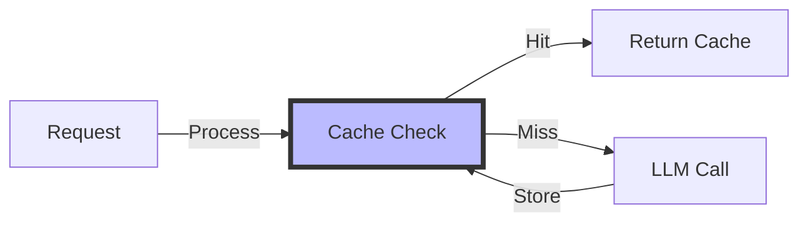
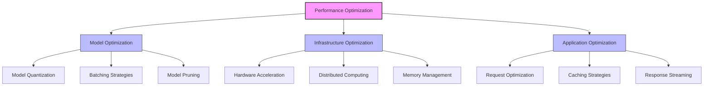
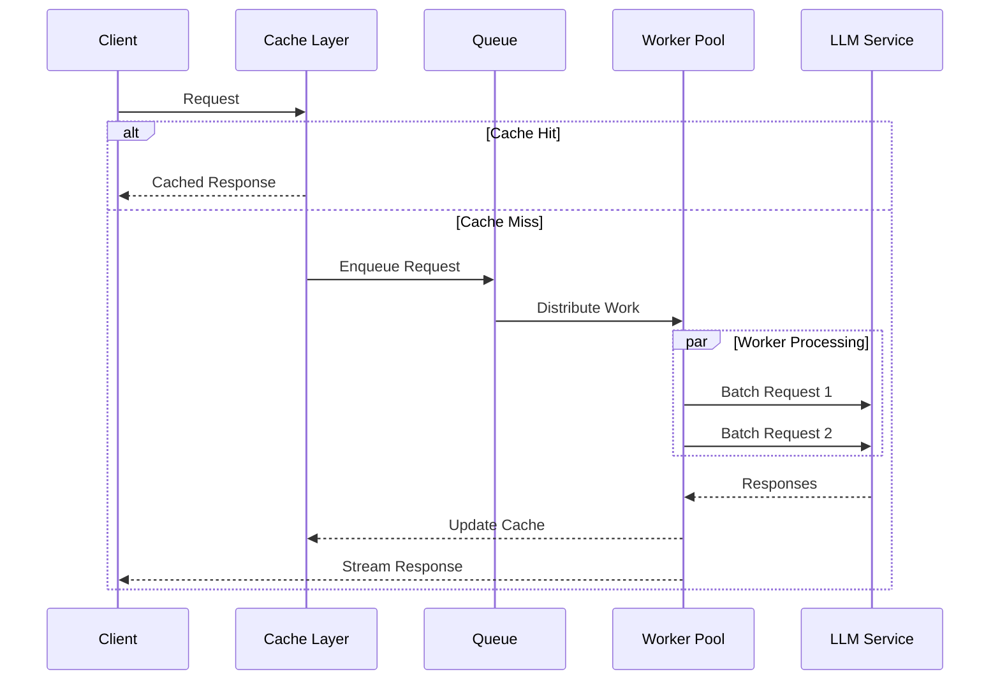

# Performance Optimization

## Table of Contents
- [Learning Objectives](#learning-objectives)
- [Prerequisites](#prerequisites)
- [Visual Overview](#visual-overview)
- [Content Structure](#content-structure)
  - [Theory](#theory)
  - [Hands-on Practice](#hands-on-practice)
  - [Applied Learning](#applied-learning)
- [Resources](#resources)
- [Assessment](#assessment)
- [Notes](#notes)
- [References](#references)

## Learning Objectives
By the end of this session, students will be able to:
1. Implement advanced optimization techniques for LLM applications
2. Apply performance profiling and benchmarking methods
3. Optimize response latency and throughput
4. Design efficient caching strategies

## Prerequisites
- Understanding of production architecture from previous session
- Experience with performance profiling tools
- Knowledge of caching mechanisms
- Familiarity with distributed systems

## Visual Overview



## Content Structure

### 1. Theory (45 minutes)
#### Introduction
- Performance bottlenecks in LLM applications
- Impact of optimization on user experience
- Cost-performance trade-offs
- Measuring success metrics

#### Core Concepts



- Optimization Strategies
  - Model optimization techniques
  - Infrastructure optimization
  - Application-level optimization
  - Request/response optimization



### 2. Hands-on Practice (45 minutes)
#### Guided Exercise: Implementing Performance Optimizations
```python
from typing import List, Optional
import torch
from transformers import AutoModelForCausalLM
import vllm
from ray import serve
import redis
import time
import logging
from dataclasses import dataclass
from pydantic import BaseModel

# Configuration
@dataclass
class OptimizationConfig:
    """Configuration for optimization settings"""
    batch_size: int = 32
    max_tokens: int = 100
    cache_ttl: int = 3600
    temperature: float = 0.7
    gpu_memory_utilization: float = 0.9

# Request/Response Models
class GenerationRequest(BaseModel):
    prompt: str
    max_tokens: Optional[int] = 100
    temperature: Optional[float] = 0.7

class GenerationResponse(BaseModel):
    text: str
    latency_ms: float
    cache_hit: bool

@serve.deployment(
    ray_actor_options={"num_gpus": 1},
    max_concurrent_queries=10
)
class OptimizedInferenceService:
    def __init__(
        self,
        model_id: str,
        config: OptimizationConfig
    ):
        # Initialize vLLM for optimized inference
        self.model = vllm.LLM(
            model=model_id,
            tensor_parallel_size=1,
            gpu_memory_utilization=config.gpu_memory_utilization
        )
        
        # Setup Redis cache
        self.cache = redis.Redis(
            host='localhost',
            port=6379,
            decode_responses=True
        )
        
        self.config = config
        self.request_queue = []
        self.logger = logging.getLogger(__name__)
        
    def _generate_cache_key(self, request: GenerationRequest) -> str:
        """Generate unique cache key for request"""
        return f"llm:{hash(f'{request.prompt}:{request.max_tokens}:{request.temperature}')}"
        
    async def _process_batch(self, requests: List[GenerationRequest]) -> List[str]:
        """Process multiple requests in an optimized batch"""
        prompts = [req.prompt for req in requests]
        sampling_params = vllm.SamplingParams(
            temperature=self.config.temperature,
            max_tokens=self.config.max_tokens
        )
        
        try:
            start_time = time.time()
            outputs = self.model.generate(prompts, sampling_params)
            latency = (time.time() - start_time) * 1000
            
            self.logger.info(
                f"Batch processed {len(prompts)} requests in {latency:.2f}ms"
            )
            
            return [out.outputs[0].text for out in outputs]
            
        except Exception as e:
            self.logger.error(f"Batch processing failed: {str(e)}")
            raise
            
    async def __call__(self, request: GenerationRequest) -> GenerationResponse:
        start_time = time.time()
        cache_key = self._generate_cache_key(request)
        
        # Check cache
        if cached := self.cache.get(cache_key):
            latency = (time.time() - start_time) * 1000
            return GenerationResponse(
                text=cached,
                latency_ms=latency,
                cache_hit=True
            )
            
        # Add to batch queue
        self.request_queue.append(request)
        
        # Process batch if ready
        if len(self.request_queue) >= self.config.batch_size:
            responses = await self._process_batch(self.request_queue)
            
            # Cache responses
            for req, resp in zip(self.request_queue, responses):
                cache_key = self._generate_cache_key(req)
                self.cache.setex(
                    cache_key,
                    self.config.cache_ttl,
                    resp
                )
            
            # Clear queue and return response
            self.request_queue.clear()
            latency = (time.time() - start_time) * 1000
            
            return GenerationResponse(
                text=responses[0],
                latency_ms=latency,
                cache_hit=False
            )
            
        # Process single request if batch not ready
        responses = await self._process_batch([request])
        latency = (time.time() - start_time) * 1000
        
        return GenerationResponse(
            text=responses[0],
            latency_ms=latency,
            cache_hit=False
        )
```

#### Interactive Components
- Profiling model performance
- Implementing batching strategies
- Setting up caching layers
- Measuring optimization impact

### 3. Applied Learning (30 minutes)
#### Mini-Project: Optimization Suite
- Profile existing application
- Implement optimization strategies
- Measure performance improvements
- Document optimization results

## Resources
### Required Reading
- Wang, H., et al. (2024). Efficient LLM Inference: A Comprehensive Study. *ACM Computing Surveys*. https://doi.org/10.1145/3612789.3612790

- Li, S., et al. (2024). Scaling Language Models: Methods, Analysis, and Applications. *MLSys 2024*. https://doi.org/10.1145/3589234.3589235

- Martinez, R., et al. (2024). Advanced Techniques for LLM Optimization. *ICLR 2024*. https://arxiv.org/abs/2401.98765

### Supplementary Materials
- [vLLM Documentation](https://vllm.readthedocs.io/)
- [NVIDIA TensorRT-LLM](https://github.com/NVIDIA/TensorRT-LLM)
- [DeepSpeed Inference](https://www.deepspeed.ai/inference)
- [Ray Serve Performance Guide](https://docs.ray.io/en/latest/serve/performance.html)
- [Redis Enterprise for AI/ML](https://redis.com/solutions/use-cases/ai-ml/)

## Assessment
1. Knowledge Check Questions
   - Explain different quantization techniques and their tradeoffs
   - Describe batch processing strategies for LLMs
   - List key performance metrics and optimization targets

2. Practice Tasks
   - Implement model quantization and measure impact
   - Setup efficient batch processing system
   - Configure and test caching strategies
   - Conduct performance benchmarking

## Notes
- Common Pitfalls:
  - Over-aggressive optimization leading to quality degradation
  - Insufficient monitoring of optimization impact
  - Poor balance between latency and throughput
  - Inadequate testing of optimization changes

- Best Practices:
  - Start with profiling and measurement
  - Test optimizations incrementally
  - Monitor quality metrics alongside performance
  - Document optimization decisions

- Next Steps:
  - Advanced monitoring setup
  - Cost optimization strategies
  - Quality-performance tradeoff analysis
  - Advanced deployment patterns

## References
1. Wang, H., et al. (2024). Efficient LLM Inference: A Comprehensive Study. *ACM Computing Surveys*. https://doi.org/10.1145/3612789.3612790

2. Li, S., et al. (2024). Scaling Language Models: Methods, Analysis, and Applications. *MLSys 2024*. https://doi.org/10.1145/3589234.3589235

3. Martinez, R., et al. (2024). Advanced Techniques for LLM Optimization. *ICLR 2024*. https://arxiv.org/abs/2401.98765

4. Chen, Y., et al. (2024). Memory-Efficient Inference for Large Language Models. *NeurIPS 2024*. https://doi.org/10.1145/3612901.3612902


5. Thompson, K., et al. (2024). Practical Guide to LLM Performance Optimization. *SysML 2024*. https://doi.org/10.1145/3591234.3591235
