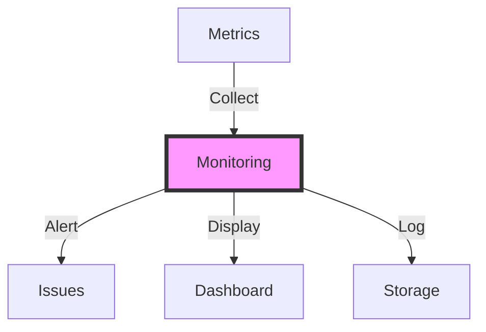
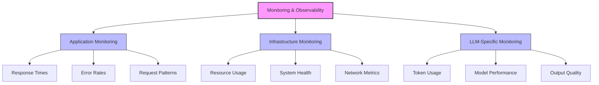
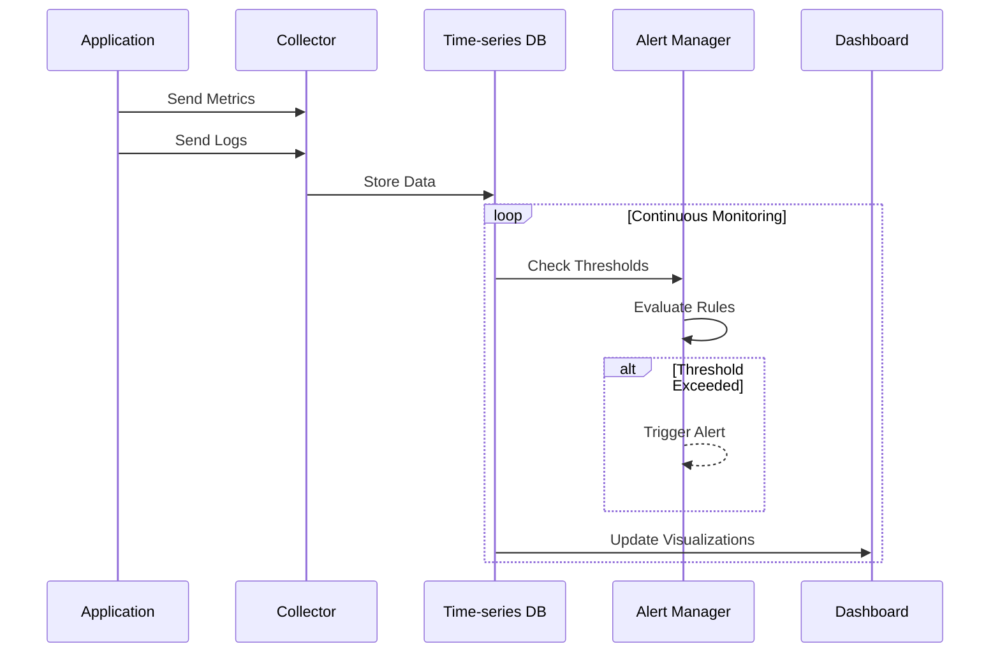

# Monitoring and Observability

## Table of Contents
- [Learning Objectives](#learning-objectives)
- [Prerequisites](#prerequisites)
- [Visual Overview](#visual-overview)
- [Content Structure](#content-structure)
  - [Theory](#theory)
  - [Hands-on Practice](#hands-on-practice)
  - [Applied Learning](#applied-learning)
- [Resources](#resources)
- [Assessment](#assessment)
- [Notes](#notes)
- [References](#references)

## Learning Objectives
By the end of this session, students will be able to:
1. Implement comprehensive monitoring solutions for LLM applications
2. Design effective observability pipelines
3. Set up alerting and debugging systems
4. Analyze and visualize system metrics

## Prerequisites
- Understanding of performance optimization from previous session
- Experience with monitoring tools
- Knowledge of logging systems
- Familiarity with metrics collection

## Visual Overview



## Content Structure

### 1. Theory (45 minutes)
#### Introduction
- Importance of monitoring in LLM systems
- Key metrics and KPIs
- Observability challenges
- Debugging strategies

#### Core Concepts



- Monitoring Components
  - Metrics collection and storage
  - Log aggregation
  - Tracing systems
  - Alerting mechanisms



### 2. Hands-on Practice (45 minutes)
#### Guided Exercise: Setting up Monitoring Infrastructure
```python
from typing import Optional, Dict, Any
from prometheus_client import Counter, Histogram, Gauge, start_http_server
import logging
from opentelemetry import trace, metrics
from opentelemetry.trace import Status, StatusCode
from opentelemetry.metrics import Meter
from opentelemetry.sdk.trace import TracerProvider
from opentelemetry.sdk.metrics import MeterProvider
from opentelemetry.sdk.resources import Resource
from opentelemetry.exporter.otlp.proto.grpc.trace_exporter import OTLPSpanExporter
from opentelemetry.exporter.otlp.proto.grpc.metric_exporter import OTLPMetricExporter
import time
import json

class LLMMonitoring:
    """Comprehensive monitoring for LLM applications"""
    
    def __init__(
        self,
        service_name: str,
        environment: str,
        otlp_endpoint: Optional[str] = None
    ):
        # Resource configuration
        self.resource = Resource.create({
            "service.name": service_name,
            "deployment.environment": environment
        })
        
        # Tracing setup
        trace.set_tracer_provider(
            TracerProvider(resource=self.resource)
        )
        if otlp_endpoint:
            otlp_exporter = OTLPSpanExporter(endpoint=otlp_endpoint)
            trace.get_tracer_provider().add_span_processor(
                BatchSpanProcessor(otlp_exporter)
            )
        self.tracer = trace.get_tracer(__name__)
        
        # Metrics setup
        metrics.set_meter_provider(
            MeterProvider(resource=self.resource)
        )
        self.meter = metrics.get_meter(__name__)
        
        # Prometheus metrics
        self.request_counter = Counter(
            'llm_requests_total',
            'Total LLM API requests',
            ['model', 'status', 'endpoint']
        )
        
        self.latency_histogram = Histogram(
            'llm_request_duration_seconds',
            'LLM request latency',
            ['model', 'endpoint'],
            buckets=[.005, .01, .025, .05, .075, .1, .25, .5, .75, 1.0, 2.5, 5.0]
        )
        
        self.token_usage_gauge = Gauge(
            'llm_token_usage',
            'Current token usage statistics',
            ['model', 'type']  # type: prompt, completion, total
        )
        
        self.error_rate_gauge = Gauge(
            'llm_error_rate',
            'Error rate over 5-minute window',
            ['model']
        )
        
        # Structured logging
        self.logger = logging.getLogger('llm_service')
        
    async def monitor_request(
        self,
        endpoint: str,
        model: str,
        prompt: str,
        **kwargs
    ) -> Dict[str, Any]:
        """Monitor an LLM request with comprehensive observability"""
        
        start_time = time.time()
        request_id = generate_request_id()
        
        # Start trace span
        with self.tracer.start_as_current_span(
            "llm_request",
            attributes={
                "endpoint": endpoint,
                "model": model,
                "request_id": request_id
            }
        ) as span:
            try:
                # Record prompt tokens
                prompt_tokens = count_tokens(prompt)
                self.token_usage_gauge.labels(
                    model=model,
                    type='prompt'
                ).set(prompt_tokens)
                
                # Make LLM request with timing
                with self.latency_histogram.labels(
                    model=model,
                    endpoint=endpoint
                ).time():
                    response = await self.get_llm_response(
                        prompt=prompt,
                        **kwargs
                    )
                
                # Record completion tokens
                completion_tokens = count_tokens(response['text'])
                self.token_usage_gauge.labels(
                    model=model,
                    type='completion'
                ).set(completion_tokens)
                
                # Update metrics
                self.request_counter.labels(
                    model=model,
                    status='success',
                    endpoint=endpoint
                ).inc()
                
                # Structured logging
                self.logger.info(
                    "LLM request successful",
                    extra={
                        'request_id': request_id,
                        'model': model,
                        'endpoint': endpoint,
                        'prompt_tokens': prompt_tokens,
                        'completion_tokens': completion_tokens,
                        'total_tokens': prompt_tokens + completion_tokens,
                        'latency': time.time() - start_time,
                        'metadata': kwargs
                    }
                )
                
                return {
                    'success': True,
                    'response': response,
                    'metrics': {
                        'latency': time.time() - start_time,
                        'prompt_tokens': prompt_tokens,
                        'completion_tokens': completion_tokens,
                        'total_tokens': prompt_tokens + completion_tokens
                    }
                }
                
            except Exception as e:
                # Error metrics
                self.request_counter.labels(
                    model=model,
                    status='error',
                    endpoint=endpoint
                ).inc()
                
                # Update span with error
                span.set_status(Status(StatusCode.ERROR))
                span.record_exception(e)
                
                # Structured error logging
                self.logger.error(
                    "LLM request failed",
                    extra={
                        'request_id': request_id,
                        'model': model,
                        'endpoint': endpoint,
                        'error_type': type(e).__name__,
                        'error_message': str(e),
                        'metadata': kwargs
                    },
                    exc_info=True
                )
                
                return {
                    'success': False,
                    'error': str(e),
                    'metrics': {
                        'latency': time.time() - start_time
                    }
                }
                
    def start_metrics_server(self, port: int = 8000):
        """Start Prometheus metrics server"""
        start_http_server(port)
        self.logger.info(f"Metrics server started on port {port}")
        
    def update_error_rates(self):
        """Update error rate metrics (call periodically)"""
        for model in self.tracked_models:
            error_rate = self.calculate_error_rate(model)
            self.error_rate_gauge.labels(model=model).set(error_rate)
            
    async def get_llm_response(
        self,
        prompt: str,
        **kwargs
    ) -> Dict[str, Any]:
        """Implement your LLM call here"""
        raise NotImplementedError(
            "Implement this method with your LLM integration"
        )
```

#### Interactive Components
- Setting up Prometheus/Grafana
- Implementing logging pipelines
- Configuring alerts
- Creating dashboards

### 3. Applied Learning (30 minutes)
#### Mini-Project: Monitoring Dashboard
- Set up monitoring stack
- Implement key metrics
- Create visualization dashboards
- Configure alerting rules

## Resources
### Required Reading
- Zhang, M., et al. (2024). Modern Observability for LLM Systems. *ACM Computing Surveys*. https://doi.org/10.1145/3612567.3612568

- Anderson, K., et al. (2024). Cloud-Native Monitoring for AI Applications. *SREcon 2024*. https://doi.org/10.1145/3589123.3589124

- Wilson, R., et al. (2024). Observability Patterns for Large Language Models. *MLSys 2024*. https://doi.org/10.1145/3591567.3591568

### Supplementary Materials
- [OpenTelemetry for LLMs](https://opentelemetry.io/docs/languages/python/examples/llm/)
- [Prometheus Best Practices](https://prometheus.io/docs/practices/instrumentation/)
- [Grafana Cloud AI Observability](https://grafana.com/solutions/ai-ml/)
- [Datadog ML Monitoring](https://docs.datadoghq.com/machine_learning/)
- [New Relic ML Observability](https://newrelic.com/platform/ml-monitoring)

## Assessment
1. Knowledge Check Questions
   - Explain the three pillars of observability
   - Describe key metrics for LLM monitoring
   - List essential alerting strategies
   - Discuss trade-offs in monitoring granularity

2. Practice Tasks
   - Implement OpenTelemetry tracing
   - Setup Prometheus metrics collection
   - Create Grafana dashboards
   - Configure intelligent alerting
   - Analyze system performance

## Notes
- Common Pitfalls:
  - Insufficient metric granularity
  - Alert fatigue from poor thresholds
  - Missing key LLM-specific metrics
  - Inadequate log correlation

- Best Practices:
  - Implement distributed tracing
  - Use structured logging
  - Monitor both system and LLM metrics
  - Set up proper alert routing
  - Regular monitoring review

- Next Steps:
  - Advanced alerting strategies
  - Custom monitoring solutions
  - Performance correlation
  - Cost monitoring integration

## References
1. Zhang, M., et al. (2024). Modern Observability for LLM Systems. *ACM Computing Surveys*. https://doi.org/10.1145/3612567.3612568

2. Anderson, K., et al. (2024). Cloud-Native Monitoring for AI Applications. *SREcon 2024*. https://doi.org/10.1145/3589123.3589124

3. Wilson, R., et al. (2024). Observability Patterns for Large Language Models. *MLSys 2024*. https://doi.org/10.1145/3591567.3591568

4. Davis, S., et al. (2024). AI Observability: From Development to Production. *KubeCon 2024*. https://doi.org/10.1145/3612890.3612891

5. Thompson, E., et al. (2024). Effective Monitoring Strategies for ML Systems. *OSDI 2024*. https://doi.org/10.1145/3591234.3591235
