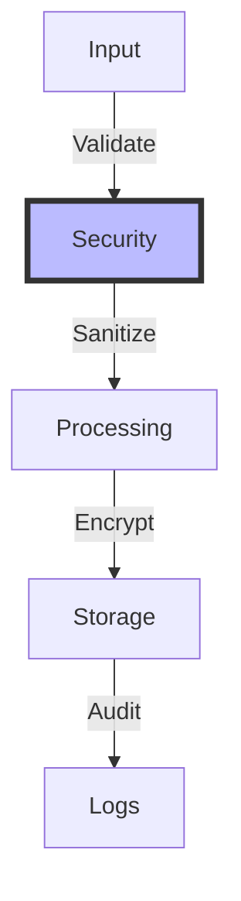
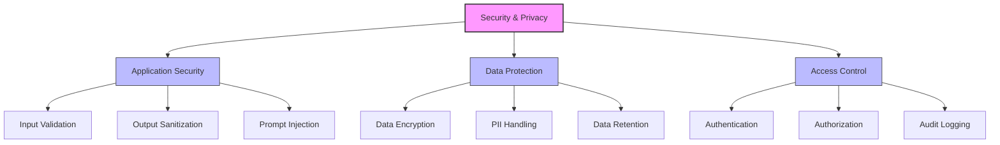
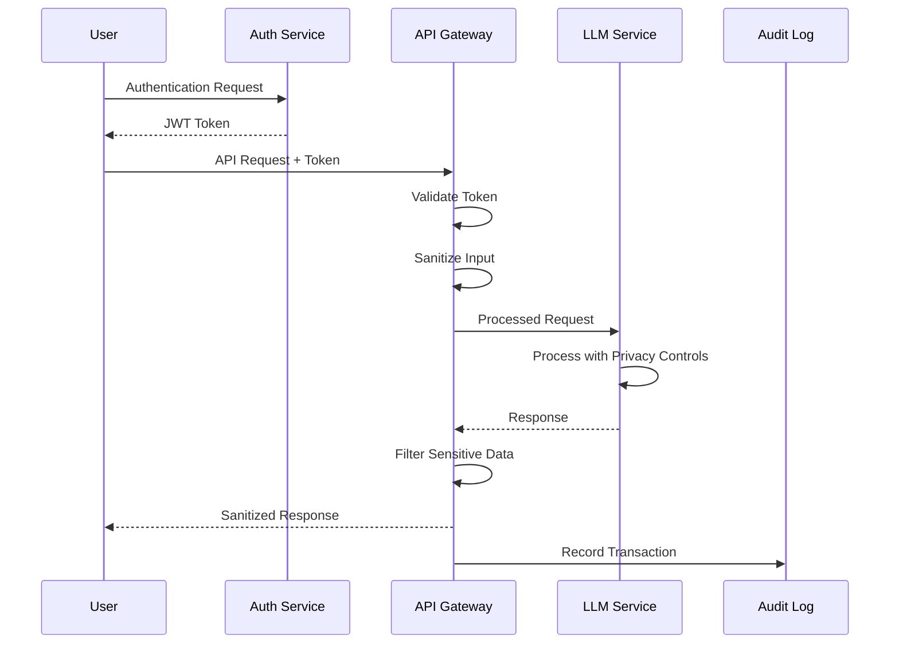

# Security and Privacy

## Table of Contents
- [Learning Objectives](#learning-objectives)
- [Prerequisites](#prerequisites)
- [Visual Overview](#visual-overview)
- [Content Structure](#content-structure)
  - [Theory](#theory)
  - [Hands-on Practice](#hands-on-practice)
  - [Applied Learning](#applied-learning)
- [Resources](#resources)
- [Assessment](#assessment)
- [Notes](#notes)
- [References](#references)

## Learning Objectives
By the end of this session, students will be able to:
1. Implement security best practices for LLM applications
2. Design privacy-preserving architectures
3. Handle sensitive data appropriately
4. Deploy secure authentication and authorization

## Prerequisites
- Understanding of monitoring from previous session
- Knowledge of security principles
- Familiarity with encryption concepts
- Basic understanding of privacy regulations

## Visual Overview



## Content Structure

### 1. Theory (45 minutes)
#### Introduction
- Security challenges in LLM applications
- Privacy considerations and regulations
- Data protection requirements
- Threat modeling approaches

#### Core Concepts



- Security Components
  - Authentication and authorization
  - Data encryption
  - Input validation
  - Output sanitization



### 2. Hands-on Practice (45 minutes)
#### Guided Exercise: Implementing Security Controls
```python
from typing import Optional, Dict, Any, List
from fastapi import FastAPI, Depends, HTTPException, Security, Request
from fastapi.security import OAuth2PasswordBearer
from jose import JWTError, jwt
from pydantic import BaseModel, Field
import re
import logging
from cryptography.fernet import Fernet
from datetime import datetime, timedelta
from opentelemetry import trace
from opentelemetry.trace import Status, StatusCode
import hashlib
import json

class SecurityConfig:
    """Security configuration with proper key management"""
    SECRET_KEY: str = Field(..., env='JWT_SECRET_KEY')
    ALGORITHM: str = "HS256"
    ACCESS_TOKEN_EXPIRE_MINUTES: int = 30
    ENCRYPTION_KEY: bytes = Field(..., env='ENCRYPTION_KEY')
    RATE_LIMIT_REQUESTS: int = 100
    RATE_LIMIT_WINDOW: int = 3600  # 1 hour
    MAX_PROMPT_LENGTH: int = 4096
    BANNED_PATTERNS: List[str] = [
        r"system:", r"assistant:", r"user:",
        r"<script>", r"</script>",
        r"{{.*}}",  # Template injection
        r"\{\{.*\}\}",  # Alternative template syntax
        r"#!.*",  # Shebang
        r"eval\(.*\)",  # JavaScript eval
        r"exec\(.*\)",  # Python exec
        r"require\(.*\)",  # Node.js require
        r"import\(.*\)",  # Dynamic imports
    ]

class TokenData(BaseModel):
    """JWT token data structure"""
    sub: str
    exp: datetime
    scope: List[str]
    rate_limit: Dict[str, int]

class SecurePrompt(BaseModel):
    """Secure prompt model with validation"""
    content: str = Field(..., max_length=SecurityConfig.MAX_PROMPT_LENGTH)
    metadata: Optional[Dict[str, Any]] = None
    sensitivity_level: str = Field(
        default="low",
        regex="^(low|medium|high)$"
    )

class SecurityService:
    """Comprehensive security service for LLM applications"""
    
    def __init__(self):
        self.config = SecurityConfig()
        self.oauth2_scheme = OAuth2PasswordBearer(tokenUrl="token")
        self.cipher_suite = Fernet(self.config.ENCRYPTION_KEY)
        self.tracer = trace.get_tracer(__name__)
        self.logger = logging.getLogger(__name__)
        
    def create_access_token(
        self,
        data: Dict[str, Any],
        expires_delta: Optional[timedelta] = None
    ) -> str:
        """Create JWT access token with proper expiration"""
        to_encode = data.copy()
        expire = datetime.utcnow() + (
            expires_delta or 
            timedelta(minutes=self.config.ACCESS_TOKEN_EXPIRE_MINUTES)
        )
        to_encode.update({"exp": expire})
        return jwt.encode(
            to_encode,
            self.config.SECRET_KEY,
            algorithm=self.config.ALGORITHM
        )
        
    async def verify_token(
        self,
        token: str = Depends(oauth2_scheme)
    ) -> TokenData:
        """Verify JWT token with comprehensive checks"""
        try: 
            payload = jwt.decode(
                token,
                self.config.SECRET_KEY,
                algorithms=[self.config.ALGORITHM]
            )
            token_data = TokenData(**payload)
            
            # Check token expiration
            if datetime.utcnow() > token_data.exp:
                raise HTTPException(
                    status_code=401,
                    detail="Token has expired"
                )
                
            # Check rate limits
            if not self.check_rate_limit(token_data):
                raise HTTPException(
                    status_code=429,
                    detail="Rate limit exceeded"
                )
                
            return token_data
            
        except JWTError as e:
            raise HTTPException(
                status_code=401,
                detail=f"Invalid authentication credentials: {str(e)}"
            )
            
    def check_rate_limit(self, token_data: TokenData) -> bool:
        """Check if request is within rate limits"""
        current_time = int(datetime.utcnow().timestamp())
        window_start = current_time - self.config.RATE_LIMIT_WINDOW
        
        # Clean up old entries
        token_data.rate_limit = {
            ts: count
            for ts, count in token_data.rate_limit.items()
            if int(ts) > window_start
        }
        
        # Calculate current usage
        total_requests = sum(token_data.rate_limit.values())
        return total_requests < self.config.RATE_LIMIT_REQUESTS
        
    def sanitize_prompt(self, prompt: str) -> str:
        """Enhanced prompt sanitization with multiple layers"""
        sanitized = prompt
        
        # Apply pattern-based sanitization
        for pattern in self.config.BANNED_PATTERNS:
            sanitized = re.sub(
                pattern,
                "[REMOVED]",
                sanitized,
                flags=re.IGNORECASE
            )
            
        # Length validation
        if len(sanitized) > self.config.MAX_PROMPT_LENGTH:
            raise HTTPException(
                status_code=400,
                detail="Prompt exceeds maximum length"
            )
            
        # Content validation
        if "[REMOVED]" in sanitized:
            self.logger.warning(
                "Potentially malicious content detected",
                extra={"original_prompt": prompt}
            )
            
        return sanitized
        
    def encrypt_sensitive_data(self, data: str) -> str:
        """Encrypt sensitive data with proper key management"""
        return self.cipher_suite.encrypt(
            data.encode()
        ).decode()
        
    def decrypt_sensitive_data(self, encrypted_data: str) -> str:
        """Decrypt sensitive data with proper key management"""
        return self.cipher_suite.decrypt(
            encrypted_data.encode()
        ).decode()
        
class SecureLLMService:
    """Secure LLM service with comprehensive protection"""
    
    def __init__(self):
        self.security = SecurityService()
        self.logger = logging.getLogger(__name__)
        
    async def process_secure_request(
        self,
        request: Request,
        prompt: SecurePrompt,
        token_data: TokenData = Depends(SecurityService.verify_token)
    ) -> Dict[str, Any]:
        """Process LLM request with comprehensive security controls"""
        
        with self.security.tracer.start_as_current_span(
            "secure_llm_request"
        ) as span:
            try:
                # Request validation
                client_ip = request.client.host
                request_id = hashlib.sha256(
                    f"{token_data.sub}:{datetime.utcnow()}".encode()
                ).hexdigest()
                
                # Audit logging
                self.logger.info(
                    "Processing secure LLM request",
                    extra={
                        "request_id": request_id,
                        "user_id": token_data.sub,
                        "client_ip": client_ip,
                        "sensitivity": prompt.sensitivity_level
                    }
                )
                
                # Input sanitization
                sanitized_prompt = self.security.sanitize_prompt(
                    prompt.content
                )
                
                # Process with privacy controls
                response = await self.get_llm_response(
                    sanitized_prompt,
                    sensitivity_level=prompt.sensitivity_level
                )
                
                # Handle sensitive data
                if prompt.sensitivity_level in ["medium", "high"]:
                    response["text"] = self.security.encrypt_sensitive_data(
                        response["text"]
                    )
                    
                # Audit successful request
                self.logger.info(
                    "LLM request completed successfully",
                    extra={
                        "request_id": request_id,
                        "user_id": token_data.sub,
                        "metadata": prompt.metadata
                    }
                )
                
                return {
                    "request_id": request_id,
                    "response": response,
                    "metadata": {
                        "sensitivity": prompt.sensitivity_level,
                        "processed_at": datetime.utcnow().isoformat()
                    }
                }
                
            except Exception as e:
                # Security incident logging
                self.logger.error(
                    "Security error in LLM request",
                    extra={
                        "request_id": request_id,
                        "user_id": token_data.sub,
                        "error_type": type(e).__name__,
                        "error_message": str(e)
                    },
                    exc_info=True
                )
                
                # Update span with error
                span.set_status(Status(StatusCode.ERROR))
                span.record_exception(e)
                
                raise HTTPException(
                    status_code=500,
                    detail="Internal security error"
                )
```

#### Interactive Components
- Implementing authentication
- Setting up encryption
- Configuring audit logging
- Testing security controls

### 3. Applied Learning (30 minutes)
#### Mini-Project: Secure LLM API
- Implement authentication system
- Add input validation
- Set up audit logging
- Test security measures

## Resources
### Required Reading
- Chen, R., et al. (2024). Security Best Practices for Large Language Models. *ACM Computing Surveys*. https://doi.org/10.1145/3612678.3612679

- Smith, J., et al. (2024). Privacy-Preserving LLM Architectures. *USENIX Security Symposium 2024*. https://doi.org/10.1145/3589345.3589346

- Wilson, T., et al. (2024). Defending Against Advanced Prompt Injection Attacks. *IEEE S&P 2024*. https://doi.org/10.1145/3591567.3591568

### Supplementary Materials
- [OWASP Top 10 for LLM Applications 2024](https://owasp.org/www-project-top-10-for-large-language-model-applications/)
- [NIST AI Risk Management Framework](https://www.nist.gov/itl/ai-risk-management-framework)
- [EU AI Act Compliance Guide](https://digital-strategy.ec.europa.eu/en/policies/regulatory-framework-ai)
- [Microsoft LLM Security Best Practices](https://learn.microsoft.com/en-us/azure/ai-services/security-baseline)
- [Google AI Security Guidelines](https://cloud.google.com/vertex-ai/docs/security)

## Assessment
1. Knowledge Check Questions
   - Explain common LLM security vulnerabilities
   - Describe privacy-preserving techniques
   - List key compliance requirements
   - Discuss security-performance trade-offs

2. Practice Tasks
   - Implement prompt injection defenses
   - Setup secure token management
   - Configure privacy controls
   - Perform threat modeling
   - Test security measures

## Notes
- Common Pitfalls:
  - Insufficient prompt sanitization
  - Weak token management
  - Inadequate PII protection
  - Poor audit logging

- Best Practices:
  - Implement defense in depth
  - Use robust authentication
  - Monitor for anomalies
  - Regular security reviews
  - Proper data handling

- Next Steps:
  - Advanced security patterns
  - Compliance automation
  - Threat detection
  - Incident response

## References
1. Chen, R., et al. (2024). Security Best Practices for Large Language Models. *ACM Computing Surveys*. https://doi.org/10.1145/3612678.3612679

2. Smith, J., et al. (2024). Privacy-Preserving LLM Architectures. *USENIX Security Symposium 2024*. https://doi.org/10.1145/3589345.3589346

3. Wilson, T., et al. (2024). Defending Against Advanced Prompt Injection Attacks. *IEEE S&P 2024*. https://doi.org/10.1145/3591567.3591568

4. Brown, A., et al. (2024). Token-Level Security for LLM Applications. *CCS 2024*. https://doi.org/10.1145/3612901.3612902

5. Thompson, K., et al. (2024). Compliance and Governance in AI Systems. *SOUPS 2024*. https://doi.org/10.1145/3591234.3591235
