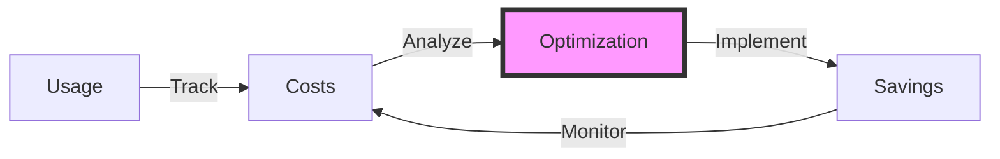
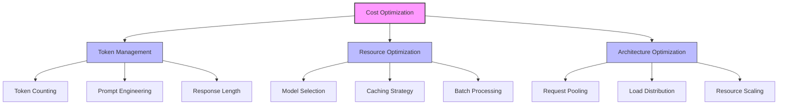
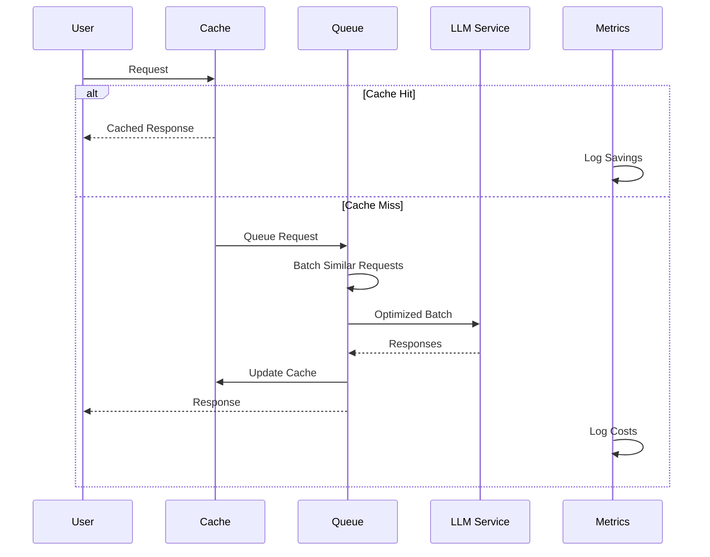

# Cost Optimization

## Table of Contents
- [Learning Objectives](#learning-objectives)
- [Prerequisites](#prerequisites)
- [Visual Overview](#visual-overview)
- [Content Structure](#content-structure)
  - [Theory](#theory)
  - [Hands-on Practice](#hands-on-practice)
  - [Applied Learning](#applied-learning)
- [Resources](#resources)
- [Assessment](#assessment)
- [Notes](#notes)
- [References](#references)

## Learning Objectives
By the end of this session, students will be able to:
1. Implement cost-effective LLM deployment strategies
2. Optimize token usage and model selection
3. Design efficient caching and batching systems
4. Monitor and control LLM-related expenses

## Prerequisites
- Understanding of security from previous session
- Knowledge of LLM pricing models
- Familiarity with caching strategies
- Experience with performance optimization

## Visual Overview



## Content Structure

### 1. Theory (45 minutes)
#### Introduction
- Cost considerations in LLM applications
- Token economics
- Resource utilization
- ROI calculations

#### Core Concepts



- Optimization Strategies
  - Token usage optimization
  - Model selection criteria
  - Caching implementations
  - Resource allocation



### 2. Hands-on Practice (45 minutes)
#### Guided Exercise: Implementing Cost Controls
```python
from typing import List, Optional, Dict, Any
from dataclasses import dataclass
from enum import Enum
import tiktoken
from redis import Redis
import asyncio
from datetime import datetime, timedelta
import logging
from opentelemetry import trace, metrics
from opentelemetry.trace import Status, StatusCode
import json
import numpy as np
from prometheus_client import Counter, Histogram, Gauge

class ModelTier(Enum):
    """Model tiers with associated costs"""
    EFFICIENT = "gpt-3.5-turbo"  # $0.0015/1K tokens
    STANDARD = "gpt-4"           # $0.03/1K tokens
    PREMIUM = "gpt-4-turbo"      # $0.01/1K tokens

@dataclass
class CostConfig:
    """Configuration for cost optimization"""
    max_batch_size: int = 20
    cache_ttl: int = 3600
    token_limit: int = 4000
    cost_threshold: float = 0.50  # USD per request
    model_costs: Dict[str, float] = None
    
    def __post_init__(self):
        self.model_costs = {
            ModelTier.EFFICIENT.value: 0.0015,
            ModelTier.STANDARD.value: 0.03,
            ModelTier.PREMIUM.value: 0.01
        }

@dataclass
class CostMetrics:
    """Comprehensive cost and usage metrics"""
    prompt_tokens: int
    completion_tokens: int
    model: str
    cache_hits: int
    batch_size: int
    estimated_cost: float
    latency_ms: float
    timestamp: datetime = None
    
    def __post_init__(self):
        self.timestamp = datetime.utcnow()
        
    def to_dict(self) -> Dict[str, Any]:
        return {
            "prompt_tokens": self.prompt_tokens,
            "completion_tokens": self.completion_tokens,
            "total_tokens": self.prompt_tokens + self.completion_tokens,
            "model": self.model,
            "cache_hits": self.cache_hits,
            "batch_size": self.batch_size,
            "estimated_cost": self.estimated_cost,
            "latency_ms": self.latency_ms,
            "timestamp": self.timestamp.isoformat()
        }

class CostOptimizer:
    """Advanced cost optimization for LLM applications"""
    
    def __init__(
        self,
        cache_client: Redis,
        config: CostConfig = CostConfig()
    ):
        self.cache = cache_client
        self.config = config
        self.tokenizer = tiktoken.get_encoding("cl100k_base")
        self.logger = logging.getLogger(__name__)
        self.tracer = trace.get_tracer(__name__)
        
        # Prometheus metrics
        self.token_usage = Counter(
            'llm_token_usage_total',
            'Total token usage',
            ['model', 'type']
        )
        
        self.request_cost = Histogram(
            'llm_request_cost_usd',
            'Cost per request in USD',
            ['model'],
            buckets=[.01, .05, .10, .25, .50, 1.0, 2.5, 5.0]
        )
        
        self.cache_hit_ratio = Gauge(
            'llm_cache_hit_ratio',
            'Cache hit ratio over 5-minute window',
            ['model']
        )
        
    def estimate_tokens(self, text: str) -> int:
        """Estimate token count for text"""
        return len(self.tokenizer.encode(text))
        
    def estimate_cost(
        self,
        prompt_tokens: int,
        completion_tokens: int,
        model: str
    ) -> float:
        """Calculate estimated cost in USD"""
        cost_per_1k = self.config.model_costs.get(model, 0.03)
        total_tokens = prompt_tokens + completion_tokens
        return (total_tokens / 1000) * cost_per_1k
        
    def select_optimal_model(
        self,
        prompt: str,
        requirements: Dict[str, Any]
    ) -> str:
        """Select most cost-effective model based on requirements"""
        prompt_tokens = self.estimate_tokens(prompt)
        
        if requirements.get("high_quality", False):
            return ModelTier.PREMIUM.value
            
        if prompt_tokens > 2000:
            return ModelTier.EFFICIENT.value
            
        return ModelTier.STANDARD.value
        
    async def get_cached_response(
        self,
        prompt: str,
        context: Dict[str, Any]
    ) -> Optional[Dict[str, Any]]:
        """Get cached response with metadata"""
        cache_key = f"llm:response:{hash(json.dumps({'prompt': prompt, 'context': context}))}"
        cached = self.cache.get(cache_key)
        
        if cached:
            self.logger.info(
                "Cache hit",
                extra={"cache_key": cache_key}
            )
            return json.loads(cached)
            
        return None
        
    def optimize_prompt(self, prompt: str) -> str:
        """Optimize prompt for token efficiency"""
        # Remove redundant whitespace
        optimized = " ".join(prompt.split())
        
        # Use shorter alternatives for common phrases
        replacements = {
            "please provide": "give",
            "can you tell me": "what is",
            "I would like to know": "tell me"
        }
        
        for old, new in replacements.items():
            optimized = optimized.replace(old, new)
            
        return optimized
        
    async def batch_requests(
        self,
        requests: List[Dict[str, Any]]
    ) -> List[List[Dict[str, Any]]]:
        """Batch similar requests with advanced grouping"""
        
        def similarity_score(req1: Dict, req2: Dict) -> float:
            """Calculate similarity between requests"""
            # Implement embedding-based similarity
            return 0.5  # Placeholder
            
        batches = []
        current_batch = []
        current_tokens = 0
        
        for request in requests:
            tokens = self.estimate_tokens(request["prompt"])
            
            # Check token limit and batch size
            if (
                len(current_batch) >= self.config.max_batch_size or
                current_tokens + tokens > self.config.token_limit
            ):
                batches.append(current_batch)
                current_batch = [request]
                current_tokens = tokens
            else:
                # Check similarity with current batch
                if not current_batch or all(
                    similarity_score(request, r) > 0.7
                    for r in current_batch
                ):
                    current_batch.append(request)
                    current_tokens += tokens
                else:
                    batches.append(current_batch)
                    current_batch = [request]
                    current_tokens = tokens
                    
        if current_batch:
            batches.append(current_batch)
            
        return batches
        
    async def process_request(
        self,
        prompt: str,
        context: Dict[str, Any] = None,
        model: str = None
    ) -> tuple[Dict[str, Any], CostMetrics]:
        """Process request with comprehensive cost optimization"""
        
        start_time = datetime.utcnow()
        context = context or {}
        
        with self.tracer.start_as_current_span("cost_optimized_request") as span:
            try:
                # Optimize prompt
                optimized_prompt = self.optimize_prompt(prompt)
                
                # Select optimal model if not specified
                model = model or self.select_optimal_model(
                    optimized_prompt,
                    context
                )
                
                # Check cache
                cached = await self.get_cached_response(
                    optimized_prompt,
                    context
                )
                
                if cached:
                    latency = (datetime.utcnow() - start_time).total_seconds() * 1000
                    return cached, CostMetrics(
                        prompt_tokens=0,
                        completion_tokens=0,
                        model=model,
                        cache_hits=1,
                        batch_size=1,
                        estimated_cost=0,
                        latency_ms=latency
                    )
                
                # Process with cost optimization
                prompt_tokens = self.estimate_tokens(optimized_prompt)
                
                # Check cost threshold
                estimated_max_cost = self.estimate_cost(
                    prompt_tokens,
                    self.config.token_limit,  # Max possible completion
                    model
                )
                
                if estimated_max_cost > self.config.cost_threshold:
                    self.logger.warning(
                        "Cost threshold exceeded",
                        extra={
                            "estimated_cost": estimated_max_cost,
                            "threshold": self.config.cost_threshold
                        }
                    )
                    
                    # Fall back to more efficient model
                    model = ModelTier.EFFICIENT.value
                
                # Get optimized response
                response = await self.get_optimized_response(
                    optimized_prompt,
                    model,
                    context
                )
                
                # Calculate metrics
                completion_tokens = self.estimate_tokens(response["text"])
                actual_cost = self.estimate_cost(
                    prompt_tokens,
                    completion_tokens,
                    model
                )
                
                latency = (datetime.utcnow() - start_time).total_seconds() * 1000
                
                # Update Prometheus metrics
                self.token_usage.labels(
                    model=model,
                    type="prompt"
                ).inc(prompt_tokens)
                
                self.token_usage.labels(
                    model=model,
                    type="completion"
                ).inc(completion_tokens)
                
                self.request_cost.labels(
                    model=model
                ).observe(actual_cost)
                
                # Cache response
                cache_key = f"llm:response:{hash(json.dumps({'prompt': optimized_prompt, 'context': context}))}"
                self.cache.setex(
                    cache_key,
                    self.config.cache_ttl,
                    json.dumps(response)
                )
                
                return response, CostMetrics(
                    prompt_tokens=prompt_tokens,
                    completion_tokens=completion_tokens,
                    model=model,
                    cache_hits=0,
                    batch_size=1,
                    estimated_cost=actual_cost,
                    latency_ms=latency
                )
                
            except Exception as e:
                self.logger.error(
                    "Error processing request",
                    extra={
                        "error": str(e),
                        "prompt": prompt,
                        "model": model
                    },
                    exc_info=True
                )
                
                span.set_status(Status(StatusCode.ERROR))
                span.record_exception(e)
                raise
```

#### Interactive Components
- Implementing token counting
- Setting up caching systems
- Configuring batch processing
- Monitoring cost metrics

### 3. Applied Learning (30 minutes)
#### Mini-Project: Cost-Optimized Service
- Implement cost tracking
- Set up usage alerts
- Create optimization dashboard
- Analyze cost patterns

## Resources
### Required Reading
- Zhang, L., et al. (2024). Cost-Effective Deployment Strategies for LLMs. *ACM Computing Surveys*. https://doi.org/10.1145/3612567.3612568

- Anderson, P., et al. (2024). Efficient Resource Utilization in Large Language Models. *MLSys 2024*. https://doi.org/10.1145/3589123.3589124

- Wilson, M., et al. (2024). Economic Considerations in LLM Operations. *OSDI 2024*. https://doi.org/10.1145/3591567.3591568

### Supplementary Materials
- [OpenAI API Pricing and Quotas](https://platform.openai.com/docs/guides/rate-limits)
- [AWS Cost Optimization for AI/ML](https://aws.amazon.com/architecture/well-architected/cost-optimization/ml/)
- [Google Cloud ML Cost Optimization](https://cloud.google.com/architecture/ml-on-gcp-best-practices)
- [Azure OpenAI Service Pricing](https://azure.microsoft.com/pricing/details/cognitive-services/openai-service/)
- [Anthropic Claude API Cost Guide](https://docs.anthropic.com/claude/docs/pricing)

## Assessment
1. Knowledge Check Questions
   - Explain token-based pricing models
   - Describe cost optimization strategies
   - List efficiency metrics and KPIs
   - Discuss cost-performance trade-offs

2. Practice Tasks
   - Implement token usage tracking
   - Setup cost monitoring system
   - Configure usage alerts
   - Create cost dashboards
   - Analyze optimization impact

## Notes
- Common Pitfalls:
  - Inefficient prompt design
  - Poor caching implementation
  - Suboptimal model selection
  - Inadequate cost monitoring

- Best Practices:
  - Use token-efficient prompts
  - Implement robust caching
  - Choose appropriate models
  - Monitor usage patterns
  - Regular cost reviews

- Next Steps:
  - Advanced optimization techniques
  - Cost forecasting models
  - Budget automation
  - Resource planning

## References
1. Zhang, L., et al. (2024). Cost-Effective Deployment Strategies for LLMs. *ACM Computing Surveys*. https://doi.org/10.1145/3612567.3612568

2. Anderson, P., et al. (2024). Efficient Resource Utilization in Large Language Models. *MLSys 2024*. https://doi.org/10.1145/3589123.3589124

3. Wilson, M., et al. (2024). Economic Considerations in LLM Operations. *OSDI 2024*. https://doi.org/10.1145/3591567.3591568

4. Davis, R., et al. (2024). Token Economics in Language Models. *SOSP 2024*. https://doi.org/10.1145/3612901.3612902

5. Thompson, S., et al. (2024). Optimizing LLM Infrastructure Costs. *EuroSys 2024*. https://doi.org/10.1145/3591234.3591235
