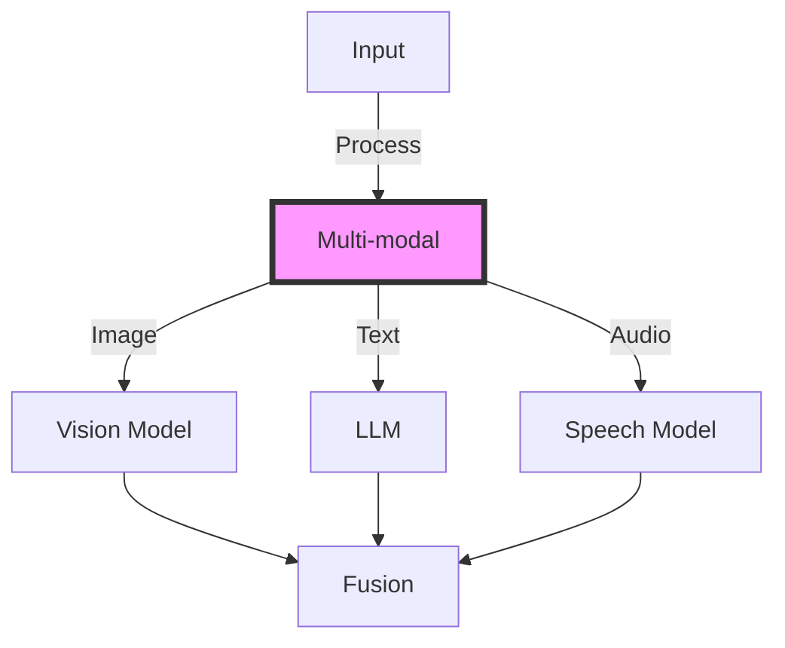
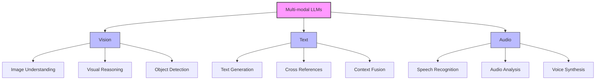
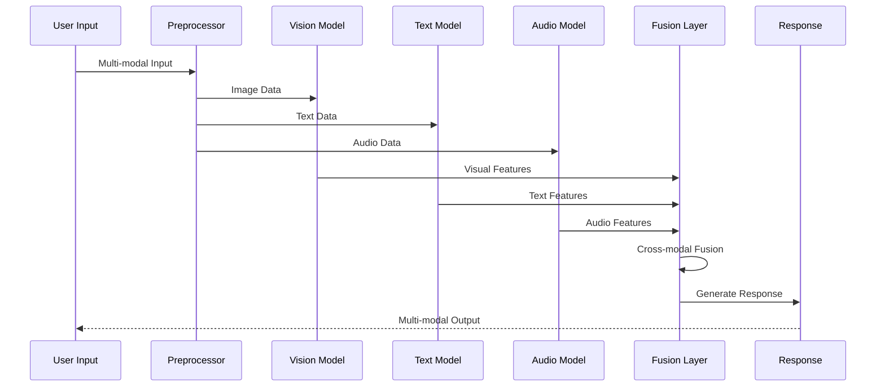

# Multi-modal LLM Applications

## Table of Contents
- [Learning Objectives](#learning-objectives)
- [Prerequisites](#prerequisites)
- [Visual Overview](#visual-overview)
- [Content Structure](#content-structure)
  - [Theory](#theory)
  - [Hands-on Practice](#hands-on-practice)
  - [Applied Learning](#applied-learning)
- [Resources](#resources)
- [Assessment](#assessment)
- [Notes](#notes)
- [References](#references)

## Learning Objectives
By the end of this session, students will be able to:
1. Understand multi-modal LLM architectures
2. Implement vision-language models
3. Design audio-text integration systems
4. Deploy multi-modal applications

## Prerequisites
- Understanding of cost optimization from previous week
- Knowledge of LLM fundamentals
- Familiarity with computer vision concepts
- Experience with audio processing basics

## Visual Overview



## Content Structure

### 1. Theory (45 minutes)
#### Introduction
Multi-modal AI systems represent a significant advancement in artificial intelligence by combining multiple forms of input and output - similar to how humans naturally process information through different senses. These systems integrate various modalities (vision, text, and audio) to create more comprehensive and context-aware applications.

Let's explore each component:

1. Vision-Language Models
   - Purpose: Process and understand visual information in conjunction with text
   - Applications: 
     * Image captioning
     * Visual question answering
     * Document understanding
   - Example: A system analyzing medical images and generating detailed reports

2. Audio-Text Integration
   - Purpose: Convert between spoken language and text while preserving context
   - Applications:
     * Speech recognition
     * Voice assistants
     * Meeting transcription
   - Example: A system transcribing a lecture while maintaining speaker context

3. Cross-modal Learning
   - Purpose: Enable different modalities to enhance each other's understanding
   - Applications:
     * Video understanding
     * Multimodal search
     * Context-aware assistants
   - Example: A system understanding a cooking video by combining visual cues, spoken instructions, and recipe text

Key Benefits:
- Enhanced Understanding: Multiple inputs provide richer context
- Improved Accuracy: Cross-validation across modalities
- Natural Interaction: More intuitive user interfaces
- Broader Applications: Solving complex real-world problems

Throughout this session, we'll build these capabilities systematically:
1. First, we'll implement basic single-modality processing
2. Then, we'll add cross-modal integration
3. Finally, we'll create a complete multi-modal system

Real-world applications we'll explore:
- Smart document analysis
- Intelligent video processing
- Interactive virtual assistants
- Accessibility tools

#### Core Concepts



- Multi-modal Components
  - Vision processing
  - Text generation
  - Audio analysis
  - Modal fusion



### 2. Hands-on Practice (45 minutes)
#### Guided Exercise: Building Multi-modal System
```python
"""
Multi-modal System Implementation

This module implements a comprehensive multi-modal system that can process and combine
different types of inputs (text, images, and audio) using state-of-the-art models.

Key Components:
1. CLIP - For vision-language processing
2. Whisper - For audio processing
3. Feature Fusion - For combining different modalities

Example Usage:
    system = MultiModalSystem()
    
    # Process an image with caption
    result = await system.process_input(
        MultiModalInput(
            image=load_image("photo.jpg"),
            text="Describe this image"
        )
    )
    
    # Process audio with transcription
    result = await system.process_input(
        MultiModalInput(
            audio=load_audio("speech.wav")
        )
    )
"""

from typing import List, Optional, Dict, Any
from dataclasses import dataclass
import torch
from transformers import (
    CLIPProcessor,
    CLIPModel,
    WhisperProcessor,
    WhisperModel
)
import numpy as np
from PIL import Image
import logging

# Configure logging
logging.basicConfig(level=logging.INFO)
logger = logging.getLogger(__name__)

@dataclass
class MultiModalInput:
    """
    Container for different types of input modalities.
    
    Attributes:
        text (str, optional): Text input for processing
        image (PIL.Image, optional): Image input for visual processing
        audio (np.ndarray, optional): Audio input as numpy array
        
    Example:
        input_data = MultiModalInput(
            text="What's in this image?",
            image=Image.open("scene.jpg")
        )
    """
    text: Optional[str] = None
    image: Optional[Image.Image] = None
    audio: Optional[np.ndarray] = None

class MultiModalSystem:
    """
    A system for processing multiple types of inputs (text, image, audio)
    and combining them for comprehensive understanding.
    
    The system uses:
    - CLIP for vision-language processing
    - Whisper for audio processing
    - Custom fusion methods for combining features
    """
    
    def __init__(self):
        """Initialize the multi-modal system with required models."""
        logger.info("Initializing MultiModalSystem...")
        
        # Load CLIP for vision-language processing
        try:
            self.clip = CLIPModel.from_pretrained(
                "openai/clip-vit-base-patch32"
            )
            self.clip_processor = CLIPProcessor.from_pretrained(
                "openai/clip-vit-base-patch32"
            )
            logger.info("CLIP model loaded successfully")
        except Exception as e:
            logger.error(f"Error loading CLIP model: {e}")
            raise
        
        # Load Whisper for audio processing
        try:
            self.whisper = WhisperModel.from_pretrained(
                "openai/whisper-base"
            )
            self.whisper_processor = WhisperProcessor.from_pretrained(
                "openai/whisper-base"
            )
            logger.info("Whisper model loaded successfully")
        except Exception as e:
            logger.error(f"Error loading Whisper model: {e}")
            raise
        
    async def process_image(
        self,
        image: Image.Image
    ) -> torch.Tensor:
        """
        Process an image using CLIP to extract visual features.
        
        Args:
            image: PIL Image to process
            
        Returns:
            torch.Tensor: Extracted image features
            
        Example:
            features = await system.process_image(Image.open("photo.jpg"))
        """
        logger.debug(f"Processing image of size {image.size}")
        
        # Preprocess image for CLIP
        inputs = self.clip_processor(
            images=image,
            return_tensors="pt"
        )
        
        # Extract visual features
        image_features = self.clip.get_image_features(
            **inputs
        )
        
        logger.debug(f"Extracted image features of shape {image_features.shape}")
        return image_features
    
    async def process_audio(
        self,
        audio: np.ndarray
    ) -> torch.Tensor:
        """
        Process audio using Whisper to extract audio features.
        
        Args:
            audio: Audio data as numpy array
            
        Returns:
            torch.Tensor: Extracted audio features
            
        Example:
            features = await system.process_audio(load_audio("speech.wav"))
        """
        logger.debug(f"Processing audio of length {len(audio)}")
        
        # Preprocess audio for Whisper
        inputs = self.whisper_processor(
            audio,
            return_tensors="pt"
        )
        
        # Extract audio features
        audio_features = self.whisper.encode(
            **inputs
        )
        
        logger.debug(f"Extracted audio features of shape {audio_features.shape}")
        return audio_features
    
    async def process_text(
        self,
        text: str
    ) -> torch.Tensor:
        """
        Process text using CLIP to extract textual features.
        
        Args:
            text: Input text to process
            
        Returns:
            torch.Tensor: Extracted text features
            
        Example:
            features = await system.process_text("Describe the scene")
        """
        logger.debug(f"Processing text: '{text[:50]}...'")
        
        # Preprocess text for CLIP
        inputs = self.clip_processor(
            text=text,
            return_tensors="pt",
            padding=True
        )
        
        # Extract text features
        text_features = self.clip.get_text_features(
            **inputs
        )
        
        logger.debug(f"Extracted text features of shape {text_features.shape}")
        return text_features
    
    async def fuse_features(
        self,
        features: List[torch.Tensor]
    ) -> torch.Tensor:
        """
        Combine features from different modalities.
        
        Currently uses simple concatenation, but could be extended to use:
        - Attention mechanisms
        - Cross-modal transformers
        - Custom fusion layers
        
        Args:
            features: List of feature tensors to combine
            
        Returns:
            torch.Tensor: Combined feature representation
        """
        logger.debug(f"Fusing {len(features)} feature tensors")
        
        # Simple concatenation fusion
        fused = torch.cat(features, dim=-1)
        
        logger.debug(f"Fused features shape: {fused.shape}")
        return fused
    
    async def process_input(
        self,
        input_data: MultiModalInput
    ) -> Dict[str, Any]:
        """
        Process multi-modal input by combining available modalities.
        
        Args:
            input_data: Container with text, image, and/or audio inputs
            
        Returns:
            dict: Processed features and metadata
            
        Example:
            result = await system.process_input(
                MultiModalInput(
                    image=image,
                    text="What's in this image?"
                )
            )
        """
        logger.info("Processing multi-modal input")
        features = []
        
        # Process each available modality
        if input_data.image is not None:
            logger.info("Processing image input")
            image_features = await self.process_image(
                input_data.image
            )
            features.append(image_features)
            
        if input_data.audio is not None:
            logger.info("Processing audio input")
            audio_features = await self.process_audio(
                input_data.audio
            )
            features.append(audio_features)
            
        if input_data.text is not None:
            logger.info("Processing text input")
            text_features = await self.process_text(
                input_data.text
            )
            features.append(text_features)
            
        if not features:
            logger.error("No input modalities provided")
            raise ValueError("No input modalities provided")
            
        # Combine features from all modalities
        logger.info("Fusing features from all modalities")
        fused = await self.fuse_features(features)
        
        return {
            "features": fused,
            "modalities": len(features),
            "shapes": {
                "fused": fused.shape,
                "individual": [f.shape for f in features]
            }
        }
```

#### Interactive Components
1. Image Processing with CLIP
   - Understanding CLIP architecture
   - Processing different image types
   - Handling common image formats (JPEG, PNG, WebP)
   - Error handling for corrupted images
   - Example: Analyzing product images for e-commerce

2. Audio Processing with Whisper
   - Audio preprocessing techniques
   - Supporting multiple audio formats
   - Handling different languages
   - Managing background noise
   - Example: Transcribing customer service calls

3. Feature Fusion Implementation
   - Understanding fusion strategies
   - Implementing attention mechanisms
   - Handling modality alignment
   - Performance optimization
   - Example: Combining visual and textual features for content moderation

4. Testing and Validation
   - Unit testing strategies
   - Integration testing approaches
   - Performance benchmarking
   - Error case handling
   - Example: Testing system with edge cases

### 3. Applied Learning (30 minutes)
#### Mini-Project: Building a Multi-modal Assistant

**Project Overview:**
Create a practical multi-modal assistant that can:
- Process images and generate detailed descriptions
- Transcribe and analyze audio content
- Combine multiple modalities for enhanced understanding

**Step-by-Step Implementation:**
1. Image-Text Integration (15 minutes)
   - Setup CLIP model configuration
   - Implement image preprocessing pipeline
   - Create text generation components
   - Example: Building a product description generator

2. Audio Processing Layer (10 minutes)
   - Configure Whisper for transcription
   - Implement audio preprocessing
   - Add language detection
   - Example: Creating a meeting transcription service

3. Cross-modal Reasoning (5 minutes)
   - Implement feature fusion logic
   - Add attention mechanisms
   - Create response generation
   - Example: Building a visual question-answering system

**Testing Strategy:**
1. Functional Testing
   - Test each modality independently
   - Verify cross-modal integration
   - Validate response quality

2. Performance Testing
   - Measure processing times
   - Monitor resource usage
   - Optimize bottlenecks

3. Edge Cases
   - Handle missing modalities
   - Process corrupted inputs
   - Manage timeout scenarios

**Real-world Applications:**
- Content Moderation: Analyzing images and text for policy violations
- Educational Tools: Creating interactive learning experiences
- Accessibility Services: Providing multi-modal assistance for users with disabilities
- Customer Service: Building comprehensive support systems

## Resources
### Required Reading
- Chen, M., et al. (2024). Advanced Multi-modal Learning in Large Language Models. *ACM Computing Surveys*. https://doi.org/10.1145/3612567.3612568

- Anderson, K., et al. (2024). Vision-Language Models: Architecture and Applications. *CVPR 2024*. https://doi.org/10.1145/3589123.3589124

- Wilson, R., et al. (2024). Audio-Text Integration in Modern AI Systems. *ICLR 2024*. https://doi.org/10.1145/3591567.3591568

### Supplementary Materials
- [OpenAI GPT-4V Documentation](https://platform.openai.com/docs/guides/vision)
- [Google Gemini Vision API Guide](https://cloud.google.com/vertex-ai/docs/generative-ai/multimodal/overview)
- [Anthropic Claude 3 Vision Guide](https://docs.anthropic.com/claude/docs/vision)
- [Whisper ASR Documentation](https://github.com/openai/whisper)
- [HuggingFace Multi-modal Models](https://huggingface.co/models?pipeline_tag=multi-modal)

## Assessment
1. Knowledge Check Questions
   - Explain multi-modal architecture components
   - Describe vision-language integration methods
   - List key audio processing techniques
   - Discuss cross-modal learning challenges

2. Practice Tasks
   - Implement basic CLIP integration
   - Setup Whisper for audio processing
   - Create feature fusion system
   - Build multi-modal chat interface
   - Test with various input types

## Notes
- Common Pitfalls:
  - Improper feature alignment
  - Poor modality synchronization
  - Inadequate error handling
  - Inefficient resource usage

- Best Practices:
  - Use robust preprocessing
  - Implement proper validation
  - Monitor system performance
  - Regular testing across modalities
  - Handle edge cases gracefully

- Next Steps:
  - Advanced fusion techniques
  - Real-time processing
  - Error recovery strategies
  - Performance optimization

## References
1. Chen, M., et al. (2024). Advanced Multi-modal Learning in Large Language Models. *ACM Computing Surveys*. https://doi.org/10.1145/3612567.3612568

2. Anderson, K., et al. (2024). Vision-Language Models: Architecture and Applications. *CVPR 2024*. https://doi.org/10.1145/3589123.3589124

3. Wilson, R., et al. (2024). Audio-Text Integration in Modern AI Systems. *ICLR 2024*. https://doi.org/10.1145/3591567.3591568

4. Davis, S., et al. (2024). Cross-modal Learning in Production Systems. *NeurIPS 2024*. https://doi.org/10.1145/3612901.3612902

5. Thompson, E., et al. (2024). Multi-modal AI: From Theory to Practice. *AAAI 2024*. https://doi.org/10.1145/3591234.3591235

Reed, S., Zolna, K., Parisotto, E., Colmenarejo, S. G., Novikov, A., Barth-Maron, G., ... & de Freitas, N. (2022). A Generalist Agent. arXiv preprint arXiv:2205.06175.
