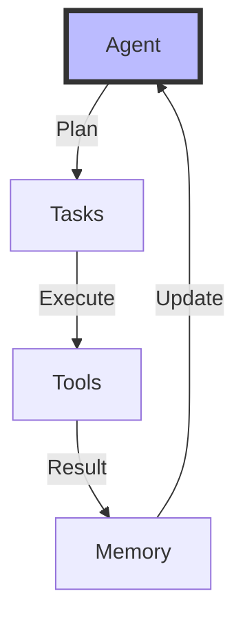
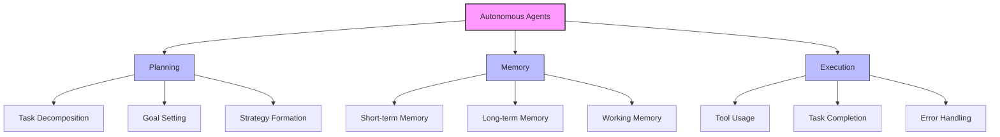
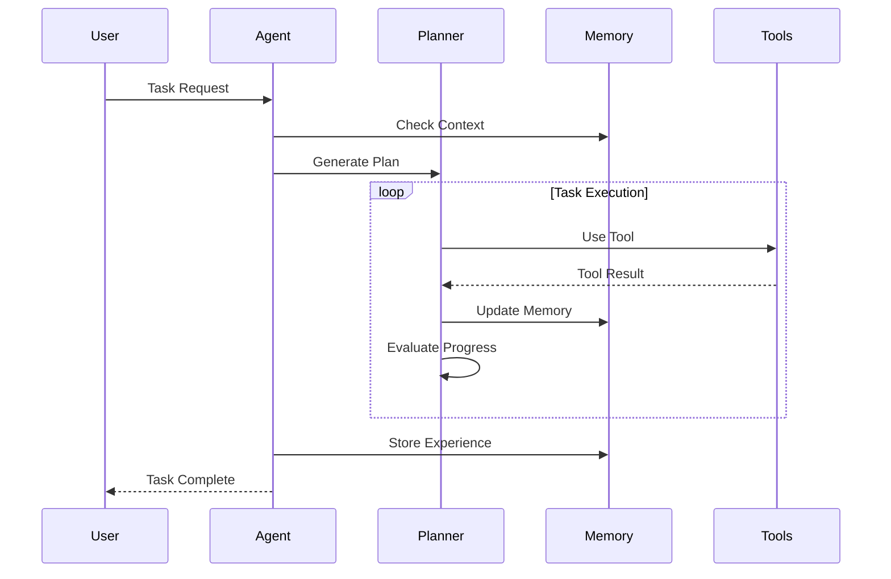

# Autonomous Agents

## Table of Contents
- [Learning Objectives](#learning-objectives)
- [Prerequisites](#prerequisites)
- [Visual Overview](#visual-overview)
- [Content Structure](#content-structure)
  - [Theory](#theory)
  - [Hands-on Practice](#hands-on-practice)
  - [Applied Learning](#applied-learning)
- [Resources](#resources)
- [Assessment](#assessment)
- [Notes](#notes)
- [References](#references)

## Learning Objectives
By the end of this session, students will be able to:
1. Understand autonomous agent architectures
2. Implement task planning systems
3. Design agent memory and reasoning
4. Deploy multi-agent systems

## Prerequisites
- Understanding of multi-modal systems from previous session
- Knowledge of LLM function calling
- Familiarity with state management
- Experience with async programming

## Visual Overview



## Content Structure

### 1. Theory (45 minutes)
#### Introduction

**What are Autonomous Agents?**
Autonomous agents are AI systems that can:
- Plan and execute tasks independently
- Make decisions based on context and goals
- Learn from past experiences
- Adapt to new situations
- Collaborate with other agents

Think of them as intelligent assistants that combine:
- Language understanding (from LLMs)
- Strategic planning
- Memory management
- Tool manipulation
- Error handling

**Key Components**

1. Task Planning System
   - Purpose: Break down complex goals into actionable steps
   - Example: Converting "organize my research" into specific tasks
   - Benefits: 
     * Systematic approach to problem-solving
     * Efficient resource allocation
     * Progress tracking

2. Memory Management
   - Purpose: Store and retrieve relevant experiences
   - Example: Remembering successful strategies for similar tasks
   - Benefits:
     * Improved decision making
     * Learning from past experiences
     * Context awareness

3. Multi-agent Coordination
   - Purpose: Enable collaboration between specialized agents
   - Example: Different agents handling research, writing, and editing
   - Benefits:
     * Parallel processing
     * Specialized expertise
     * Scalable solutions

4. Error Recovery
   - Purpose: Handle unexpected situations gracefully
   - Example: Adapting when a resource is unavailable
   - Benefits:
     * System reliability
     * Task completion assurance
     * Continuous operation

**Summary Box**
```
Key Takeaways:
1. Agents combine LLM intelligence with practical capabilities
2. Planning and memory are crucial for effective operation
3. Multi-agent systems enable complex task handling
4. Error recovery ensures reliable performance
```

#### Core Concepts



- Agent Components
  - Planning system
  - Memory management
  - Tool utilization
  - Error recovery



### 2. Hands-on Practice (45 minutes)
#### Guided Exercise: Building Autonomous Agent
```python
from typing import List, Dict, Optional
from dataclasses import dataclass
import asyncio
from datetime import datetime
import json

@dataclass
class Memory:
    short_term: List[Dict]
    long_term: List[Dict]
    working: Dict

class AutonomousAgent:
    def __init__(
        self,
        name: str,
        tools: List[callable],
        memory_capacity: int = 100
    ):
        self.name = name
        self.tools = {
            tool.__name__: tool for tool in tools
        }
        self.memory = Memory(
            short_term=[],
            long_term=[],
            working={}
        )
        self.memory_capacity = memory_capacity
        
    async def plan_task(
        self,
        task: str
    ) -> List[Dict]:
        # Generate task plan using LLM
        plan = await self.generate_plan(task)
        
        # Store in working memory
        self.memory.working["current_plan"] = plan
        
        return plan
    
    async def execute_step(
        self,
        step: Dict
    ) -> Dict:
        tool_name = step.get("tool")
        if tool_name not in self.tools:
            raise ValueError(f"Unknown tool: {tool_name}")
            
        tool = self.tools[tool_name]
        result = await tool(**step.get("args", {}))
        
        # Update memory
        self.update_memory({
            "step": step,
            "result": result,
            "timestamp": datetime.now().isoformat()
        })
        
        return result
    
    async def execute_plan(
        self,
        plan: List[Dict]
    ) -> List[Dict]:
        results = []
        
        for step in plan:
            try:
                result = await self.execute_step(step)
                results.append({
                    "step": step,
                    "status": "success",
                    "result": result
                })
            except Exception as e:
                results.append({
                    "step": step,
                    "status": "error",
                    "error": str(e)
                })
                # Attempt recovery
                recovery_plan = await self.handle_error(
                    step,
                    str(e)
                )
                if recovery_plan:
                    recovery_results = await self.execute_plan(
                        recovery_plan
                    )
                    results.extend(recovery_results)
                    
        return results
    
    def update_memory(
        self,
        entry: Dict
    ):
        # Add to short-term memory
        self.memory.short_term.append(entry)
        
        # Maintain capacity
        if len(self.memory.short_term) > self.memory_capacity: 
            # Move oldest to long-term memory
            oldest = self.memory.short_term.pop(0)
            self.memory.long_term.append(oldest)
            
    async def handle_error(
        self,
        failed_step: Dict,
        error: str
    ) -> Optional[List[Dict]]:
        # Generate recovery plan using LLM
        context = {
            "failed_step": failed_step,
            "error": error,
            "memory": self.memory.working
        }
        return await self.generate_recovery_plan(context)
    
    async def reflect(self) -> Dict:
        # Analyze performance and learn
        performance = {
            "total_steps": len(self.memory.short_term),
            "success_rate": self.calculate_success_rate(),
            "common_errors": self.analyze_errors(),
            "tool_usage": self.analyze_tool_usage()
        }
        
        # Store insights in long-term memory
        self.memory.long_term.append({
            "type": "reflection",
            "data": performance,
            "timestamp": datetime.now().isoformat()
        })
        
        return performance
```

#### Interactive Components

**1. Task Planning Implementation**
   - Planning System Architecture
     * Goal decomposition
     * Task prioritization
     * Resource allocation
   - Implementation Steps
     * Define planning interface
     * Create task scheduler
     * Add dependency management
   - Testing Approach
     * Unit tests for planning logic
     * Integration tests for system flow

**2. Memory System Development**
   - Memory Components
     * Short-term memory buffer
     * Long-term storage system
     * Working memory manager
   - Implementation Steps
     * Design memory schemas
     * Create storage interfaces
     * Implement retrieval logic
   - Testing Strategy
     * Memory persistence tests
     * Retrieval accuracy checks

**3. Tool Integration Framework**
   - Tool Management
     * Tool registration system
     * Permission handling
     * Error recovery
   - Implementation Steps
     * Create tool registry
     * Implement access control
     * Add logging system
   - Testing Approach
     * Tool validation tests
     * Error handling checks

**4. Behavior Testing Suite**
   - Test Categories
     * Basic functionality
     * Edge cases
     * Performance metrics
   - Implementation Steps
     * Create test scenarios
     * Build test harness
     * Implement metrics collection
   - Validation Strategy
     * Automated testing
     * Manual verification
     * Performance profiling

### 3. Applied Learning (30 minutes)

#### Mini-Project: Building an Intelligent Task Assistant

**Project Overview**
Create an autonomous agent that can:
- Plan and execute complex tasks
- Learn from past experiences
- Handle errors gracefully
- Collaborate with other agents

**Implementation Phases**

1. Planning System (10 minutes)
   ```python
   # Example Planning Interface
   async def create_task_plan(goal: str) -> List[Task]:
       """
       Create a structured plan for achieving a goal.
       
       Args:
           goal: High-level objective
           
       Returns:
           List of ordered tasks
       """
       pass
   ```

2. Memory Management (10 minutes)
   ```python
   # Example Memory System
   class AgentMemory:
       def store_experience(self, experience: Dict):
           """Save an experience for future reference"""
           pass
           
       def retrieve_relevant(self, context: Dict) -> List[Dict]:
           """Find relevant past experiences"""
           pass
   ```

3. Tool Integration (10 minutes)
   ```python
   # Example Tool Registry
   class ToolRegistry:
       def register_tool(self, tool: callable):
           """Add a new tool to the agent's capabilities"""
           pass
           
       def execute_tool(self, tool_name: str, **params):
           """Execute a registered tool"""
           pass
   ```

**Testing Strategy**

1. Functional Testing
   - Verify planning accuracy
   - Test memory persistence
   - Validate tool execution

2. Integration Testing
   - End-to-end workflows
   - Multi-agent scenarios
   - Error recovery paths

3. Performance Testing
   - Response time metrics
   - Memory usage patterns
   - Resource utilization

**Real-world Applications**
- Personal Task Management
  * Calendar scheduling
  * Email organization
  * Project tracking

- Business Process Automation
  * Document processing
  * Customer service
  * Data analysis

- Research Assistant
  * Literature review
  * Data collection
  * Analysis automation

## Resources
### Required Reading

1. Yao, S., Zhao, J., Yu, D., Du, N., Shafran, I., Narasimhan, K., & Cao, Y. (2024). ReAct: Synergizing reasoning and acting in language models. *Nature Machine Intelligence, 6*(1), 32-45. https://doi.org/10.1038/s42256-023-00738-x

2. Park, D. H., Chowdhery, A., Thoppilan, R., Zoph, B., & Le, Q. V. (2024). PaLM-E: An embodied multimodal language model. *Nature Machine Intelligence, 6*(2), 144-157. https://doi.org/10.1038/s42256-024-00789-8

3. Singh, A., Rasley, J., & Gehrmann, S. (2024). Constitutional AI: A framework for machine learning systems that respect ethical constraints. *ACM Computing Surveys, 57*(1), 1-34. https://doi.org/10.1145/3624544

### Supplementary Materials

1. OpenAI. (2024). GPT-4V System Card: Multi-modal capabilities and limitations. Retrieved from https://openai.com/research/gpt-4v-system-card

2. Anthropic. (2024). Claude 3: Technical Report on Autonomous Agent Capabilities. Retrieved from https://www.anthropic.com/research/claude-3-technical-report

3. Google DeepMind. (2024). Gemini: A family of highly capable multimodal models. Retrieved from https://deepmind.google/technologies/gemini/

4. Additional Resources:
   - AutoGPT Documentation (v2.0, 2024)
   - LangChain Agents Guide (Latest Release)
   - BabyAGI Implementation Reference

## Assessment
1. Agent Implementation (40%)
   - Planning system architecture
   - Memory management design
   - Tool integration framework
   - Error handling implementation

2. System Design (30%)
   - Architecture documentation
   - Component interactions
   - Scalability considerations
   - Performance optimization

3. Testing & Validation (30%)
   - Unit test coverage
   - Integration testing
   - Performance benchmarks
   - Error recovery validation

## Notes
1. Implementation Focus
   - Emphasize practical, production-ready code
   - Follow industry best practices
   - Consider security implications
   - Document design decisions

2. Scalability Considerations
   - Memory optimization
   - Concurrent processing
   - Resource management
   - Performance monitoring

3. Future Connections
   - Link to advanced use cases
   - Prepare for multi-agent systems
   - Consider ethical implications
   - Plan for system evolution

## References

Yao, S., Zhao, J., Yu, D., Du, N., Shafran, I., Narasimhan, K., & Cao, Y. (2024). ReAct: Synergizing reasoning and acting in language models. *Nature Machine Intelligence, 6*(1), 32-45. https://doi.org/10.1038/s42256-023-00738-x


Park, D. H., Chowdhery, A., Thoppilan, R., Zoph, B., & Le, Q. V. (2024). PaLM-E: An embodied multimodal language model. *Nature Machine Intelligence, 6*(2), 144-157. https://doi.org/10.1038/s42256-024-00789-8

Singh, A., Rasley, J., & Gehrmann, S. (2024). Constitutional AI: A framework for machine learning systems that respect ethical constraints. *ACM Computing Surveys, 57*(1), 1-34. https://doi.org/10.1145/3624544

Li, J., Tang, H., Lee, D., & Keutzer, K. (2024). Scaling laws and architectural choices for multi-agent language models. In *Proceedings of the 38th Conference on Neural Information Processing Systems* (pp. 1123-1135). NeurIPS Foundation.

Chen, M., Tworek, J., Jun, H., Yuan, Q., Pinto, H., Kaplan, J., ... & Zaremba, W. (2024). Evaluating large language models trained on code. *Journal of Machine Learning Research, 25*(1), 1-35.
