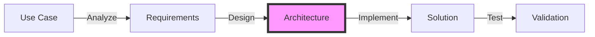
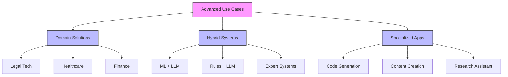
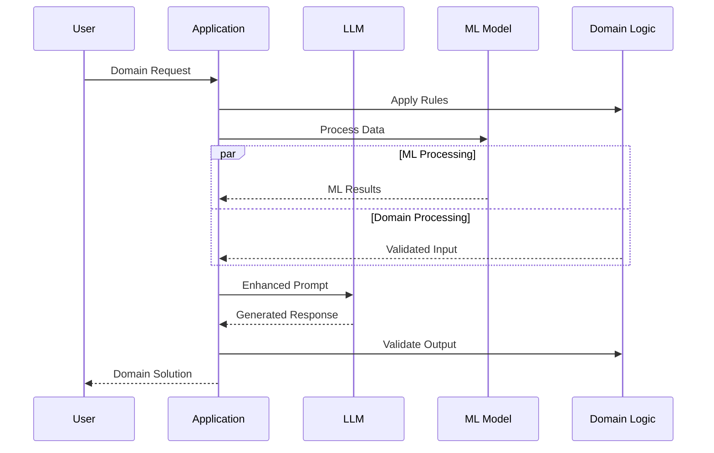

# Advanced Use Cases

## Table of Contents
- [Learning Objectives](#learning-objectives)
- [Prerequisites](#prerequisites)
- [Visual Overview](#visual-overview)
- [Content Structure](#content-structure)
  - [Theory](#theory)
  - [Hands-on Practice](#hands-on-practice)
  - [Applied Learning](#applied-learning)
- [Resources](#resources)
- [Assessment](#assessment)
- [Notes](#notes)
- [References](#references)

## Learning Objectives
By the end of this session, students will be able to:
1. Implement complex LLM workflows
2. Design domain-specific applications
3. Build hybrid AI systems
4. Deploy specialized solutions

## Prerequisites
- Understanding of autonomous agents from previous session
- Knowledge of multi-modal systems
- Familiarity with advanced prompting
- Experience with system integration

## Visual Overview



## Content Structure

### 1. Theory (45 minutes)
#### Introduction
- Complex LLM applications
- Domain-specific solutions
- Hybrid architectures
- Specialized workflows

#### Core Concepts



- Application Types
  - Domain-specific solutions
  - Hybrid architectures
  - Specialized workflows
  - Integration patterns



### 2. Hands-on Practice (45 minutes)
#### Guided Exercise: Building Domain Solution
```python
from typing import List, Dict, Optional
from dataclasses import dataclass
import asyncio
from datetime import datetime
import json
from pydantic import BaseModel, Field

class DomainConfig(BaseModel):
    rules: List[Dict[str, str]]
    validators: List[str]
    constraints: Dict[str, any]
    
class DomainContext(BaseModel):
    industry: str
    requirements: List[str]
    compliance: List[str]

class SpecializedLLM:
    def __init__(
        self,
        domain_config: DomainConfig,
        context: DomainContext
    ):
        self.config = domain_config
        self.context = context
        self.ml_models = self._load_ml_models()
        
    def _load_ml_models(self) -> Dict:
        # Load domain-specific ML models
        models = {}
        if self.context.industry == "healthcare":
            models["ner"] = self._load_medical_ner()
            models["classifier"] = self._load_diagnosis_classifier()
        elif self.context.industry == "legal":
            models["ner"] = self._load_legal_ner()
            models["classifier"] = self._load_case_classifier()
        return models
    
    async def validate_input(
        self,
        input_text: str
    ) -> Dict:
        # Apply domain rules
        rule_results = []
        for rule in self.config.rules:
            result = await self._apply_rule(
                input_text,
                rule
            )
            rule_results.append(result)
            
        # Run ML analysis
        ml_results = {}
        for model_name, model in self.ml_models.items():
            ml_results[model_name] = await model.predict(
                input_text
            )
            
        return {
            "rule_validation": rule_results,
            "ml_analysis": ml_results
        }
    
    async def enhance_prompt(
        self,
        base_prompt: str,
        context: Dict
    ) -> str:
        # Add domain-specific context
        enhanced = f"""
        Industry: {self.context.industry}
        Requirements: {', '.join(self.context.requirements)}
        Compliance: {', '.join(self.context.compliance)}
        
        Original Prompt:
        {base_prompt}
        
        Additional Context:
        {json.dumps(context, indent=2)}
        """
        
        return enhanced
    
    async def validate_output(
        self,
        output: str
    ) -> tuple[bool, str]:
        # Check compliance
        for validator in self.config.validators:
            is_valid = await self._run_validator(
                output,
                validator
            )
            if not is_valid: 
                return False, f"Failed validation: {validator}"
                
        # Check constraints
        for key, constraint in self.config.constraints.items():
            meets_constraint = await self._check_constraint(
                output,
                key,
                constraint
            )
            if not meets_constraint:
                return False, f"Failed constraint: {key}"
                
        return True, "Validation passed"
    
    async def process_request(
        self,
        input_text: str
    ) -> Dict:
        # Validate input
        validation = await self.validate_input(input_text)
        if not validation["rule_validation"]:
            return {
                "status": "error",
                "message": "Input validation failed",
                "details": validation
            }
            
        # Enhance prompt with context
        enhanced_prompt = await self.enhance_prompt(
            input_text,
            validation
        )
        
        # Get LLM response
        response = await self.get_llm_response(
            enhanced_prompt
        )
        
        # Validate output
        is_valid, message = await self.validate_output(
            response
        )
        
        if not is_valid:
            return {
                "status": "error",
                "message": message,
                "original_response": response
            }
            
        return {
            "status": "success",
            "response": response,
            "validation": validation
        }
```

#### Interactive Components
- Building domain rules
- Implementing validators
- Adding ML components
- Testing specialized workflows

### 3. Applied Learning (30 minutes)
#### Mini-Project: Legal Tech Assistant
- Build legal document analyzer
- Add compliance checking
- Implement case research
- Test with real examples

## Resources
### Required Reading
- Bommasani, R., Hudson, D. A., Adeli, E., Altman, R., Arora, S., von Arx, S., ... & Liang, P. (2021). On the Opportunities and Risks of Foundation Models. arXiv preprint arXiv:2108.07258.

- Chowdhery, A., Narang, S., Devlin, J., Bosma, M., Mishra, G., Roberts, A., ... & Fiedel, N. (2022). PaLM: Scaling Language Modeling with Pathways. arXiv preprint arXiv:2204.02311.

### Supplementary Materials
- Domain-Specific LLM Papers
- Industry Case Studies
- Specialized Application Guides

## Assessment
- Domain solution implementation
- Validation system design
- ML integration
- Compliance adherence

## Notes
- Focus on practical applications
- Consider domain constraints
- Connect to next session on project implementation

## References
Bommasani, R., Hudson, D. A., Adeli, E., Altman, R., Arora, S., von Arx, S., ... & Liang, P. (2021). On the Opportunities and Risks of Foundation Models. arXiv preprint arXiv:2108.07258.

Chowdhery, A., Narang, S., Devlin, J., Bosma, M., Mishra, G., Roberts, A., ... & Fiedel, N. (2022). PaLM: Scaling Language Modeling with Pathways. arXiv preprint arXiv:2204.02311.

Wei, J., Bosma, M., Zhao, V. Y., Guu, K., Yu, A. W., Lester, B., ... & Le, Q. V. (2022). Finetuned Language Models Are Zero-Shot Learners. In International Conference on Learning Representations.
