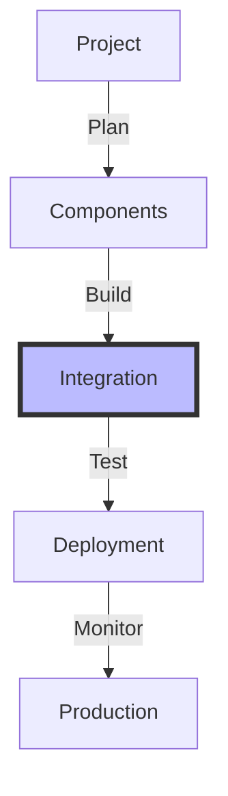
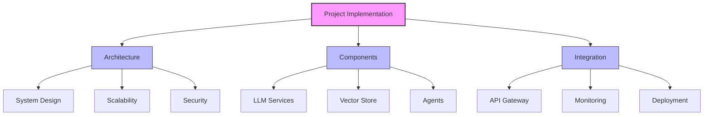
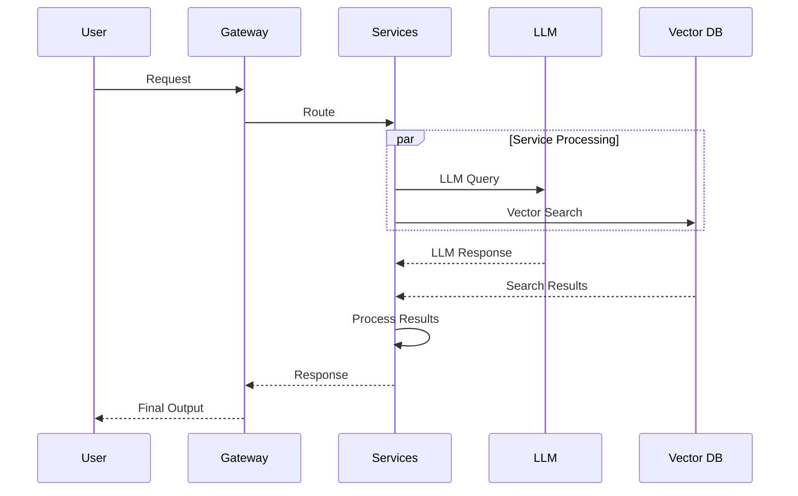

# Project Implementation

## Table of Contents
- [Learning Objectives](#learning-objectives)
- [Prerequisites](#prerequisites)
- [Visual Overview](#visual-overview)
- [Content Structure](#content-structure)
  - [Theory](#theory)
  - [Hands-on Practice](#hands-on-practice)
  - [Applied Learning](#applied-learning)
- [Resources](#resources)
- [Assessment](#assessment)
- [Notes](#notes)
- [References](#references)

## Learning Objectives
By the end of this session, students will be able to:
1. Design comprehensive LLM applications
2. Implement production-ready features
3. Integrate advanced components
4. Deploy scalable solutions

## Prerequisites
- Understanding of advanced use cases from previous session
- Knowledge of autonomous agents
- Familiarity with multi-modal systems
- Experience with system architecture

## Visual Overview



## Content Structure

### 1. Theory (45 minutes)
#### Introduction
- Project architecture
- Component integration
- Production considerations
- Deployment strategies

#### Core Concepts



- Implementation Aspects
  - System architecture
  - Component integration
  - Production readiness
  - Deployment pipeline



### 2. Hands-on Practice (45 minutes)
#### Guided Exercise: Building Production System
```python
from typing import List, Dict, Optional
from dataclasses import dataclass
import asyncio
from datetime import datetime
import json
from fastapi import FastAPI, HTTPException
from pydantic import BaseModel

class SystemConfig(BaseModel):
    components: List[str]
    integrations: Dict[str, Dict]
    scaling: Dict[str, any]
    
class ProductionSystem:
    def __init__(
        self,
        config: SystemConfig
    ):
        self.config = config
        self.services = self._init_services()
        self.monitoring = self._setup_monitoring()
        
    def _init_services(self) -> Dict:
        services = {}
        for component in self.config.components:
            if component == "llm":
                services["llm"] = self._init_llm_service()
            elif component == "vector_store":
                services["vector_store"] = self._init_vector_store()
            elif component == "agent":
                services["agent"] = self._init_agent_service()
        return services
    
    async def process_request(
        self,
        request: Dict
    ) -> Dict:
        # Validate request
        try:
            validated = await self._validate_request(
                request
            )
        except ValueError as e:
            raise HTTPException(
                status_code=400,
                detail=str(e)
            )
            
        # Route to appropriate service
        service = self._route_request(validated)
        
        # Process with retries
        for attempt in range(3):
            try:
                result = await service.process(
                    validated
                )
                break
            except Exception as e:
                if attempt == 2:
                    raise HTTPException(
                        status_code=500,
                        detail=f"Processing failed: {str(e)}"
                    )
                await asyncio.sleep(1)
                
        # Post-process result
        processed = await self._post_process(
            result
        )
        
        return {
            "status": "success",
            "data": processed,
            "metadata": {
                "processing_time": datetime.now().isoformat(),
                "service": service.__class__.__name__
            }
        }
    
    async def scale_service(
        self,
        service_name: str,
        scale_factor: int
    ):
        if service_name not in self.services:
            raise ValueError(f"Unknown service: {service_name}")
            
        scaling_config = self.config.scaling.get(
            service_name,
            {}
        )
        
        if not scaling_config:
            raise ValueError(
                f"No scaling config for: {service_name}"
            )
            
        service = self.services[service_name]
        await service.scale(
            factor=scale_factor,
            **scaling_config
        )
        
    async def monitor_health(self) -> Dict: 
        health_status = {}
        
        for name, service in self.services.items():
            try:
                status = await service.health_check()
                health_status[name] = {
                    "status": "healthy",
                    "details": status
                }
            except Exception as e:
                health_status[name] = {
                    "status": "unhealthy",
                    "error": str(e)
                }
                
        return health_status
    
    async def deploy_update(
        self,
        component: str,
        update_config: Dict
    ) -> bool:
        if component not in self.services:
            raise ValueError(f"Unknown component: {component}")
            
        service = self.services[component]
        
        # Backup current state
        backup = await service.backup()
        
        try:
            # Apply update
            await service.update(update_config)
            
            # Verify health
            health = await service.health_check()
            if not health["status"] == "healthy":
                raise ValueError("Health check failed")
                
            return True
            
        except Exception as e:
            # Rollback on failure
            await service.restore(backup)
            raise HTTPException(
                status_code=500,
                detail=f"Update failed: {str(e)}"
            )
```

#### Interactive Components
- Building system architecture
- Implementing services
- Adding monitoring
- Testing deployment

### 3. Applied Learning (30 minutes)
#### Mini-Project: Production LLM System
- Build scalable architecture
- Add monitoring and logging
- Implement deployment pipeline
- Test with load scenarios

## Resources
### Required Reading
- Rajkumar, M., Bharti, V., & Ramaswamy, S. (2023). Scaling Large Language Models in Production: Challenges and Solutions. arXiv preprint arXiv:2309.07854.

- Zhang, X., Yang, Z., Liu, Y., & Li, D. (2023). Production-Ready LLM Systems: A Comprehensive Survey. arXiv preprint arXiv:2310.05920.

### Supplementary Materials
- System Design Papers
- Production Case Studies
- Deployment Guides

## Assessment
- Architecture design
- Component integration
- Monitoring implementation
- Deployment strategy

## Notes
- Focus on production readiness
- Consider scalability aspects
- Connect to final project presentation

## References
Rajkumar, M., Bharti, V., & Ramaswamy, S. (2023). Scaling Large Language Models in Production: Challenges and Solutions. arXiv preprint arXiv:2309.07854.

Zhang, X., Yang, Z., Liu, Y., & Li, D. (2023). Production-Ready LLM Systems: A Comprehensive Survey. arXiv preprint arXiv:2310.05920.

Brown, T. B., Mann, B., Ryder, N., Subbiah, M., Kaplan, J., Dhariwal, P., ... & Amodei, D. (2020). Language Models are Few-Shot Learners. arXiv preprint arXiv:2005.14165.
