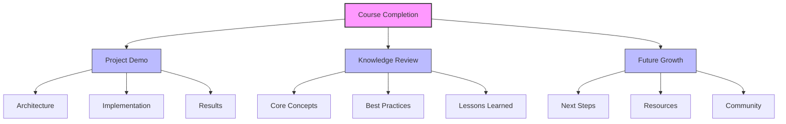
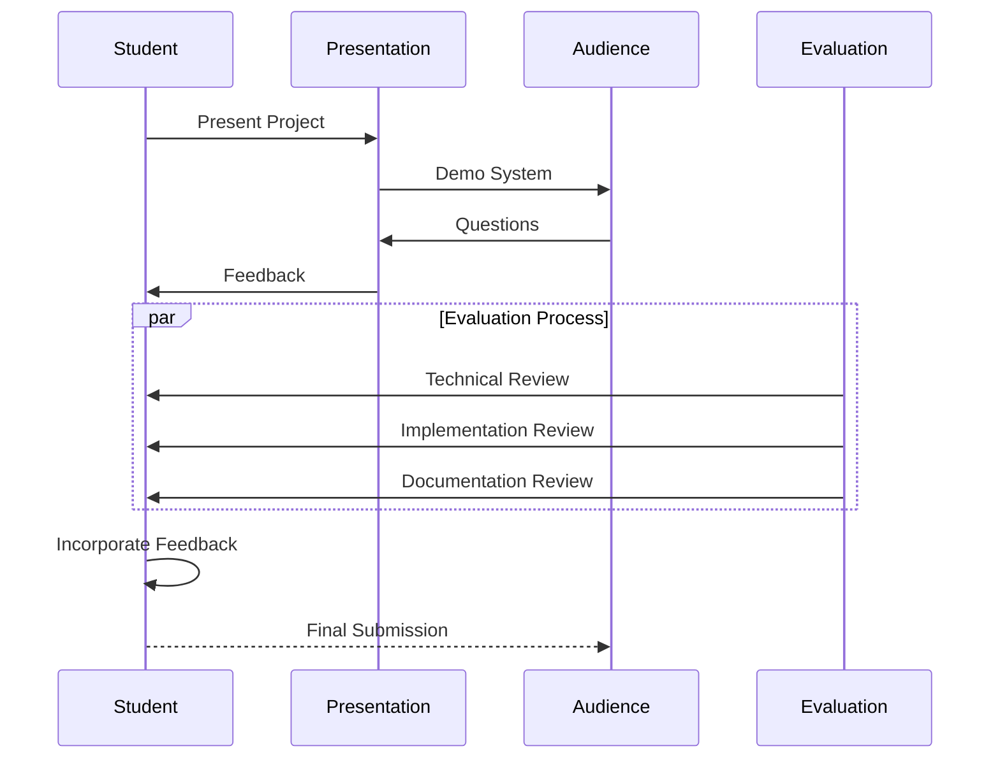
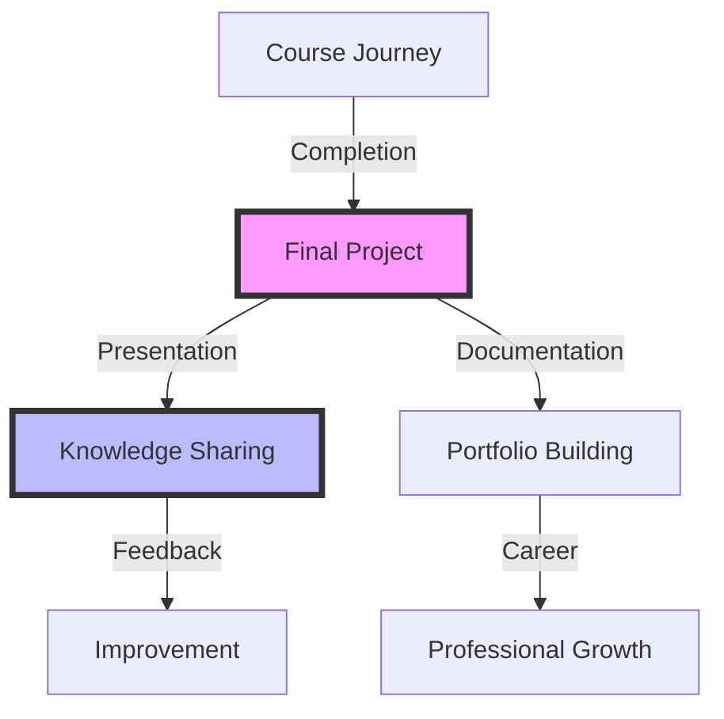

# Project Presentation and Course Wrap-up

## Table of Contents
- [Learning Objectives](#learning-objectives)
- [Prerequisites](#prerequisites)
- [Visual Overview](#visual-overview)
- [Content Structure](#content-structure)
  - [Theory](#theory)
  - [Hands-on Practice](#hands-on-practice)
  - [Applied Learning](#applied-learning)
- [Resources](#resources)
- [Assessment](#assessment)
- [Notes](#notes)
- [References](#references)

## Learning Objectives
By the end of this session, students will be able to:
1. Present production-ready LLM applications
2. Evaluate peer projects effectively
3. Synthesize course learnings
4. Plan future development

## Prerequisites
- Completed project implementation
- Understanding of all course topics
- Prepared presentation materials
- Documentation ready

## Content Structure

### 1. Theory (30 minutes)
#### Introduction
- Project presentation guidelines
- Evaluation criteria
- Course summary
- Future directions

#### Core Concepts



- Presentation Components
  - System architecture
  - Implementation details
  - Results and metrics
  - Lessons learned



### 2. Project Presentations (60 minutes)
#### Presentation Format
- 10 minutes per project
- 5 minutes Q&A
- Live demonstration
- Technical deep dive

#### Evaluation Criteria
```python
from dataclasses import dataclass
from typing import List, Dict
import json

@dataclass
class EvaluationCriteria:
    technical_depth: float  # 0.0 to 1.0
    implementation: float   # 0.0 to 1.0
    innovation: float      # 0.0 to 1.0
    presentation: float    # 0.0 to 1.0
    documentation: float   # 0.0 to 1.0

class ProjectEvaluation:
    def __init__(
        self,
        project_name: str,
        team_members: List[str]
    ):
        self.project_name = project_name
        self.team_members = team_members
        self.criteria = EvaluationCriteria(
            technical_depth=0.0,
            implementation=0.0,
            innovation=0.0,
            presentation=0.0,
            documentation=0.0
        )
        self.feedback = []
        
    def evaluate_technical(
        self,
        architecture: Dict,
        implementation: Dict,
        scalability: Dict
    ) -> float:
        # Evaluate technical aspects
        scores = []
        
        # Architecture (0.4)
        arch_score = self._evaluate_architecture(
            architecture
        )
        scores.append(arch_score * 0.4)
        
        # Implementation (0.4)
        impl_score = self._evaluate_implementation(
            implementation
        )
        scores.append(impl_score * 0.4)
        
        # Scalability (0.2)
        scale_score = self._evaluate_scalability(
            scalability
        )
        scores.append(scale_score * 0.2)
        
        self.criteria.technical_depth = sum(scores)
        return self.criteria.technical_depth
    
    def evaluate_innovation(
        self,
        novelty: Dict,
        impact: Dict,
        creativity: Dict
    ) -> float:
        # Evaluate innovation
        scores = []
        
        # Novelty (0.3)
        novel_score = self._evaluate_novelty(
            novelty
        )
        scores.append(novel_score * 0.3)
        
        # Impact (0.4)
        impact_score = self._evaluate_impact(
            impact
        )
        scores.append(impact_score * 0.4)
        
        # Creativity (0.3)
        creative_score = self._evaluate_creativity(
            creativity
        )
        scores.append(creative_score * 0.3)
        
        self.criteria.innovation = sum(scores)
        return self.criteria.innovation
    
    def evaluate_presentation(
        self,
        clarity: float,
        demo_quality: float,
        qa_handling: float
    ) -> float:
        # Evaluate presentation
        weights = {
            "clarity": 0.4,
            "demo": 0.4,
            "qa": 0.2
        }
        
        score = (
            clarity * weights["clarity"] +
            demo_quality * weights["demo"] +
            qa_handling * weights["qa"]
        )
        
        self.criteria.presentation = score
        return score
    
    def add_feedback(
        self,
        category: str,
        comment: str,
        suggestion: str
    ):
        self.feedback.append({
            "category": category,
            "comment": comment,
            "suggestion": suggestion,
            "timestamp": datetime.now().isoformat()
        })
        
    def generate_report(self) -> Dict:
        total_score = (
            self.criteria.technical_depth * 0.3 +
            self.criteria.implementation * 0.3 +
            self.criteria.innovation * 0.2 +
            self.criteria.presentation * 0.1 +
            self.criteria.documentation * 0.1
        )
        
        return {
            "project_name": self.project_name,
            "team_members": self.team_members,
            "scores": {
                "technical_depth": self.criteria.technical_depth,
                "implementation": self.criteria.implementation,
                "innovation": self.criteria.innovation,
                "presentation": self.criteria.presentation,
                "documentation": self.criteria.documentation,
                "total": total_score
            },
            "feedback": self.feedback,
            "timestamp": datetime.now().isoformat()
        }
```

### 3. Course Wrap-up (30 minutes)
#### Key Takeaways
- LLM fundamentals
- Production considerations
- Best practices
- Future trends

#### Next Steps
- Advanced topics
- Research areas
- Community resources
- Continued learning

### Interactive Components

1. Project Presentation Practice (60 minutes)
   - Students will practice their final presentations in small groups
   - Peer feedback and critique sessions
   - Refinement of presentation materials

2. Course Reflection Exercise (30 minutes)
   - Individual reflection on learning journey
   - Documentation of key insights and growth areas
   - Planning for continued learning and application

3. Community Building (30 minutes)
   - Exchange of contact information
   - Discussion of future collaboration opportunities
   - Formation of study/practice groups

## Visual Overview



## Resources
### Required Reading
- Lin, J., & Zhou, W. (2023). Best Practices for LLM Application Development: A Comprehensive Review. arXiv preprint arXiv:2309.12235.

- Chen, M., & Wang, X. (2023). From Prototype to Production: Lessons Learned in Building LLM Applications. arXiv preprint arXiv:2310.03721.

### Supplementary Materials
- Course Project Examples
- Industry Case Studies
- Research Directions

## Assessment
- Project presentation
- Technical implementation
- Documentation quality
- Peer evaluation

## Notes
- Focus on key learnings
- Share practical insights
- Encourage continued growth

## References
Lin, J., & Zhou, W. (2023). Best Practices for LLM Application Development: A Comprehensive Review. arXiv preprint arXiv:2309.12235.

Chen, M., & Wang, X. (2023). From Prototype to Production: Lessons Learned in Building LLM Applications. arXiv preprint arXiv:2310.03721.

Brown, T. B., Mann, B., Ryder, N., Subbiah, M., Kaplan, J., Dhariwal, P., ... & Amodei, D. (2020). Language Models are Few-Shot Learners. arXiv preprint arXiv:2005.14165.
